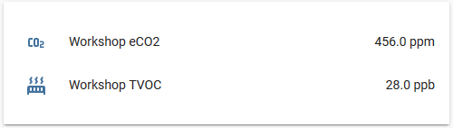

SGP30 CO₂ and Volatile Organic Compound Sensor
==============================================

.. seo::
    :description: Instructions for setting up SGP30 CO₂eq and Volatile Organic Compound sensor
    :image: sgp30.png

The ``sgp30`` sensor platform  allows you to use your Sensiron SGP30 multi-pixel gas
(`datasheet <https://www.sensirion.com/fileadmin/user_upload/customers/sensirion/Dokumente/9_Gas_Sensors/Datasheets/Sensirion_Gas_Sensors_SGP30_Datasheet.pdf>`__) sensors or the SVM30 breakout-boards  (`product page <https://www.sensirion.com/en/environmental-sensors/gas-sensors/multi-gas-humidity-temperature-module-svm30/>`__) with ESPHome.
The :ref:`I²C Bus <i2c>` is required to be set up in your configuration for this sensor to work.

.. code-block:: yaml

    # Example configuration entry
    sensor:
      - platform: sgp30
        eco2:
          name: "Workshop eCO2"
          accuracy_decimals: 1
        tvoc:
          name: "Workshop TVOC"
          accuracy_decimals: 1
        address: 0x58
        update_interval: 5s

Configuration variables:
------------------------

- **eco2** (**Required**): The information for the CO₂eq. sensor.

  - **name** (**Required**, string): The name for the CO₂eq sensor.
  - **id** (*Optional*, :ref:`config-id`): Set the ID of this sensor for use in lambdas.
  - All other options from :ref:`Sensor <config-sensor>`.

- **tvoc** (**Required**): The information for the total Volatile Organic Compounds sensor.

  - **name** (**Required**, string): The name for the humidity sensor.
  - **id** (*Optional*, :ref:`config-id`): Set the ID of this sensor for use in lambdas.
  - All other options from :ref:`Sensor <config-sensor>`.

- **address** (*Optional*, int): Manually specify the I²C address of the sensor.
  Defaults to ``0x58``.

- **update_interval** (*Optional*, :ref:`config-time`): The interval to check the
  sensor. Defaults to ``60s``.

Advanced:

- **baseline** (*Optional*): The block containing baselines for calibration purposes. See :ref:`sgp30-calibrating` for more info.

  - **eco2_baseline** (**Required**, int): The eCO2 baseline for calibration purposes.

  - **tvoc_baseline** (**Required**, int): The TVOC baseline for calibration purposes.

- **compensation** (*Optional*): The block containing sensors used for compensation.

  - **temperature_source** (*Optional*, :ref:`config-id`): Give an external temperature sensor ID
    here. This can improve the sensor's internal calculations.

  - **humidity_source** (*Optional*, :ref:`config-id`): Give an external humidity sensor ID
    here. This can improve the sensor's internal calculations.

.. _sgp30-calibrating:

Calibrating Baseline
--------------------

The SGP30 sensor will re-calibrate its baseline each time it is powered on. During the first power-up this can take up to 12 hours.

For best performance and faster startup times, the current **baseline** needs to be persistently stored on the device before shutting it down and set again accordingly after boot up
that also means that if the sensor reboots at a time when the air is less clean than normal,
the values will have a constant offset and cannot be compared to the values before the last
boot.

To do this, let the sensor boot up with no baseline set and let the sensor calibrate itself. After around 12 hours you can then view the remote logs on the ESP. The next
time the sensor is read out, you will see a log message with something like ``Current eCO2 baseline: 0x86C5, TVOC baseline: 0x8B38``.

Now set the baseline property in your configuration file like so with the value you got
via the logs:

.. code-block:: yaml

    # Example configuration entry
    sensor:
      - platform: sgp30
        # ...
        baseline:
          eco2_baseline: 0x86C5
          tvoc_baseline: 0x8B38

The next time you upload the code, the SGP30 will be continue its operation with this baseline and you will get consistent values.

Please note that Sensirion recommends that after around 7 days, the baseline will need to be
re-calibrated because the internal sensor has a slight value drift over time.

See Also
--------

- :ref:`sensor-filters`
- :doc:`dht`
- :doc:`dht12`
- :doc:`hdc1080`
- :doc:`htu21d`
- :doc:`sht3xd`
- :apiref:`sgp30/sgp30.h`
- :ghedit:`Edit`
