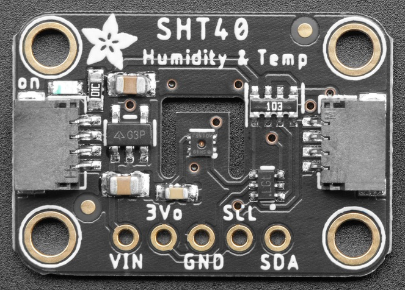

SHT4X Temperature and Humidity Sensor
=====================================

.. seo::
    :description: Instructions for setting up SHT4X temperature and humidity sensor
    :image: sht4x.jpg

The ``sht4x`` sensor platform  allows you to use your SHT4X temperature and humidity sensor
(`datasheet <https://sensirion.com/media/documents/33FD6951/63E1087C/Datasheet_SHT4x_1.pdf>`__, `Adafruit`_) with ESPHome.

The :ref:`I²C Bus <i2c>` is required to be set up in your configuration for this sensor to work.

.. _Adafruit: https://www.adafruit.com/product/4885

.. code-block:: yaml

    sensor:
      - platform: sht4x
        temperature:
          name: "Temperature"
        humidity:
          name: "Relative Humidity"

Configuration variables:
------------------------

- **temperature** (*Optional*): Temperature.

  - **name** (**Required**, string): The name of the sensor.
  - **id** (*Optional*, :ref:`config-id`): Manually specify the ID used for code generation.
  - All other options from :ref:`Sensor <config-sensor>`.

- **humidity** (*Optional*): Relative Humidity.

  - **name** (**Required**, string): The name of the sensor.
  - **id** (*Optional*, :ref:`config-id`): Manually specify the ID used for code generation.
  - All other options from :ref:`Sensor <config-sensor>`.

- **precision** (*Optional*, string): The measurement precision, either ``High``, ``Med`` or ``Low``. Default is ``High``.
- **heater_max_duty** (*Optional*, float): The maximum duty cycle of the heater (limited to ``0.05``). Default is ``0.0``, i.e. heater off.
- **heater_power** (*Optional*, string): The heater power, either ``High``, ``Med`` or ``Low``. Default is ``High``.
- **heater_time** (*Optional*, string):  The length of time to run the heater, either ``Long`` (1000ms) or ``Short`` (100ms). Default is ``Long``.
- **address** (*Optional*, int): Manually specify the I²C address of the sensor. Default is ``0x44``.
- **update_interval** (*Optional*, :ref:`config-time`): The interval to check the sensor. Defaults to ``60s``.

Heater Configuration:
---------------------

The SHT4X includes an on-chip heater which is intended to remove condensation from the sensor that
has been sprayed onto the sensor or in high humidity environments. This can help
maintain accurate humidity measurements.

The heater can be enabled by setting ``heater_max_duty`` up to a maximum duty cycle
of ``5%`` (``0.05``). This runs the heater on a regular interval. While the heater
is in operation the sensor disables measurements so no updates will be published.

See the (`datasheet <https://sensirion.com/media/documents/33FD6951/63E1087C/Datasheet_SHT4x_1.pdf>`__)
for more information about heater operation.

See Also
--------

- :doc:`/components/sensor/sht3xd`
- :doc:`/components/sensor/shtcx`
- :ref:`sensor-filters`
- :doc:`absolute_humidity`
- :apiref:`sht4x/sht4x.h`
- :ghedit:`Edit`
