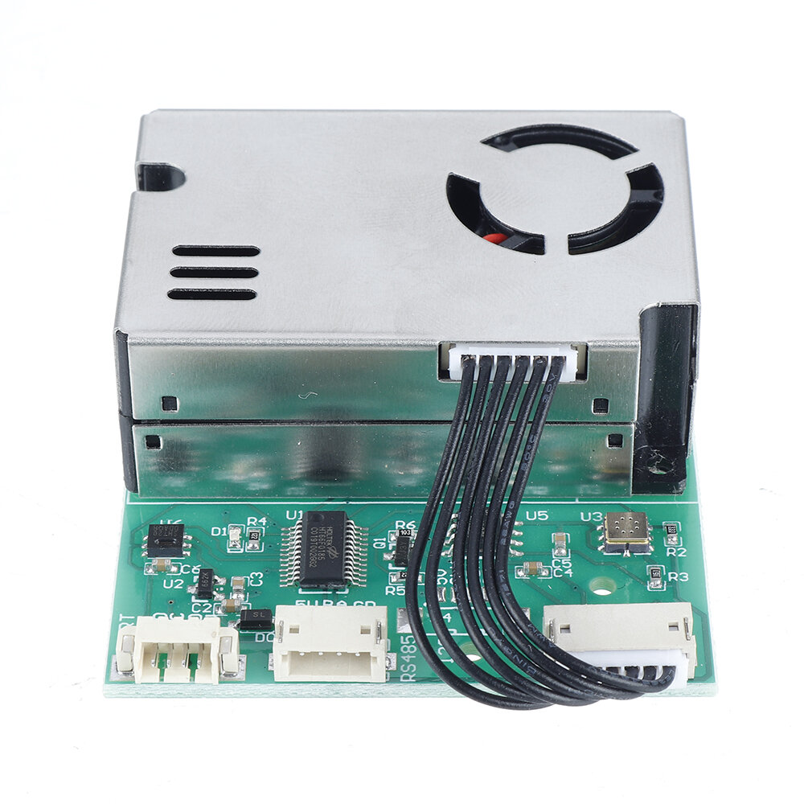
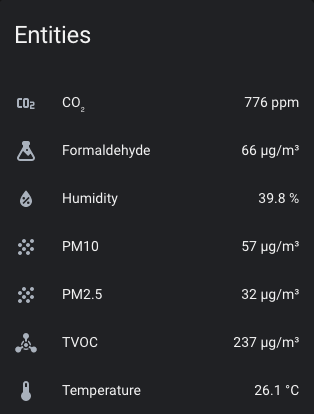
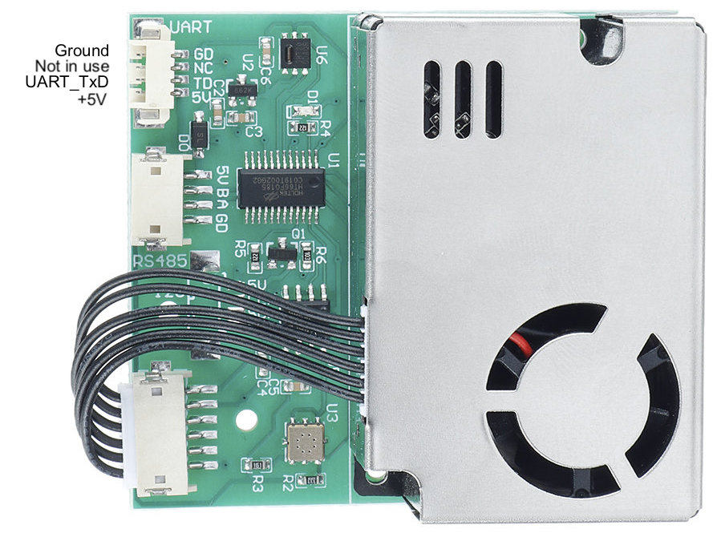

SM300D2 7-in-1 Air Quality Sensor
=================================

.. seo::
    :description: Instructions for setting up SM300D2 sensor to work with ESPHome
    :image: sm300d2.jpg
    :keywords: sm300d2

The ``sm300d2`` sensor platform allows you to use the SM300D2 7-in-1 Air Quality Sensor with ESPHome.

    SM300D2 7-in-1 Air Quality Sensor.

Although the SM300D2 sensor supports connections via UART or RS485, this platform only supports UART
connections. The LCD module which is often sold with/for these sensor boards can work over either UART
or RS485, so you can use the LCD over RS485 and an ESP over UART at the same time (see
:ref:`note below <pins-note>` regarding powering everything).

Make sure you have a :ref:`UART bus <uart>` in your configuration with the ``rx_pin`` connected to the
sensor's TX pin. The sensor does not support receiving data, so the ``tx_pin`` does not need to be
connected. The UART bus should be set to a baud rate of 9600 to match the sensor's output. Setting the
``rx_pin``'s mode to ``INPUT_PULLDOWN`` may help improve reliability if you're regularly getting missed
or bad/incomplete readings.

.. code-block:: yaml

    # Example configuration entry
    uart:
      rx_pin:
        number: D0
        mode: INPUT_PULLDOWN
      tx_pin: D1
      baud_rate: 9600

    sensor:
      - platform: sm300d2
        co2:
          name: "SM300D2 CO2 Value"
        formaldehyde:
          name: "SM300D2 Formaldehyde Value"
        tvoc:
          name: "SM300D2 TVOC Value"
        pm_2_5:
          name: "SM300D2 PM2.5 Value"
        pm_10_0:
          name: "SM300D2 PM10 Value"
        temperature:
          name: "SM300D2 Temperature Value"
        humidity:
          name: "SM300D2 Humidity Value"
        update_interval: 60s

Configuration variables:
------------------------

- **co2** (**Required**): The information for the CO₂ sensor. Readings in parts per million (ppm).

  - **name** (**Required**, string): The name of the CO₂ sensor.
  - **id** (*Optional*, :ref:`config-id`): Set the ID of this sensor for use in lambdas.
  - All other options from :ref:`Sensor <config-sensor>`.

- **formaldehyde** (**Required**): The information for the formaldehyde sensor. Readings in µg/m³.

  - **name** (**Required**, string): The name of the formaldehyde sensor.
  - **id** (*Optional*, :ref:`config-id`): Set the ID of this sensor for use in lambdas.
  - All other options from :ref:`Sensor <config-sensor>`.

- **tvoc** (**Required**): The information for the total volatile organic compounds (TVOC) sensor. Readings in µg/m³.

  - **name** (**Required**, string): The name of the TVOC sensor.
  - **id** (*Optional*, :ref:`config-id`): Set the ID of this sensor for use in lambdas.
  - All other options from :ref:`Sensor <config-sensor>`.

- **pm_2_5** (**Required**): The information for the **Weight Concentration** sensor for fine particles up to 2.5μm. Readings in µg/m³.

  - **name** (**Required**, string): The name of the PM2.5 sensor.
  - **id** (*Optional*, :ref:`config-id`): Set the ID of this sensor for use in lambdas.
  - All other options from :ref:`Sensor <config-sensor>`.

- **pm_10_0** (**Required**): The information for the **Weight Concentration** sensor for coarse particles up to 10μm. Readings in µg/m³.

  - **name** (**Required**, string): The name of the PM10 sensor.
  - **id** (*Optional*, :ref:`config-id`): Set the ID of this sensor for use in lambdas.
  - All other options from :ref:`Sensor <config-sensor>`.

- **temperature** (**Required**): The information for the temperature sensor. Readings in degrees celsius (°C).

  - **name** (**Required**, string): The name of the temperature sensor.
  - **id** (*Optional*, :ref:`config-id`): Set the ID of this sensor for use in lambdas.
  - All other options from :ref:`Sensor <config-sensor>`.

- **humidity** (**Required**): The information for the relative humidity sensor. Readings in %.

  - **name** (**Required**, string): The name of the humidity sensor.
  - **id** (*Optional*, :ref:`config-id`): Set the ID of this sensor for use in lambdas.
  - All other options from :ref:`Sensor <config-sensor>`.

- **update_interval** (*Optional*, :ref:`config-time`): The interval to check the
  sensor. Defaults to ``60s``.

- **uart_id** (*Optional*, :ref:`config-id`): Manually specify the ID of the :ref:`UART Component <uart>` if you want
  to use multiple UART buses.

- **id** (*Optional*, :ref:`config-id`): Manually specify the ID used for actions.

    Pins on the SM300D2. UART RX is not in use.

.. _pins-note:

.. note::

    The board's ``GD`` pin must be connected to a ``GND`` pin on the ESP.

    The sensor board requires between 4.8 and 5.2 volts via the ``5V`` pin in either the UART or RS485 socket, as they
    are connected. If you're using a USB-powered ESP module with a 5V input pin (i.e. ``VIN``) exposed, you can choose
    to connect the UART ``5V`` pin to the ESP's ``VIN`` and then power everything through either the LCD module or the
    ESP module, with a single power cable. If you choose to power the ESP separately from the sensor board, leave the
    UART ``5V`` pin unconnected.
    

See Also
--------

- :ref:`sensor-filters`
- :apiref:`sm300d2/sm300d2.h`
- :ghedit:`Edit`
