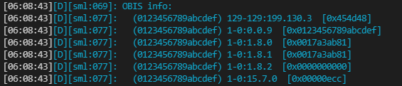

SML (Smart Message Language)
============================

.. seo::
    :description: Instructions for setting up SML sensors
    :image: sml.svg
    :keywords: sml

The ``SML`` component connects to smart meters which use the *Smart Message Language* (SML) protocol.

Although the SML protocol is well defined, it gives a lot of freedom to the manufacturers how to store
and identify the transmitted data. Within a telegram the physical values are identified by *OBIS* codes
(Object Identification System). If it is known which code the manufacturer assigns to the physical value,
the corresponding value can be extracted.

Hardware
--------

This component is passive, it does not transmit any data to your equipment. Usually a smart meter transmit
a telegram at regular intervals (2-4 seconds) on its own.
This component decodes and updates the configured sensors at the pace the data is received.

Most smart meters transmit the telegrams using an infrared optical interface. As a sensor a  suitable photo
transistor (e.g. BPW40) can be attached to the ESP's UART (emitter to `GND` and collector to `RX` pin). A more
mature solution can be found `here
<https://wiki.volkszaehler.org/hardware/controllers/ir-schreib-lesekopf-ttl-ausgang>`_ (in German).
There are plenty of other examples and ready to buy solutions on the web.

Configuration
-------------

As the communciation with the sensor is done using UART, you need to have the :ref:`UART bus <uart>`
in your configuration. The interface parameters should be set to 9600/8N1 or 9600/7E1 depending on your
smart meter. If you see checksum errors in the log try changing the interface parameter.

.. code-block:: yaml

    # Example configuration entry
    uart:
      id: uart_bus
      tx_pin: GPIO1
      rx_pin: GPIO3
      baud_rate: 9600
      data_bits: 8
      parity: NONE
      stop_bits: 1

    sml:
      id: mysml
      uart_id: uart_bus

    sensor:
      - platform: sml
        name: "Total energy"
        sml_id: mysml
        server_id: "0123456789abcdef"
        obis: "1-0:1.8.0"
        unit_of_measurement: kWh
        accuracy_decimals: 1
        filters:
          - multiply: 0.0001

    text_sensor:
      - platform: sml
        name: "Manufacturer"
        sml_id: mysml
        server_id: "0123456789abcdef"
        obis: "129-129:199.130.3"
        format: text

Configuration variables:
------------------------

.. _sml-platform:

SML platform
************

- **id** (*Optional*, :ref:`config-id`): Manually specify the ID used for code generation.
- **uart_id** (*Optional*, :ref:`config-id`): Manually specify the ID of the :ref:`UART Component <uart>` if you want
  to use multiple UART buses.

Sensor
******

- **obis** (*Required*, string): Specify the OBIS code you want to retrieve data for from the device.
  The format must be (A-B:C.D.E, e.g. 1-0:1.8.0)
- **server_id** (*Optional*, string): Specify the device's server_id to retrieve the OBIS code from. Should be specified if more then one device is connected to the same hardware sensor component.
- **sml_id** (*Optional*, :ref:`config-id`): The ID of the :ref:`SML platform <sml-platform>`
- All other options from :ref:`Sensor <config-sensor>`.

Text Sensor
***********

- **obis** (*Required*, string): Specify the OBIS code you want to retrieve data for from the device.
  The format must be (A-B:C.D.E, e.g. 1-0:1.8.0)
- **server_id** (*Optional*, string): Specify the device's server_id to retrieve the OBIS code from. Should be specified if more then one device is connected to the same hardware sensor component.
- **sml_id** (*Optional*, :ref:`config-id`): The ID of the :ref:`SML platform <sml-platform>`
- **format** (*Optional*, string): Override the automatic interpretation of the transmitted binary data value. Possible values (`int`, `uint`, `bool`, `hex`, `text`).
- All other options from :ref:`Text Sensor <config-text_sensor>`.

Getting OBIS codes and sensor ids
---------------------------------

The physical values in the transmitted SML telegram are identified by a *server id* and *OBIS codes*. The *server id*
identifies your smart meter. If you have only one hardware component attached to your optical sensor you usually
don't have to care about the server id and you may ommit it in your configuration.

In order to get the server id and the available OBIS codes provided by your smart meter, simply set up the
:ref:`SML platform <sml-platform>` and observe the log output (the :ref:`log level <logger-log_levels>`
must be set to at least ``debug``!).

Your log output will show something like this:

    OBIS information in the log of the `SML` component

Each line represents a combination of the server id (in brackets), the OBIS code and the transmitted hex value
(in square brackets).

Precision errors
----------------
Many smart meters emit very huge numbers for certain OBIS codes (like the accumulated total active energy).
This may lead to precision errors for the values reported by the sensor component to ESPHome. This shows in
the fact that slightly wrong numbers may be reported to HomeAssistant. This is a result from internal limitations
in ESPHome and has nothing to do with the SML component.

If you cannot live with this, you can use the `TextSensor` with an appropriate format to transmit the value as
a string to HomeAssistant. On the HomeAssistant side you can define a `Template Sensor <https://www.home-assistant.io/integrations/template/>`_
to cast the value into the appropriate format and do some scaling.

For ESPHome we have:

.. code-block:: yaml

    # ESPHome configuration file
    text_sensor:
      - platform: sml
        name: "Total energy text"
        obis: "1-0:1.8.0"
        format: uint

The `format` parameter is optional. If ommited, the SML component will try to guess the correct datatype
from the received SML message.

And in HomeAssistant:

.. code-block:: yaml

    # Home Assistant configuration.yaml
    template:
      - sensor:
          - name: "Total Energy Consumption"
            unit_of_measurement: "kWh"
            state: >
              
                {{ states('sensor.total_energy_consumption') }}
              
                {{ ((states('sensor.total_energy_text') | float) * 0.0001) | round(2) }}
              

Usually the template sensor's value would turn to 0 if the ESP device is unavailable.
This results in problems when using the sensor in combination with the `Utility Meter <https://www.home-assistant.io/integrations/utility_meter/>`_ integration.
The state template provided above checks for the sensor's availability and keeps the
current state in case of unavailability.

See Also
--------

- :apiref:`sml/sml.h`
- :ghedit:`Edit`
