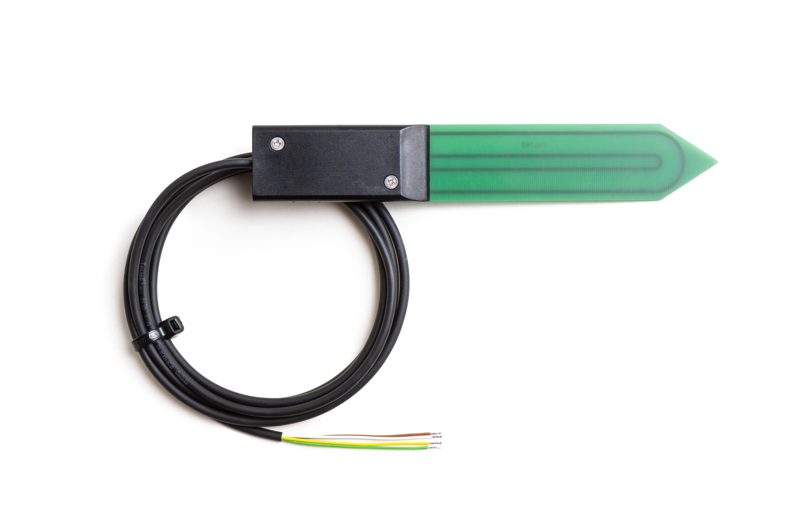

SMT100 Soil Moisture Sensor
===========================

.. seo::
    :description: Instructions for setting up SMT100 soil moisture and temperature sensor
    :image: smt100.jpg
    :keywords: smt100

The SMT100 sensor platform allows you to use the SMT100 soil moisture and temperature with ESPHome.

The communication with this component is done via a :ref:`UART <uart>` using a simple ASCII protocol. You must
therefore have a ``uart:`` entry in your configuration with both the TX and RX pins set to some pins on your
board and the baud rate set to 9600.

.. code-block:: yaml

    # Example configuration entry
    uart:
      tx_pin: TX
      rx_pin: RX
      baud_rate: 9600

    sensor:
      - platform: smt100
        counts:
            name: "Counts"
        permittivity:
            name: "Permittivity"
        temperature:
            name: "Temperature"
        moisture:
            name: "Moisture"
        voltage:
            name: "Voltage"

Configuration variables:
------------------------

- **counts** (*Optional*): Raw measurement data from the sensor electronics (dimensionless quantity). Higher counts mean less moisture. May be used for material specific calibrations.

  - **name** (**Required**): Sensor name.
  - All other options from :ref:`Sensor <config-sensor>`.

- **dielectric_constant** (*Optional*): Dielectric coefficient or permittivity of the material to be measured (dimensionless quantity). Higher permittivity means higher water content. May be used for material specific calibration.

  - **name** (**Required**): Sensor name.
  - All other options from :ref:`Sensor <config-sensor>`.

- **temperature** (*Optional*): Soil temperature in degrees Celsius. Please note that the temperature sensor is inside the black sensor enclosure and requires some time to equilibrate with the soil temperature.

  - **name** (**Required**): Sensor name.
  - All other options from :ref:`Sensor <config-sensor>`.

- **moisture** (*Optional*): Soil moisture (volumetric water content in %).

  - **name** (**Required**): Sensor name.
  - All other options from :ref:`Sensor <config-sensor>`.

- **voltage** (*Optional*): Supply voltage of the sensor in Volt.

  - **name** (**Required**): Sensor name.
  - All other options from :ref:`Sensor <config-sensor>`.

- **uart_id** (*Optional*, :ref:`config-id`): Manually specify the ID of the :ref:`UART Component <uart>` if you want
  to use multiple UART buses.

- **update_interval** (*Optional*, :ref:`config-time`): The interval to pull the sensor. Defaults is 60s.

See Also
--------

- :doc:`/components/sensor/smt100`
- :ref:`sensor-filters`
- :apiref:`smt100/smt100.h`
- :ghedit:`Edit`
