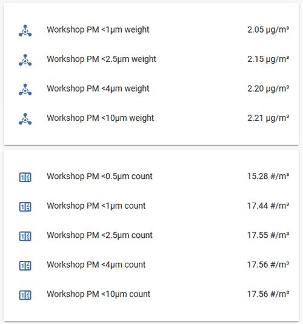
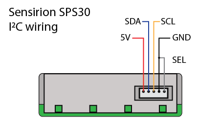

SPS30 Particulate Matter Sensor
===============================

.. seo::
    :description: Instructions for setting up SPS30 PM1.0, PM2.5, PM4, PM10 Particulate Matter sensors
    :image: sps30.jpg

The ``sps30`` sensor platform allows you to use your Sensirion SPS30
(`datasheet <https://sensirion.com/media/documents/8600FF88/616542B5/Sensirion_PM_Sensors_Datasheet_SPS30.pdf>`__) sensors with ESPHome.
The :ref:`I²C Bus <i2c>` is required to be set up in your configuration for this sensor to work.
This sensor supports both UART and I²C communication. However, at the moment only I²C communication is implemented.

.. _Sparkfun: https://www.sparkfun.com/products/15103

.. code-block:: yaml

    # Example configuration entry
    sensor:
      - platform: sps30
        pm_1_0:
          name: "Workshop PM <1µm Weight concentration"
          id: "workshop_PM_1_0"
        pm_2_5:
          name: "Workshop PM <2.5µm Weight concentration"
          id: "workshop_PM_2_5"
        pm_4_0:
          name: "Workshop PM <4µm Weight concentration"
          id: "workshop_PM_4_0"
        pm_10_0:
          name: "Workshop PM <10µm Weight concentration"
          id: "workshop_PM_10_0"
        pmc_0_5:
          name: "Workshop PM <0.5µm Number concentration"
          id: "workshop_PMC_0_5"
        pmc_1_0:
          name: "Workshop PM <1µm Number concentration"
          id: "workshop_PMC_1_0"
        pmc_2_5:
          name: "Workshop PM <2.5µm Number concentration"
          id: "workshop_PMC_2_5"
        pmc_4_0:
          name: "Workshop PM <4µm Number concentration"
          id: "workshop_PMC_4_0"
        pmc_10_0:
          name: "Workshop PM <10µm Number concentration"
          id: "workshop_PMC_10_0"
        pm_size:
          name: "Typical Particle size"
          id: "pm_size"
        address: 0x69
        update_interval: 10s

Configuration variables:
------------------------

- **pm_1_0** (*Optional*): The information for the **Weight Concentration** sensor for fine particles up to 1μm. Readings in µg/m³.

  - **name** (**Required**, string): The name for this sensor.
  - **id** (*Optional*, :ref:`config-id`): Set the ID of this sensor for use in automation and lambdas.
  - All other options from :ref:`Sensor <config-sensor>`.

- **pm_2_5** (*Optional*): The information for the **Weight Concentration** sensor for fine particles up to 2.5μm. Readings in µg/m³.

  - **name** (**Required**, string): The name for this sensor.
  - **id** (*Optional*, :ref:`config-id`): Set the ID of this sensor for use in automation and lambdas.
  - All other options from :ref:`Sensor <config-sensor>`.

- **pm_4_0** (*Optional*): The information for the **Weight Concentration** sensor for coarse particles up to 4μm. Readings in µg/m³.

  - **name** (**Required**, string): The name for this sensor.
  - **id** (*Optional*, :ref:`config-id`): Set the ID of this sensor for use in automation and lambdas.
  - All other options from :ref:`Sensor <config-sensor>`.

- **pm_10_0** (*Optional*): The information for the **Weight Concentration** sensor for coarse particles up to 10μm. Readings in µg/m³.

  - **name** (**Required**, string): The name for this sensor.
  - **id** (*Optional*, :ref:`config-id`): Set the ID of this sensor for use in automation and lambdas.
  - All other options from :ref:`Sensor <config-sensor>`.

- **pmc_0_5** (*Optional*): The information for the **Number Concentration** sensor for ultrafine particles up to 0.5μm. Readings in particles/cm³.

  - **name** (**Required**, string): The name for this sensor.
  - **id** (*Optional*, :ref:`config-id`): Set the ID of this sensor for use in automation and lambdas.
  - All other options from :ref:`Sensor <config-sensor>`.

- **pmc_1_0** (*Optional*): The information for the **Number Concentration** sensor for fine particles up to 1μm. Readings in particles/cm³.

  - **name** (**Required**, string): The name for this sensor.
  - **id** (*Optional*, :ref:`config-id`): Set the ID of this sensor for use in automation and lambdas.
  - All other options from :ref:`Sensor <config-sensor>`.

- **pmc_2_5** (*Optional*): The information for the **Number Concentration** sensor for fine particles up to 2.5μm. Readings in particles/cm³.

  - **name** (**Required**, string): The name for this sensor.
  - **id** (*Optional*, :ref:`config-id`): Set the ID of this sensor for use in automation and lambdas.
  - All other options from :ref:`Sensor <config-sensor>`.

- **pmc_4_0** (*Optional*): The information for the **Number Concentration** sensor for coarse particles up to 4μm. Readings in particles/cm³.

  - **name** (**Required**, string): The name for this sensor.
  - **id** (*Optional*, :ref:`config-id`): Set the ID of this sensor for use in automation and lambdas.
  - All other options from :ref:`Sensor <config-sensor>`.

- **pmc_10_0** (*Optional*): The information for the **Number Concentration** sensor for coarse particles up to 10μm. Readings in particles/cm³.

  - **name** (**Required**, string): The name for this sensor.
  - **id** (*Optional*, :ref:`config-id`): Set the ID of this sensor for use in automation and lambdas.
  - All other options from :ref:`Sensor <config-sensor>`.

- **pm_size** (*Optional*): Typical particle size in μm.

  - **name** (**Required**, string): The name for this sensor.
  - **id** (*Optional*, :ref:`config-id`): Set the ID of this sensor for use in automation and lambdas.
  - All other options from :ref:`Sensor <config-sensor>`.

- **auto_cleaning_interval** (*Optional*): The interval in seconds of the periodic fan-cleaning.

- **address** (*Optional*, int): Manually specify the I²C address of the sensor.
  Defaults to ``0x69``.
- **update_interval** (*Optional*, :ref:`config-time`): The interval to check the
  sensor. Defaults to ``60s``.

Wiring:
-------

The sensor has a 5 pin JST ZHR type connector, with a 1.5mm pitch. (`Matching connector housing <https://octopart.com/zhr-5-jst-279203>`__, `datasheet <http://www.farnell.com/datasheets/1393424.pdf>`__)
To force the sensor into I²C mode, the SEL pin (Interface Select pin no.5) should be shorted to ground (pin no.4)

For better stability, the SDA and SCL lines require suitable pull-up resistors.

Automatic Cleaning:
-------------------

The SPS30 sensor has an automatic fan-cleaning which will accelerate the built-in fan to maximum speed for 10 seconds in order to blow out the dust accumulated inside the fan.
The default automatic-cleaning interval is 168 hours (1 week) of uninterrupted use. Switching off the sensor resets this time counter.
Disabling of automatic-cleaning or setting a manual interval is not supported at the moment.

.. _sps30_start_autoclean_fan_action:

``sps30.start_fan_autoclean`` Action
------------------------------------

This :ref:`action <config-action>` manually starts fan-cleaning.

.. code-block:: yaml

    on_...:
      then:
        - sps30.start_fan_autoclean: my_sps30

See Also
--------

- :ref:`sensor-filters`
- :doc:`sds011`
- :doc:`pmsx003`
- :doc:`ccs811`
- :doc:`sgp30`
- :apiref:`sps30/sps30.h`
- :ghedit:`Edit`
