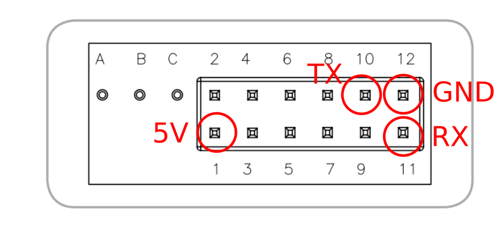

T6613/15 CO2 Sensors
==================================

.. seo::
    :description: Instructions for setting up T6613 and T6615 sensors for ESPHome
    :image: t6615.jpg
    :keywords: t6613 t6615

The ``t6615`` sensor platform allows you to use T6613 and T6615 family sensors
(`amphenol`_) with ESPHome. T6613 sensors are unreferenced and require ABC to
calibrate daily, while the T6615 sensors have a sealed reference gas and
do not require ABC calibration. All ppm ranges are supported by this platform.

.. figure:: images/t6615.png
    :align: center
    :width: 50.0%

    T6615 CO_2 Sensor.

.. _amphenol: https://amphenol-sensors.com/en/telaire/co2/525-co2-sensor-modules/319-t6615

As the communication is done using UART, you need to have an :ref:`UART bus <uart>` in your configuration with the
``rx_pin`` connected to the TX pin of the device (pin 10) and the ``tx_pin`` connected to the RX Pin of the device (pin
11). The baud rate should be set to 19200.

Additionally, the T6613/15 sensors require 5V power, while most ESP platforms only output 3.3V from their onboard
regulator, so you may need some additional components to power up the sensor.

.. code-block:: yaml

    # Example configuration entry
    sensor:
      - platform: t6615
        co2:
          name: CO2

Configuration variables:
------------------------

- **co2** (**Required**): The CO_2 data from the sensor in parts per million (ppm).
  All options from :ref:`Sensor <config-sensor>`.

- **update_interval** (*Optional*, :ref:`config-time`): The interval to check the
  sensor. Defaults to ``60s``.

- **uart_id** (*Optional*, :ref:`config-id`): Manually specify the ID of the :ref:`UART Component <uart>` if you want
  to use multiple UART buses.

- **id** (*Optional*, :ref:`config-id`): Manually specify the ID used for actions.

    Pins on the T6615. Only the ones marked with a red circle need to be connected.

See Also
--------

- :ref:`sensor-filters`
- `UART Protocol Documentation <https://amphenol-sensors.com/en/component/edocman/561-telaire-co2-sensors-uart-communications-protocol/download?Itemid=8486%20%27>`__
- :apiref:`t6615/t6615.h`
- :ghedit:`Edit`
