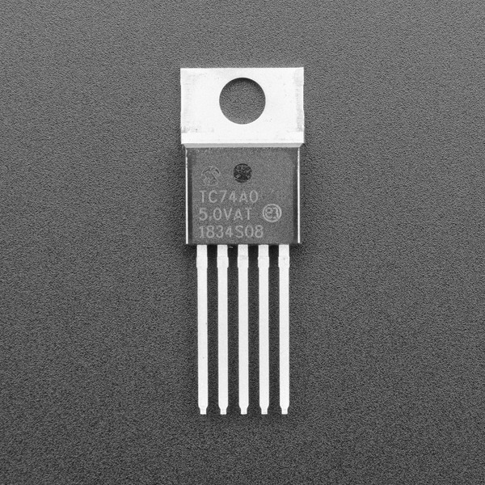

TC74 Temperature Sensor
=======================

.. seo::
    :description: Instructions for setting up the TC74 temperature sensors.
    :image: tc74.jpg
    :keywords: TC74

The TC74 sensor platform allows you to use your TC74 (`datasheet
<https://ww1.microchip.com/downloads/en/DeviceDoc/21462D.pdf>`__, `Adafruit
<https://www.adafruit.com/product/4375>`__) temperature sensors with ESPHome.
The :ref:`I²C Bus <i2c>` is required to be set up in your configuration for this
sensor to work.

    TC74 Temperature Sensor.

.. code-block:: yaml

    # Example configuration entry
    sensor:
      - platform: tc74
        name: "Living Room Temperature"

Configuration variables:
------------------------

- **update_interval** (*Optional*, :ref:`config-time`): The interval to check
  the sensor. Defaults to ``60s``.
- **address** (*Optional*, int): The I²C address of the sensor. Defaults to
  ``0x48``, the address of the TC74A0. For suffixes other than ``A0`` add the
  final digit to ``0x48`` to calculate the address. For example, the TC74A5 has
  I²C address ``0x4D``.
- All other options from :ref:`Sensor <config-sensor>`.

See Also
--------

- :ref:`sensor-filters`
- :doc:`dht`
- :doc:`dht12`
- :doc:`hdc1080`
- :doc:`sht3xd`
- :doc:`htu21d`
- :doc:`tmp102`
- :apiref:`tc74/tc74.h`
- :ghedit:`Edit`
