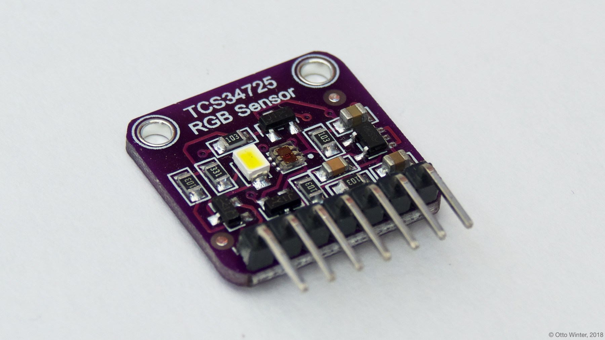

TCS34725 RGB Color Sensor
=========================

.. seo::
    :description: Instructions for setting up TCS34725 RGB color sensors.
    :image: tcs34725.jpg
    :keywords: tcs34725

The ``tcs34725`` sensor platform allows you to use your TCS34725 RGB color sensors
(`datasheet <https://cdn-shop.adafruit.com/datasheets/TCS34725.pdf>`__,
`Adafruit`_), color temperature and illuminance sensors with ESPHome. The :ref:`I²C <i2c>` is
required to be set up in your configuration for this sensor to work.

Note: If the `integration_time` is set too long for the light conditions, the sensor will overexpose.
In this case the sensor may not show 100% on its clear channel. With an `integration_time` of `614ms`
and a `gain` of `1x` the sensor will max out at around 4100 lx. In this case the individual color
channels will show `100%`, the clear channel `25%`. The illumination in lux is shown as `0` as well
as the color temperature in kelvin will show `0`.

    TCS34725 RGB Color Sensor

.. _Adafruit: https://www.adafruit.com/product/1334

.. figure:: images/tcs34725-ui.png
    :align: center
    :width: 80.0%

.. code-block:: yaml

    # Example configuration entry
    sensor:
      - platform: tcs34725
        red_channel:
          name: "TCS34725 Red Channel"
        green_channel:
          name: "TCS34725 Green Channel"
        blue_channel:
          name: "TCS34725 Blue Channel"
        clear_channel:
          name: "TCS34725 Clear Channel"
        illuminance:
          name: "TCS34725 Illuminance"
        color_temperature:
          name: "TCS34725 Color Temperature"
        glass_attenuation_factor: 1.0
        address: 0x29
        update_interval: 60s

Configuration variables:
------------------------

- **red_channel** (*Optional*): Value of the red color channel relative to the clear channel, as a percentage.
  All options from :ref:`Sensor <config-sensor>`.
- **green_channel** (*Optional*): Value of the green color channel relative to the clear channel, as a percentage.
  All options from :ref:`Sensor <config-sensor>`.
- **blue_channel** (*Optional*): Value of the blue color channel relative to the clear channel, as a percentage.
  All options from :ref:`Sensor <config-sensor>`.
- **clear_channel** (*Optional*): Value of the clear (without a color filter) channel, relative to the maximum value for
  the chosen integration time. All options from :ref:`Sensor <config-sensor>`.
- **illuminance** (*Optional*): Get the total illuminance of the sensor in lx.
- **color_temperature** (*Optional*): Get the calculated color temperature of the light in Kelvin.
- **gain** (*Optional*): Set the gain for the internal ADCs to work better in certain low-light conditions. Valid
  values are ``1x`` (default), ``4x``, ``16x``, ``60x`` (highest gain). Will be overwritten if auto integration time 
  is used
- **integration_time** (*Optional*): The amount of time the light sensor is exposed. Valid values are
  ``auto`` (default), ``2.4ms``, ``24ms``, ``50ms``, ``101ms``, ``120ms``, ``154ms``, ``180ms``, ``199ms``, 
  ``240ms``, ``300ms``, ``360ms``, ``401ms``, ``420ms``, ``480ms``, ``499ms``, ``540ms``, ``600ms``, ``614ms``.
- **glass_attenuation_factor** (*Optional*): The attenuation factor of glass if it's behind some glass facia. 
  Default is ``1.0`` means ``100%`` transmissivity. ``2`` means ``50%`` transmissivity etc.
- **address** (*Optional*, int): Manually specify the I²C address of the sensor. Defaults to ``0x29``.
- **update_interval** (*Optional*, :ref:`config-time`): The interval to check the
  sensor. Defaults to ``60s``.

For many applications, you can use AUTO timing or leave integration time empty to have the ESP select a suitable gain 
setting based on the previous measurement. If light levels change dramatically this may cause the next reading to saturate,
after which the gain will adjust down and subsequent readings will be in range.
If auto is used in a dynamic environment an update rate of 1 second is best. Filters can be used to throttle the output and 
prevent updates of marginal changes like:

.. code-block:: yaml

    illuminance:
    name: "TCS34725 Illuminance"
    filters:
      - or:
          - delta: 50
          - throttle: 60sec  

When using integration times lower than 154ms the accuracy of the sensor drops with no further gain in possible light 
accumulation. Use faster timings only if fast readout is necessary with stable light conditions recommended.

See Also
--------

- :ref:`sensor-filters`
- `TCS34725 library <https://github.com/adafruit/Adafruit_TCS34725>`__ by `Adafruit <https://www.adafruit.com/>`__
- :apiref:`tcs34725/tcs34725.h`
- :ghedit:`Edit`
