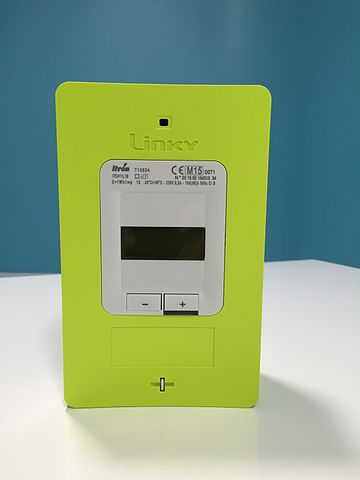
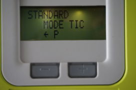
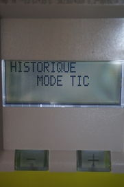

Teleinformation from Linky electrical counter.
==============================================

.. seo::
    :description: Instructions for setting up French Teleinformation
    :image: teleinfo.jpg
    :keywords: teleinfo

Component/Hub
-------------

The ``teleinfo`` component allows you to retrieve data from a
French electrical counter using Teleinformation (`datasheet <https://www.enedis.fr/sites/default/files/Enedis-NOI-CPT_54E.pdf>`__). It works with Linky electrical
counter but also legacy EDF electrical counter.

    Linky electrical counter

..

A simple electronic assembly with an optocoupler and a resistor could
let you retrieve detailed power consumption or power production.
There is plenty of example on the web.

As the communication with the Teleinformation is done using UART, you need to
have an :ref:`UART bus <uart>` in your configuration with the ``rx_pin``
connected to the output of the optocoupler component. Additionally, you need to
set the baud rate to 9600bps if counter is configured to work in standard
mode or 1200bps in historical mode.  To find out which mode you are using,
simply press -/+ buttons on the counter and look for `Standard mode` or
`Historical mode` as below.

    Linky electrical counter configured in standard mode.

..

    Linky electrical counter configured in historical mode.

..

.. code-block:: yaml

    # Example configuration entry
    uart:
      id: uart_bus
      rx_pin: GPIO3
      tx_pin: GPIO1
      baud_rate: 1200
      parity: EVEN
      data_bits: 7

    teleinfo:
      id: myteleinfo
      update_interval: 60s
      historical_mode: true

    sensor:
      - platform: teleinfo
        tag_name: "HCHC"
        name: "hchc"
        unit_of_measurement: "Wh"
        icon: mdi:flash
        teleinfo_id: myteleinfo
      - platform: teleinfo
        tag_name: "HCHP"
        name: "hchp"
        unit_of_measurement: "Wh"
        icon: mdi:flash
        teleinfo_id: myteleinfo
      - platform: teleinfo
        tag_name: "PAPP"
        name: "papp"
        unit_of_measurement: "VA"
        icon: mdi:flash
        teleinfo_id: myteleinfo

    text_sensor:
      - platform: teleinfo
        tag_name: "OPTARIF"
        name: "optarif"
        teleinfo_id: myteleinfo

Configuration variables:
------------------------

In teleinfo platform:

- **historical_mode** (*Optional*): Whether to use historical mode or standard mode.
  With historical mode, baudrate of 1200 must be used whereas 9600 must be used in
  standard mode. Defaults to ``false``.

- **update_interval** (*Optional*, :ref:`config-time`): The interval to check the
  sensor. Defaults to ``60s``.

- **uart_id** (*Optional*, :ref:`config-id`): Manually specify the ID of the :ref:`UART Component <uart>` if you want
  to use multiple UART buses.

Sensor
******

- **tag_name** (**Required**, string): Specify the tag you want to retrieve from the Teleinformation.
- **id** (*Optional*, :ref:`config-id`): Manually specify the ID used for code generation.
- All other options from :ref:`Sensor <config-sensor>`.

Text Sensor
***********

- **tag_name** (**Required**, string): Specify the tag you want to retrieve from the Teleinformation.
- **id** (*Optional*, :ref:`config-id`): Manually specify the ID used for code generation.
- All other options from :ref:`Text Sensor <config-text_sensor>`.

See Also
--------

- :ghsources:`esphome/components/teleinfo`
- :ghedit:`Edit`
