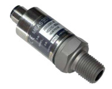

TE-M3200 Pressure Sensor
===========================================

.. seo::
    :description: Instructions for setting up TE-M3200 pressure sensors with ESPHome
    :image: tem3200.jpg
    :keywords: TEM3200 TE-M3200

The ``tem3200`` sensor platform allows you to use your TE-M3200 (`datasheet <https://www.te.com/commerce/DocumentDelivery/DDEController?Action=showdoc&DocId=Data+Sheet%7FM3200%7FA20%7Fpdf%7FEnglish%7FENG_DS_M3200_A20.pdf>`__,
`product page <https://www.te.com/en/product-CAT-PTT0068.html>`__) pressure sensors with ESPHome. 

    TE-M3200 Pressure Sensor.

Configuration
-------------
:ref:`I²C <i2c>` bus is required to be set up in your configuration for this sensor to work.

.. code-block:: yaml

    # Example configuration entry
    i2c:
                
    sensor:
      - platform: tem3200
        pressure:
          name: "Raw Pressure"
          id: pressure_raw
          
        temperature:
          name: Temperature

      - platform: copy
        source_id: pressure_raw
        name: Pressure
        state_class: measurement
        device_class: pressure
        unit_of_measurement: psi

        filters:
          - calibrate_linear:
            - 1000 -> 0.0
            - 15000 -> 100.0

Configuration variables
-----------------------

- **i2c_id** (*Optional*, :ref:`config-id`): Manually specify the ID of the :ref:`I²C Component <i2c>`. Defaults to the default I²C bus. 
- **address** (*Optional*, int): Manually specify the I²C address of  the sensor. Defaults to ``0x28``. 
- **pressure** (*Optional*): The information for the pressure sensor.

 - All other options from :ref:`Sensor <config-sensor>`.

- **temperature** (*Optional*): The information for the temperature sensor.

 - All other options from :ref:`Sensor <config-sensor>`.

Converting units
-----------------

The TE-M3200 is not calibrated to units, you have to convert the measurement to units yourself.

Estimated
*********

On page 6 of the `datasheet <https://www.te.com/commerce/DocumentDelivery/DDEController?Action=showdoc&DocId=Data+Sheet%7FM3200%7FA20%7Fpdf%7FEnglish%7FENG_DS_M3200_A20.pdf>`__
the value ``1000`` maps to approximately ``0%`` of the maximum value of the sensor (e.g. ``0``  psi for a ``100`` psi sensor);
the value ``8000`` maps to approximately ``50%`` of the maximum value of the sensor (e.g. ``50`` psi for a ``100`` psi sensor);
the value ``15000`` maps to approximately ``100%`` of the maximum value of the sensor (e.g. ``100``  psi for the ``100`` psi sensor).
Use ``calibrate_linear`` filter to map these sensor values:

.. code-block:: yaml

        # Extract of configuration
        filters:
          - calibrate_linear:
            - 1000 -> 0.0
            - 8000 -> 50.0
            - 15000 -> 100.0

Calibrated
**********
1. Expose the sensor to a low known pressure, for example ``0`` psi.
2. Observe the value of the raw pressure sensor, for example ``990``.
3. Expose the sensor to a high pressure, for example ``90`` psi.
4. Observe the value of the raw pressure sensor, for example ``13550``.
5. Use ``calibrate_linear`` filter to map the incoming value to the calibrated one:

.. code-block:: yaml

        # Extract of configuration
        filters:
          - calibrate_linear:
            - 990 -> 0
            - 13550 -> 90.0

See Also
--------

- :ref:`sensor-filters`
- `TE-M3200 Product Page <https://www.te.com/en/product-CAT-PTT0068.html>`__
- `TE-M3200 Datasheet <https://www.te.com/commerce/DocumentDelivery/DDEController?Action=showdoc&DocId=Data+Sheet%7FM3200%7FA20%7Fpdf%7FEnglish%7FENG_DS_M3200_A20.pdf>`__
- :ghedit:`Edit`
