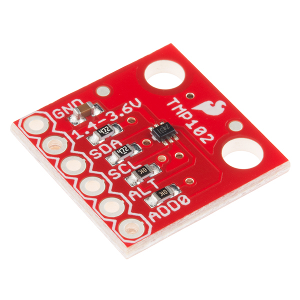

TMP102 Temperature Sensor
=========================

.. seo::
    :description: Instructions for setting up TMP102 temperature sensors.
    :image: tmp102.jpg
    :keywords: TMP102

The TMP102 Temperature sensor allows you to use your TMP102
(`Sparkfun <https://www.sparkfun.com/products/13314>`__) sensors with
ESPHome. The :ref:`I²C Bus <i2c>` is required to be set up in your
configuration for this sensor to work.

    TMP102 Temperature Sensor.

.. figure:: images/temperature.png
    :align: center
    :width: 80.0%

.. code-block:: yaml

    # Example configuration entry
    sensor:
      - platform: tmp102
        name: "Living Room Temperature"
        update_interval: 60s

Configuration variables:
------------------------

- **name** (**Required**, string): The name for the temperature sensor.
- **update_interval** (*Optional*, :ref:`config-time`): The interval to check the sensor. Defaults to ``60s``.
- **address** (*Optional*, int): The I²C address of the sensor. Defaults to ``0x48``.
  See :ref:`I²C Addresses <tmp117_i2c_addresses>` for more information.
- **id** (*Optional*, :ref:`config-id`): Set the ID of this sensor for use in lambdas.
- All other options from :ref:`Sensor <config-sensor>`.

See Also
--------

- :ref:`sensor-filters`
- :doc:`dht`
- :doc:`dht12`
- :doc:`hdc1080`
- :doc:`sht3xd`
- :doc:`htu21d`
- :apiref:`tmp102/tmp102.h`
- :ghedit:`Edit`
