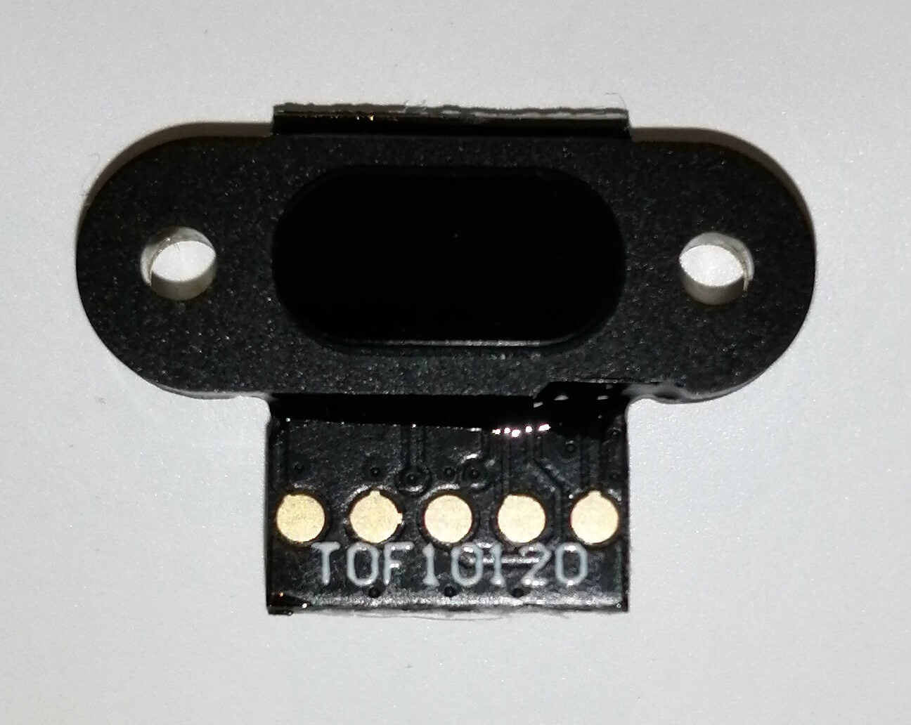

TOF10120 Time Of Flight Distance Sensor
=======================================

.. seo::
    :description: Instructions for setting up TOF10120 distance sensors in ESPHome.
    :image: tof10120.jpg
    :keywords: TOF10120

The ``tof10120`` sensor platform allows you to use TOF10120 optical time of flight sensor (`datasheet <https://github.com/simpleiot/reference/blob/master/sensors/TOF10120_english.pdf>`__)
with ESPHome to measure distances. The sensor works optically by emitting short infrared pulses
and measuring the time it takes the light to be reflected back.

The sensor can measure distances in range 10-180 centimeters, though that figure depends significantly
on several conditions like surface reflectance, field of view, temperature etc. .

The :ref:`I²C Bus <i2c>` is
required to be set up in your configuration for this sensor to work.

    TOF10120 Time Of Flight Distance Sensor.

.. code-block:: yaml

    # Example configuration entry
    sensor:
      - platform: tof10120
        name: "TOF10120 Distance"
        update_interval: 5s

Configuration variables:
------------------------

- **name** (**Required**, string): The name of the sensor.
- **update_interval** (*Optional*, :ref:`config-time`): The interval to check the
  sensor. Defaults to ``60s``.
- **address** (*Optional*, int): Manually specify the I^2C address of the sensor. Defaults to ``0x52``.
- **id** (*Optional*, :ref:`config-id`): Manually specify the ID used for code generation.
- All other options from :ref:`Sensor <config-sensor>`.

See Also
--------

- :ref:`sensor-filters`
- :apiref:`tof10120/tof10120_sensor.h`
- :ghedit:`Edit`
