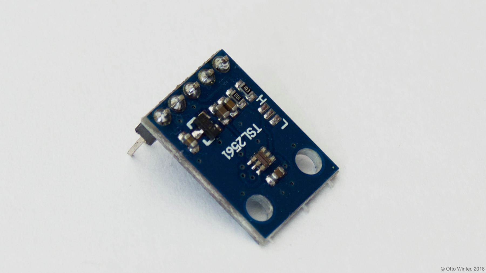

TSL2561 Ambient Light Sensor
============================

.. seo::
    :description: Instructions for setting up TSL2561 ambient light sensors in ESPHome.
    :image: tsl2561.jpg
    :keywords: TSL2561

The ``tsl2561`` sensor platform allows you to use your TSL2561
(`datasheet <https://cdn-shop.adafruit.com/datasheets/TSL2561.pdf>`__,
`Adafruit`_)
ambient light sensor with ESPHome. The :ref:`I²C <i2c>` is required to be set up in
your configuration for this sensor to work.

    TSL2561 Ambient Light Sensor.

.. _Adafruit: https://www.adafruit.com/product/439

.. figure:: images/tsl2561-ui.png
    :align: center
    :width: 80.0%

.. code-block:: yaml

    # Example configuration entry
    sensor:
      - platform: tsl2561
        name: "TSL2561 Ambient Light"
        address: 0x39
        update_interval: 60s

Configuration variables:
------------------------

- **name** (**Required**, string): The name for the sensor.
- **address** (*Optional*, int): Manually specify the I²C address of the sensor. Defaults to ``0x39``.
- **integration_time** (*Optional*, :ref:`config-time`):
  The time the sensor will take for each measurement. Longer means more accurate values. One of
  ``14ms``, ``101ms``, ``402ms``. Defaults to ``402ms``.
- **gain** (*Optional*, string): The gain of the sensor. Higher values are better in low-light conditions.
  One of ``1x`` and ``16x``. Defaults to ``1x``.
- **is_cs_package** (*Optional*, boolean): The "CS" package of this sensor has a slightly different
  formula for calculating the illuminance in lx. Set this to ``true`` if you're working with a CS
  package. Defaults to ``false``.
- **update_interval** (*Optional*, :ref:`config-time`): The interval to check the
  sensor. Defaults to ``60s``.
- **id** (*Optional*, :ref:`config-id`): Manually specify the ID used for code generation.
- All other options from :ref:`Sensor <config-sensor>`.

See Also
--------

- :ref:`sensor-filters`
- :doc:`bh1750`
- :doc:`adc`
- `SparkFun TSL2561 Arduino Library <https://github.com/sparkfun/SparkFun_TSL2561_Arduino_Library>`__ by `SparkFun <https://sparkfun.com/>`__
- :apiref:`tsl2561/tsl2561.h`
- :ghedit:`Edit`
