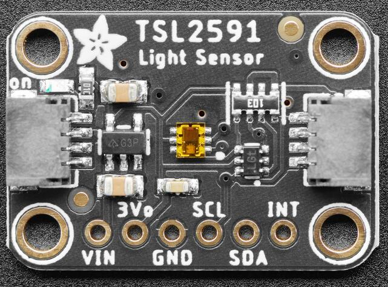
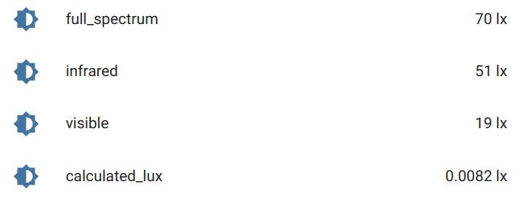

TSL2591 Ambient Light Sensor
============================

.. seo::
    :description: Instructions for setting up TSL2591 ambient light sensors in ESPHome.
    :image: tsl2591.jpg
    :keywords: TSL2591

The ``tsl2591`` sensor platform allows you to use the AMS TSL2591 ambient light sensor with ESPHome.
Communication with the device is over :ref:`I²C <i2c>`, which must be present in your configuration.

The TSL2591 device is available on breakout boards from a few vendors
(for example, `Adafruit`_, `CQRobot`_, `Waveshare`_).

.. _Adafruit: http://www.adafruit.com/products/1980
.. _CQRobot: https://www.cqrobot.com/index.php?route=product/product&product_id=1112
.. _Waveshare: https://www.waveshare.net/shop/TSL25911-Light-Sensor.htm

    TSL2591 Ambient Light Sensor on a breakout board.

    TSL2591 sensors in Home Assistant UI.

The sensor claims a dynamic range of 600 million to 1 with an effective maximum of 88000 lux.
It achieves that large range by having a configurable ``gain`` value.
For many applications, you can use AUTO gain to have the ESP select a suitable gain setting based on
the previous measurement. If light levels change dramatically this may cause the next reading to saturate,
after which the gain will adjust down and subsequent readings will be in range.
Use a higher gain value when measuring less intense light sources.
On the other hand, if you get ADC readings of 65,535 for either physical sensor,
you may be saturating that sensor and need to reduce the gain.
This Wikipedia `article <https://en.wikipedia.org/wiki/Lux>`__ has a table of some lux values for comparison.

The implementation offers four sensors.
Only one of them, ``calculated_lux``, is a true ``lux`` value, and even that is a bit subjective.
(For information about the difference between radiometric and photometric measurements, see the references.)
The other sensors are unitless readings from the device's on-board ADCs for the physical sensors.
The two physical sensors measure "visible and infrared" (channel 0) and "infrared" (channel 1), respectively.
However, the sensor readings here also provide the simple "visible" value separately.
The visible value is obtained by subtracting the reading of the physical infrared sensor
(channel 1) from the value of the physical sensor that combines visible and infrared (channel 0).
Since those are two different physical infrared sensor readings, there is the possibility of a small inaccuracy.

- **full_spectrum**: Raw 16 bit reading from the on-board ADC for the physical sensor for visible and infrared light (channel 0).
- **infrared**: Raw 16 bit reading from the on-board ADC for the physical sensor for infrared light (channel 1).
- **visible**: For convenience, a value calculated by taking the difference between the two physical sensors (channel 0 minus channel 1).
- **calculated_lux**: This is a calculated value for lux based on the readings of the
  physical sensors, the configured gain, and the configured integration time.
  For details of the actual calculation, which can depend on additional physical properties,
  see method ``get_calculated_lux()`` in the API reference.
  There are configuration items for the device factor and the glass attenuation factor that go into the lux equation.
  If you are not happy with that built-in calculation, you have the raw data you need to do your own.
  The manufacturer, AMS, has a few application notes that discuss this topic.
  See the references.
- **actual_gain**: The actual gain value being used for values reported. Updates whenever ``gain`` is changed,
  which is especially useful when the sensor is set to ``gain: auto`` to help denote relative brightness when
  extreme changes in brightness are encountered.

Values reported are said to be in units of ``lux``, but there are some things to understand about that.

- The gain multiplier values that can be configured are only approximations.
  The sensor will use something close to it, but the exact value can vary from device to device.
  There is no way to ask the device what precise gain value it is using.
  See the TSL2591 datasheet for the specific device characteristic ranges.
- The measurement of any lux value requires careful calibration for the light frequency
  or frequencies under measurement, conversion coefficients for the specific device, and other factors.
  In short, to really get a true lux value measurement, you should do a laboratory-grade calibration specific to your use case.
  If you are the sort of person who can do a laboratory-grade calibration, you probably knew all of that already.
- Even considering the above points, you can still get values that will be "in the ballpark" without calibration.
  This is especially true if you just want to distinguish among "no light", "a little bit of light",
  "a lot of light", or something similar.

.. code-block:: yaml

    # Example configuration entry
    i2c:
      # ...
    sensor:
      - platform: tsl2591
        name: "This little light of mine"
        id: "my_tls2591"
        address: 0x29
        update_interval: 60s
        gain: auto
        device_factor: 53
        glass_attenuation_factor: 14.4
        visible:
          name: "TSL2591 visible light"
        infrared:
          name: "TSL2591 infrared light"
        full_spectrum:
          name: "TSL2591 full spectrum light"
        calculated_lux:
          id: i_lux
          name: "TSL2591 Lux"
        actual_gain:
          id: "actual_gain"
          name: "TSL2591 actual gain"

Configuration variables:
------------------------
For the TSL2591 device:

- **id** (*Optional*, :ref:`config-id`): Manually specify the ID used for code generation.
- **name** (*Optional*, string): A user-friendly name for this TSL2591 device.
- **address** (*Optional*, int): Manually specify the I²C address of the device.
  Defaults to ``0x29``.
  It is not possible to change this for this device without additional hardware.
  It also automatically uses a secondary address of ``0x28`` (see the datasheet),
  making that address unavailable for other devices on the same I²C bus.
- **integration_time** (*Optional*, :ref:`config-time`):
  The time the device will use for each measurement. Longer means more accurate values.
  You cannot specify an arbitrary amount of time. It must be the equivalent of one of:

  - ``100ms``   *(default)*
  - ``200ms``
  - ``300ms``
  - ``400ms``
  - ``500ms``
  - ``600ms``

- **gain** (*Optional*, string): The gain the device will use. Higher values are better in low-light conditions.
  Multipliers here are approximate. Values below on the same line are aliases.
  You cannot specify an arbitrary gain multiplier. It must be one of:

  - ``low``, ``1x``
  - ``medium``, ``med``, ``25x``
  - ``high``, ``400x``
  - ``maximum``, ``max``, ``9500x``
  - ``auto`` *(default)*

- **update_interval** (*Optional*, :ref:`config-time`): The interval for checking the sensors.
  Defaults to ``60s``.
- **power_save_mode** (*Optional*, boolean): Should the device be powered down between update intervals?
  Defaults to ``True``.
- **device_factor** (*Optional*, float): The default is ``53.0``.
  The device factor to be used as part of the lux equation for ``calculated_lux``.
- **glass_attenuation_factor** (*Optional*, float): The default is ``7.7``.
  The glass attenuation factor to be used as part of the lux equation for ``calculated_lux``.

- All other options for I²C devices described at :ref:`I²C Bus <i2c>`.

You can configure all or any subset of the sensors described earlier.
Each configured sensor is reported separately on each ``update_interval``.

- **full_spectrum** (*Optional*): The reading for the full spectrum sensor.

  - **name** (**Required**, string): The name for the sensor.
  - All other options from :ref:`Sensor <config-sensor>`.

- **infrared** (*Optional*): The reading for the infrared sensor.

  - **name** (**Required**, string): The name for the sensor.
  - All other options from :ref:`Sensor <config-sensor>`.

- **visible** (*Optional*): The reading for visible light.

  - **name** (**Required**, string): The name for the sensor.
  - All other options from :ref:`Sensor <config-sensor>`.

- **calculated_lux** (*Optional*): The value of the calculated lux.

  - **name** (**Required**, string): The name for the sensor.
  - All other options from :ref:`Sensor <config-sensor>`.

- **actual_gain** (*Optional*): The value of gain used for reported values. Particularly useful when gain is set to "auto".

  - **name** (**Required**, string): The name for the sensor.
  - All other options from :ref:`Sensor <config-sensor>`.

Power save mode
...............
Sensor readings are only taken when the device indicates that the ADC values are valid.
If the device is powered down between readings,
there is a delay for the ADC to go through an integration cycle before a reliable reading is available.
The delay is appoximately the configured integration time.
The implementation uses asynchronous delays to wait for the ADC readings to become available.
This avoids slowing down the overall ESPHome update loop,
but it means that the publishing of state updates for the TSL2591 might come slightly later.

If you use the TSL2591 API to change the gain or integration time value,
the device is internally disabled and re-enabled.
Otherwise, the next set of ADC readings would be unreliable
because the current ADC integration cycle will have been done with mixed gain values.
(The ADCs are not automatically "aware" that the gain or integration time was changed.)
Even if power save mode is not enabled, there can be the same sort of slight
delay for the first sensor reading after the change if it happens to come at an unlucky time.

Since the delays are only a fraction of a second (a maximum of 600-700 ms)
and update intervals are typically many seconds,
the delays are not generally very interesting.
To see if delays are occurring, you can turn on debug logging.

See Also
--------

- :ref:`sensor-filters`
- `AMS TSL2591 document library <https://ams.com/tsl25911#tab/documents>`__
- `AMS TSL2591 datasheet <https://ams.com/documents/20143/36005/TSL2591_DS000338_6-00.pdf>`__
- AMS Application Note, `Developing a Custom Lux Equation <https://ams.com/documents/20143/36005/AmbientLightSensors_AN000173_2-00.pdf>`__
- `Radiometric vs. Photometric Units <https://www.thorlabs.de/catalogPages/506.pdf>`__
- `Adafruit TSL2591 Arduino Library <https://github.com/adafruit/Adafruit_TSL2591_Library>`__ by `Adafruit <https://adafruit.com/>`__ *(for comparison only)*
- `Waveshare TSL2591 Libraries <https://github.com/waveshare/TSL2591X-Light-Sensor>`__ by `Waveshare Electronics <https://www.waveshare.net/>`__ *(for comparison only)*
- :doc:`tsl2561`
- :doc:`bh1750`
- `The Water Watcher (a DIY project using a TSL2591) <https://hackaday.io/project/176690-the-water-watcher>`__
- :apiref:`tsl2591/tsl2591.h`
- :ghedit:`Edit`
