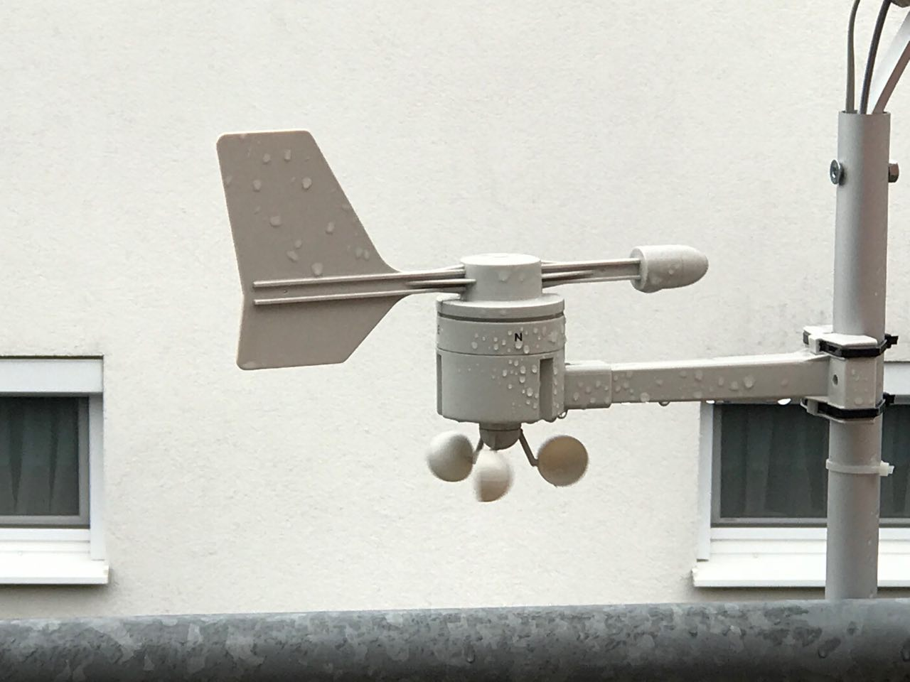

TX20/TX23 Wind Speed/Direction Sensor
=====================================

.. seo::
    :description: Instructions for setting up TX20/TX23 wind speed and direction sensors
    :image: tx20.jpg
    :keywords: TX20

The ``tx20`` sensor platform allows you to use your TX20/TX23
(`Amazon`_,
`lacrosse_tx23`_)
wind direction and speed sensors with ESPHome.
The only required pin is the black or brown cable (which is used to transmit data.)
The red cable should be connected to VCC (3.3V), green initiates the data transfer when connected to GND
and should therefore be directly connected to GND and the yellow cable should be always connected to ground.
The difference from the TX20 to the TX23 seems to be that the green cable does not matter any more and the
wind sensor is just sending a datagram every 2 seconds - pretty much the same as when the green cable was
connected to GND in the TX20.

    TX20 / TX23 Wind Speed / Direction.

.. _Amazon: https://www.amazon.de/Technoline-Tx-20/dp/B01HXZ3KLA
.. _lacrosse_tx23: https://www.lacrossetechnology.com/tx23-wind-sensor

.. code-block:: yaml

    # Example configuration entry
    sensor:
      - platform: tx20
        wind_speed:
          name: Wind speed
        wind_direction_degrees:
          name: Wind direction degrees
        pin:
          number: GPIOXX

Configuration variables:
------------------------

- **wind_speed** (**Required**): The information for the wind speed sensor.
  All options from :ref:`Sensor <config-sensor>`.

- **wind_direction_degrees** (**Required**): The information for the direction
  in degrees sensor.
  All options from :ref:`Sensor <config-sensor>`.

- **pin** (**Required**, :ref:`config-pin`): The pin, where the black or brown
  cable are connected.

.. note::

    In order to create a text sensor to show the textual representation of the wind direction
    the following config can be used. "tx20_id" needs to be replaced with the id of the TX20 sensor (**not** with the id of the subsensors).

    .. code-block:: yaml

        text_sensor:
        - platform: template
          name: "Textual Representation Wind Direction"
          lambda: |-
            return {id(tx20_id).get_wind_cardinal_direction()};
          update_interval: 2s

See Also
--------

- :ref:`sensor-filters`
- :apiref:`tx20/tx20.h`
- `Amazon Tx20 <https://www.amazon.de/Technoline-Tx-20/dp/B01HXZ3KLA>`__
- `La Crosse Tx23 <https://www.lacrossetechnology.com/tx23-wind-sensor>`__
- `Datagram Tx20 <http://www.sdpro.eu/jm/images/allegati/TX20_Documentazione.pdf>`__
- `Datagram Tx23 <https://www.lacrossetechnology.com/tx23-wind-sensor>`__-
- :ghedit:`Edit`
