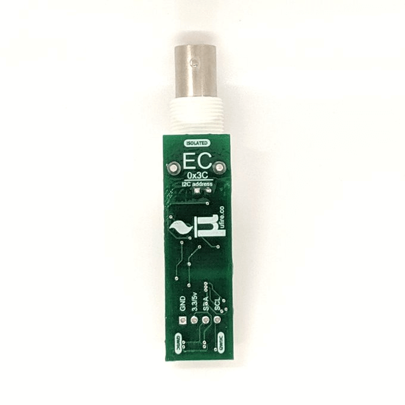

uFire Isolated EC sensor
========================

.. seo::
    :description: Instructions for setting up uFire Isolated EC sensor in esphome
    :image: ufire_ec.png
    :keywords: ufire ec sensor temperature esphome

The ``ufire_ec`` sensor platform allows you to use your uFire Isolated EC sensor
with ESPHome. The :ref:`I²C Bus <i2c>` is required to be set up in your
configuration for this sensor to work. It requires also to have a temperature
sensor in the liquid tank; this can be on the same board or an external sensor
linked to the uFire EC configuration.

.. code-block:: yaml

    # Example configuration entry
    sensor:
      - platform: ufire_ec
        id: ufire_ec_board
        temperature:
          id: temperature_liquit
          name: Temperature
        ec:
          name: EC

Configuration variables:
------------------------

- **address** (*Optional*, int): Specify the I²C address of the sensor. Defaults to ``0x3C``.
- **update_interval** (*Optional*, :ref:`config-time`): The interval to check the
  sensor. Defaults to ``60s``.
- **id** (*Optional*, :ref:`config-id`): Set the ID of this sensor for use in lambdas.
- **temperature_sensor** (*Optional*, :ref:`config-id`): Set the ID of the temperature
  sensor. Only needed if the onboard temperature sensor is not used.
- **ec** (*Optional*, :ref:`Sensor <config-sensor>`): Set the EC sensor configuration. All options from :ref:`Sensor <config-sensor>`.
- **temperature** (*Optional*, :ref:`Sensor <config-sensor>`): Set the onboard temperature sensor configuration. All options from :ref:`Sensor <config-sensor>`.
- **temperature_compensation** (*Optional*, float): Set the temperature compensation for the EC
  sensor. Defaults to ``21.0``.
- **temperature_coefficient** (*Optional*, float): Set the temperature coefficient for the EC
  sensor. Defaults to ``0.019``.

.. _sensor-ufire_ec-calibrate_probe_action:

``ufire_ec.calibrate_probe`` Action
-----------------------------------

The EC probe have to be calibrated. For this you need know the EC reference value and temperature
of the calibration solution.

.. code-block:: yaml

    # Example configuration entry
    sensor:
      - platform: ufire_ec
        id: ufire_ec_board
        # ...

    # in some trigger
    on_...:
      - sensor.ufire_ec_board.calibrate_probe:
          id: ufire_ec_board
          solution: 0.146
          temperature: !lambda "return id(temperature_liquit).state;"

Configuration options:

- **id** (**Required**, :ref:`config-id`): The ID of the ufire EC sensor.
- **solution** (**Required**, float): Solution reference EC value.
- **temperature** (**Required**, float): Solution current temperature.

.. _sensor-ufire_ec-reset_action:

``ufire_ec.reset`` Action
-------------------------

Reset the current calibration on the sensor.

.. code-block:: yaml

    # Example configuration entry
    sensor:
      - platform: ufire_ec
        id: ufire_ec_board
        # ...

    # in some trigger
    on_...:
      - sensor.ufire_ec_board.reset:
          id: ufire_ec_board

Configuration options:

- **id** (**Required**, :ref:`config-id`): The ID of the ufire EC sensor.

See Also
--------

- :ref:`sensor-filters`
- :apiref:`ufire_ec/ufire_ec.h`
- :ghedit:`Edit`
