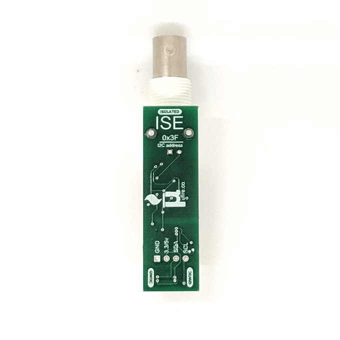

uFire ISE pH sensor
===================

.. seo::
    :description: Instructions for setting up uFire ISE pH sensor in esphome
    :image: ufire_ise.png
    :keywords: ufire ph sensor temperature esphome

The ``ufire_ise`` sensor platform allows you to use your uFire ISE pH sensor with
ESPHome. The :ref:`I²C Bus <i2c>` is
required to be set up in your configuration for this sensor to work.
It required also to have an temperature sensor in the liquid tank; this can
be on the same board or external sensor linked to the uFire ISE pH configuration.

.. code-block:: yaml

    # Example configuration entry
    sensor:
      - platform: ufire_ise
        id: ufire_ise_board
        temperature:
          id: temperature_liquid
          name: Temperature
        ph:
          name: pH

Configuration variables:
------------------------

- **address** (*Optional*, int): Specify the I²C address of the sensor. Defaults to ``0x3f``.
- **update_interval** (*Optional*, :ref:`config-time`): The interval to check the
  sensor. Defaults to ``60s``.
- **id** (*Optional*, :ref:`config-id`): Set the ID of this sensor for use in lambdas.
- **temperature_sensor** (*Optional*, :ref:`config-id`): Set the ID of the temperature
  sensor. Only needed if the onboard temperature sensor is not used.
- **ph** (*Optional*, :ref:`Sensor <config-sensor>`): Set the pH sensor configuration. All options from :ref:`Sensor <config-sensor>`.
- **temperature** (*Optional*, :ref:`Sensor <config-sensor>`): Set the onboard temperature sensor configuration. All options from :ref:`Sensor <config-sensor>`.
  Can't be used together with ``temperature_sensor``.

.. _sensor-ufire_ise-calibrate_probe_high_action:

``ufire_ise.calibrate_probe_high`` Action
-----------------------------------------

The pH probe have to be calibrated. For this you need know the pH reference value and temperature
of the calibration high solution.

.. code-block:: yaml

    # Example configuration entry
    sensor:
      - platform: ufire_ise
        id: ufire_ise_board
        # ...

    # in some trigger
    on_...:
      - sensor.ufire_ise_board.calibrate_probe_high:
          id: ufire_ise_board
          solution: 7.0
          temperature: !lambda "return id(temperature_liquid).state;"

Configuration options:

- **id** (**Required**, :ref:`config-id`): The ID of the ufire pH sensor.
- **solution** (**Required**, float): Solution reference pH value.

.. _sensor-ufire_ise-calibrate_probe_low_action:

``ufire_ise.calibrate_probe_low`` Action
----------------------------------------

The pH probe have to be calibrated. For this you need know the pH reference value and temperature
of the calibration low solution.

.. code-block:: yaml

    # Example configuration entry
    sensor:
      - platform: ufire_ise
        id: ufire_ise_board
        # ...

    # in some trigger
    on_...:
      - sensor.ufire_ise_board.calibrate_probe_low:
          id: ufire_ise_board
          solution: 4.0
          temperature: !lambda "return id(temperature_liquid).state;"

Configuration options:

- **id** (**Required**, :ref:`config-id`): The ID of the ufire pH sensor.
- **solution** (**Required**, float): Solution reference pH value.

.. _sensor-ufire_ise-reset_action:

``ufire_ise.reset`` Action
--------------------------

Reset the current calibration on the sensor.

.. code-block:: yaml

    # Example configuration entry
    sensor:
      - platform: ufire_ise
        id: ufire_ise_board
        # ...

    # in some trigger
    on_...:
      - sensor.ufire_ise_board.reset:
          id: ufire_ise_board

Configuration options:

- **id** (**Required**, :ref:`config-id`): The ID of the ufire pH sensor.

See Also
--------

- :ref:`sensor-filters`
- :apiref:`ufire_ise/ufire_ise.h`
- :ghedit:`Edit`
