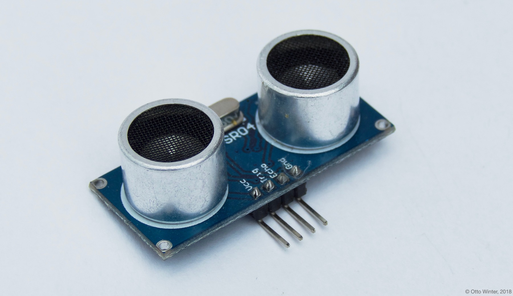

Ultrasonic Distance Sensor
==========================

.. seo::
    :description: Instructions for setting up ultrasonic distance measurement sensors in ESPHome.
    :image: ultrasonic.jpg
    :keywords: ultrasonic, hc-sr04

The ultrasonic distance sensor allows you to use simple ultrasonic
sensors like the HC-SR04
(`datasheet <https://www.electroschematics.com/wp-content/uploads/2013/07/HC-SR04-datasheet-version-2.pdf>`__,
`SparkFun <https://www.sparkfun.com/products/13959>`__) with ESPHome
to measure distances. These sensors usually can’t measure anything more
than about two meters and may sometimes make some annoying clicking
sounds.

This sensor platform expects a sensor that can be sent a **trigger
pulse** on a specific pin and will send out an **echo pulse** once a
measurement has been taken. Because sometimes (for example if no object
is detected) the echo pulse is never returned, this sensor also has a
timeout option which specifies how long to wait for values.

    HC-SR04 Ultrasonic Distance Sensor.

.. figure:: images/ultrasonic-ui.png
    :align: center
    :width: 80.0%

.. code-block:: yaml

    # Example configuration entry
    sensor:
      - platform: ultrasonic
        trigger_pin: D1
        echo_pin: D2
        name: "Ultrasonic Sensor"

Configuration variables:
------------------------

- **trigger_pin** (**Required**, :ref:`Pin Schema <config-pin_schema>`): The output pin to
  periodically send the trigger pulse to.
- **echo_pin** (**Required**, :ref:`Pin Schema <config-pin_schema>`): The input pin on which to
  wait for the echo.
- **name** (**Required**, string): The name of the sensor.
- **update_interval** (*Optional*, :ref:`config-time`): The interval to check the
  sensor. Defaults to ``60s``.
- All other options from :ref:`Sensor <config-sensor>`.

Advanced options:

- **timeout** (*Optional*, float): The number of meters for the
  timeout. Most sensors can only sense up to 2 meters. Defaults to 2 meters.
- **pulse_time** (*Optional*, :ref:`config-time`): The duration for which the trigger pin will be
  active. Defaults to ``10us``.
- **id** (*Optional*, :ref:`config-id`): Manually specify the ID used for code generation.

See Also
--------

- :ref:`sensor-filters`
- :doc:`template`
- :apiref:`ultrasonic/ultrasonic_sensor.h`
- :ghedit:`Edit`
