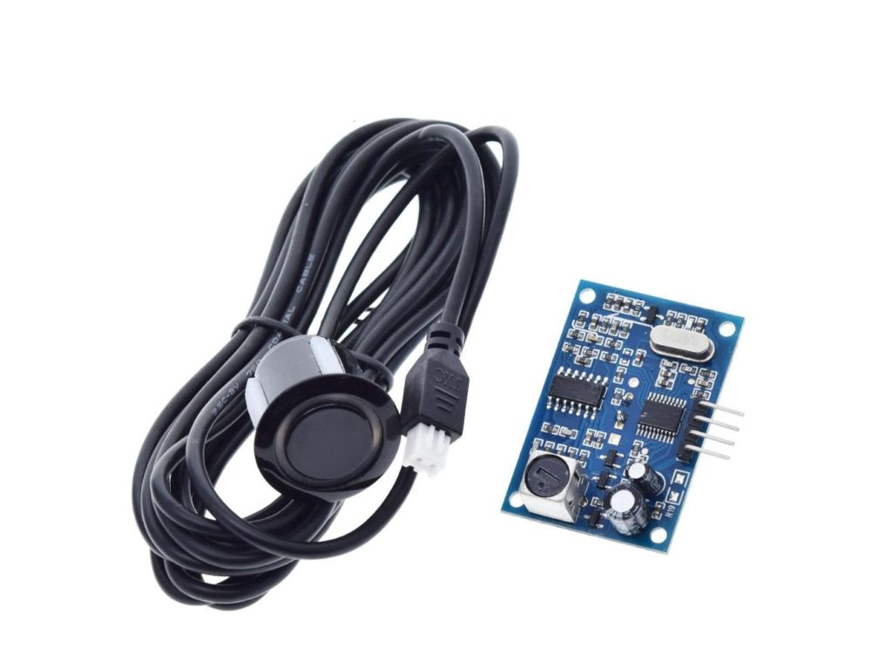

Ultrasonic Distance Sensor
==========================

.. seo::
    :description: Instructions for setting up ultrasonic distance measurement sensors in ESPHome.
    :image: ultrasonic_uart-1024x768.jpg
    :keywords: ultrasonic, aj-sr04m

The ultrasonic distance sensor allows you to use simple ultrasonic
sensors like the AJ-SR04M (`User Manual <https://device.report/manual/11063803>`__) with ESPHome
to measure distances. These sensors usually can’t measure anything more
than about two meters and may sometimes make some annoying clicking
sounds.

AJ-SR04M can be operated in five modes. 
Mode selection happens by putting resistance over R19 pads.
Component supports Mode 4 - Low power Serial Mode.

Use 47KΩ at R19 to enter the Low power Serial Mode.
In this mode the sensor is in low power sleep mode and consumes 20uA.
When the trigger command(0x55) is received RX pin, the sensor wakes up,
performs distance calculation and outputs the distance over the TX line.
The sensor goes back to sleep after transmitting data.

    AJ-SR04M Ultrasonic Distance Sensor.

.. figure:: images/ultrasonic_uart-mode_change.png
    :align: center
    :width: 80.0%

To use the sensor, first set up an :ref:`uart` with a baud rate of 9600 and connect the sensor to the specified pin.

.. code-block:: yaml

    # Example configuration entry
    uart:
      id: uart_bus
      tx_pin: D7
      rx_pin: D6
      baud_rate: 9600
      stop_bits: 1
    
    sensor:
      - platform: ultrasonic_uart
        name: "Distance"
        update_interval: 2s

Configuration variables:
------------------------

- **name** (**Required**, string): The name of the sensor.
- **uart_id** (*Optional*, :ref:`config-id`): The ID of the :ref:`UART bus <uart>` you wish to use for this sensor.
  Use this if you want to use multiple UART buses at once.
- **update_interval** (*Optional*, :ref:`config-time`): The interval to check the
  sensor. Defaults to ``60s``.
- All other options from :ref:`Sensor <config-sensor>`.

Advanced options:

- **id** (*Optional*, :ref:`config-id`): Manually specify the ID used for code generation.

See Also
--------

- :ref:`sensor-filters`
- :ref:`uart`
- :apiref:`ultrasonic_uart/ultrasonic_sensor.h`
- :ghedit:`Edit`
