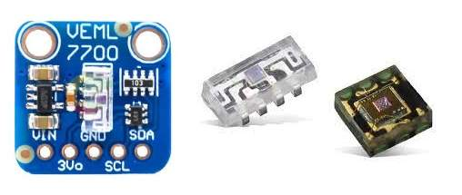
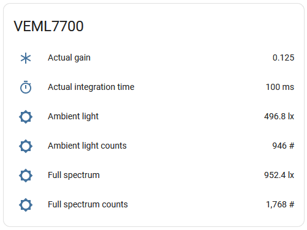
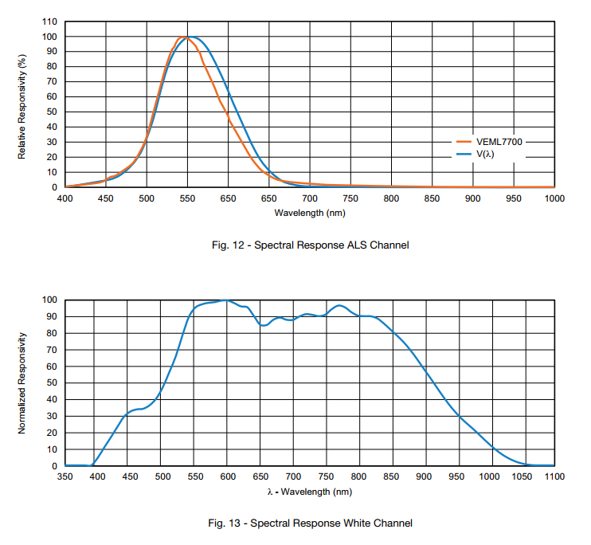

VEML7700 and VEML6030 Ambient Light Sensors
===========================================

.. seo::
    :description: Instructions for setting up VEML7700 / VEML6030 ambient light sensors in ESPHome.
    :image: veml7700.jpg
    :keywords: VEML7700, VEML6300

The ``veml7700`` sensor platform allows you to use the Vishay VEML7700 and VEML6030 ambient light sensors with ESPHome.
Communication with the device is over :ref:`I²C <i2c>`, which must be present in your configuration. VEML7700 and VEML6030 
are basically the same but in different packages. The VEML7700 uses a fixed address of ``0x10``, while the smaller VEML6030 
can be configured to use either ``0x10`` or ``0x48``.

The VEML 7700/6030 devices are available on breakout boards from a number of vendors including `Adafruit`_, `SparkFun`_, 
`DFRobot`_, and others.

.. _Adafruit: http://www.adafruit.com/products/4162
.. _SparkFun: https://www.sparkfun.com/products/15436
.. _DFRobot: https://www.dfrobot.com/product-1620.html

    VEML7700 Ambient Light Sensor on a board and standalone sensors.

    VEML sensor in Home Assistant UI.

The sensor is a high accuracy ambient light digital 16-bit resolution sensor with dynamic range from 0 lux to about 120,000 lux.
Its wide range of measurements is enabled by four configurable *gain* levels and six different *integration time* options.
Higher gain values are typically used for lower light conditions. 

The sensor has two photodiodes with different spectral response represented by two channels: an *ALS* channel and a *WHITE* channel.
The *ALS*, or *Ambient light* channel follows a so-called human eye curve very closely. The *WHITE* channel covers a much wider wavelength/spectrum, capturing quite a lot of near-infrared radiance.

    ALS and WHITE channels spectral response

Using this component's automatic measurement mode is advised; in this mode, proper *gain* and *integration time* are automatically selected by the component after
taking several  measurements. To do so, it follows a process recommended by the manufacturer.

Should you desire to manually control those parameters - please note that:

- Gain levels of 1/8 and 1/4 shall be used in most cases. 
- Gain levels of 1 an 2 are only intended to be used in low light conditions < 100 lux. For very high illuminations it shows high non-linearity.
- In the range of 0 lux - 1000 lux the sensor measurements are stricly linear for Gain 1/4 and 1/8, after 1000 lux it shows non-linearity. 

A lux compensation formula is used to get better readings in bright conditions. 
However, it gives quite high error in very bright direct sunlight (instead of 100-120 kilolux it might give 150-200k+).

This Wikipedia `article <https://en.wikipedia.org/wiki/Lux>`__ has a table of some lux values for comparison.

Automatic measurement mode
--------------------------

In automatic measurement mode the component starts from Gain 1/8 and 100 ms (*default*). 

- If illuminance is higher than 46 lx (100 counts) it gradually reduces integration time to get good reading (best in range 100 - 10,000 counts). 
- In case of low illuminance (less than 46 lx) it tries to gradually increase gain and only then increase integration time.

Please note, that in low light conditions measurement process might take several seconds due to long exposure periods and sensor reconfigurations.

Starting values can be overriden by setting ``gain`` and ``integration_time`` parameters. The gain value gets adjusted first if possible.

Lux compensation
----------------

Lux compensation is done as recommended by the manufacturer, however it can be turned off by
setting ``lux_compensation: false`` in your device's configuration.

.. math::

    \displaystyle \begin{array}{l}
    lux & = & counts \times resolution(time, gain)\\
    lux_{comp} & =& 6.0135e \times 10^{-13} \times lux^4 - 9.3924e \times 10^{-9}  \times  lux^3\\
    & & + 8.1488e \times 10^{-5}  \times  lux^2 + 1.0023  \times  lux\\
    \\
    \text{Where:} & & \\
    counts & - & \text{sensor readings, counts}\\
    resolution & - & \text{sensor resolution for given integration time and gain, lx/counts}\\
    lux & - & \text{calculated illumination, lx}\\
    lux_{comp} & - & \text{compensated illumniation, lx}\\
    \end{array}

Available data
--------------

The implementation offers seven sensors:
- Two providing *lux* value,
- Two unitless data measurements directly from the device,
- Two actual *gain* and *integration time* values used for the measurement (useful in automatic mode), and
- One fully artificial, somewhat representing near-infrared part of spectrum.

- **ambient_light**: Illuminance value for *ALS* channel representing human eye, lx
- **full_spectrum**: Illuminance value for *WHITE* channel with wide spectrum, lx
- **infrared**: Calculated illuminance value (*WHITE* minus *ALS*) representing near-infrared spectre, lx
- **ambient_light_counts**: Raw 16 bit reading from *ALS* channel, counts
- **full_spectrum_counts**: Raw 16 bit reading from *WHITE* channel, counts
- **actual_gain**: The actual gain value being used for values reported, multiplier
- **actual_integration_time**: The actual integration time being used for values reported, ms

Example configuration
---------------------

.. code-block:: yaml

    # Example configuration entry
    sensor:
      - platform: veml7700
        address: 0x10
        update_interval: 60s
        
        # short variant of sensor definition:
        ambient_light: "Ambient light"
        # longer variant of sensor definition:
        actual_gain: 
          name: "Actual gain"

Configuration variables:
------------------------

- **auto_mode** (*Optional*, boolean): Automatic gain and integration time selection. Defaults to ``True``.
- **integration_time** (*Optional*, :ref:`config-time`):
  The amount of time the sensor is exposed. Valid values are ``25ms``, ``50ms``, ``100ms`` *(default)*,
  ``200ms``, ``400ms``, ``800ms``. *In automatic mode it sets starting value*.
- **gain** (*Optional*, string): The gain the device will use for the internal ADC. Valid values are 
  ``1/8x`` *(default)*, ``1/4x``, ``1x``, ``2x``. Higher values are better in low-light conditions.
  *In automatic mode it sets starting gain value*.
- **lux_compensation** (*Optional*, boolean): Lux compensation formula is used as per manufacturer.
  Defaults to ``True``.
- **glass_attenuation_factor** (*Optional*): The attenuation factor of glass if it's behind some glass 
  or plastic facia.  Default is ``1.0`` means ``100%`` transmissivity. ``2`` means ``50%`` transmissivity etc.
- **update_interval** (*Optional*, :ref:`config-time`): The interval for checking the sensors.
  Defaults to ``60s``.
- All other options for I²C devices described at :ref:`I²C Bus <i2c>`. 
  The sensor supports bus modes "standard" and "fast": 10 kHz to 400 kHz.

Sensors
.......

You can configure all or any subset of the sensors described earlier.
Each configured sensor is reported separately on each ``update_interval``. **name** (**Required**, string) is required for 
every sensor. All other options from :ref:`Sensor <config-sensor>`. 

However, if you don't need any other options, you can just use shorthands like this: ``ambient_light: Ambient light``.

- **ambient_light** (*Optional*): Illuminance for visible light (*ALS channel*), lx.
- **full_spectrum** (*Optional*): Illuminance for the full spectrum sensor (*WHITE channel*), lx.
- **infrared** (*Optional*): Calculated illuminance for the Near-IR spectrum (*WHITE* minus *ALS*), lx.
- **ambient_light_counts** (*Optional*): The reading for visible light (*ALS channel*), counts.
- **full_spectrum_counts** (*Optional*): The reading for the full spectrum sensor (*WHITE channel*), counts.
- **actual_gain** (*Optional*): The value of gain used for reported values. Particularly useful when "auto_mode" is selected.
- **actual_integration_time** (*Optional*): Integration time used for reported values, ms. Particularly useful when "auto_mode" is selected.

See Also
--------

- :ref:`sensor-filters`
- `VEML 7700 datasheet <https://github.com/latonita/datasheets-storage/blob/main/sensors/VEML7700.pdf>`__
- Application note `Designing the VEML7700 Into an Application <https://github.com/latonita/datasheets-storage/blob/main/sensors/VEML7700-designing.pdf>`__
- `VEML 6030 datasheet <https://github.com/latonita/datasheets-storage/blob/main/sensors/VEML6030.pdf>`__
- Application note `Designing the VEML6030 Into an Application <https://github.com/latonita/datasheets-storage/blob/main/sensors/VEML6030-designing.pdf>`__
- `Radiometric vs. Photometric Units <https://www.thorlabs.de/catalogPages/506.pdf>`__
- :apiref:`veml7700/veml7700.h`
- :ghedit:`Edit`
