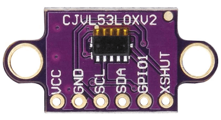
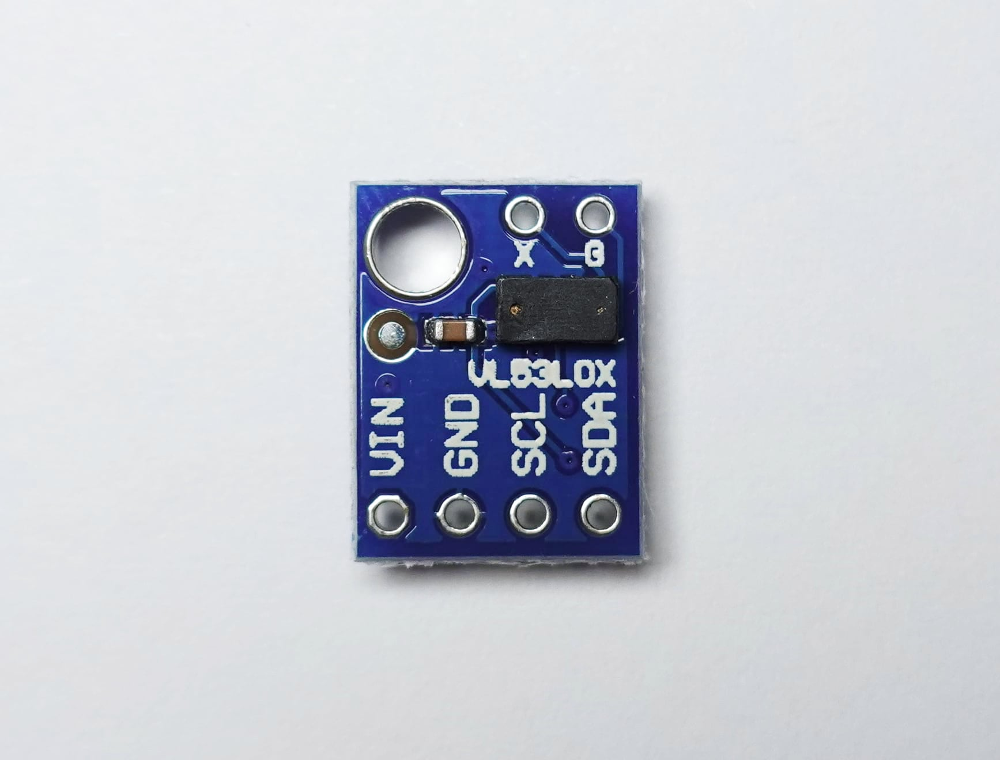
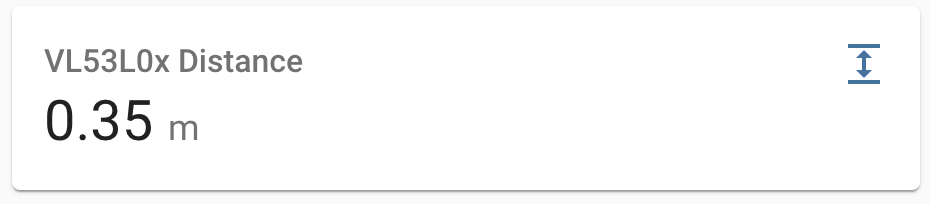

VL53L0X Time Of Flight Distance Sensor
======================================

.. seo::
    :description: Instructions for setting up VL53L0X distance sensors in ESPHome.
    :image: vl53l0x.jpg
    :keywords: VL53L0X

The ``vl53l0x`` sensor platform allows you to use VL53L0X optical time of flight
(`datasheet <https://www.st.com/resource/en/datasheet/vl53l0x.pdf>`__,
`ST <https://www.st.com/en/imaging-and-photonics-solutions/vl53l0x.html>`__) with ESPHome
to measure distances. The sensor works optically by emitting short infrared pulses
and measuring the time it takes the light to be reflected back

The sensor can measure distances up to 2 meters, though that figure depends significantly
on several conditions like surface reflectance, field of view, temperature etc. In general
you can expect surfaces up to 60cm to work, after that you need to make sure the surface is reflecting
well enough (see also section 5 of datasheet).

The :ref:`I²C Bus <i2c>` is required to be set up in your configuration for this sensor to work.

- ``VCC`` connects to 3V3 (``3V3`` will output 3.3V), or directly connect ``VCC`` to 3.3V
- ``GND`` connects to ground
- ``SCL`` connects I2C SCL (clock)
- ``SDA`` connects I2C SDA (data)
- ``GPIO1`` is not used by ESPHome
- ``XSHUT`` connects to free GPIO pin. Enable/disable device. This is optional if there is only one
  VL53L0X sensor on the I²C bus and the default ``0x29`` address is used. Otherwise this is required.

    VL53L0X Time Of Flight Distance Sensor.

.. code-block:: yaml

    # Simple configuration entry example
    sensor:
      - platform: vl53l0x
        name: "VL53L0x Distance"
        address: 0x29
        update_interval: 60s
        long_range: true

Configuration variables:
------------------------

- **update_interval** (*Optional*, :ref:`config-time`): The interval to check the
  sensor. Defaults to ``60s``.
- **signal_rate_limit** (*Optional*, float): Set the return signal rate limit in units of MCPS
  (mega counts per second). This is the minimum signal amplitude detected by the sensor necessary
  for it to report a valid reading. Setting a lower value may increase the range of the sensor
  but also increases the chance of getting inaccurate readings. Defaults to ``0.25``.
- **long_range** (*Optional*, boolean): Set the sensor in long range mode. The signal_rate_limit is overruled
  to ``0.1``. Defaults to ``false``.
- **address** (*Optional*, int): Manually specify the i2c address of the sensor. Defaults to ``0x29``.
  If an address other the ``0x29`` is specified, the sensor will be dynamically re-addressed at startup.
  A dynamic re-address of sensor requires the ``enable_pin`` configuration variable to be assigned.
  If more then one VL53L0X sensor is used on the same i2c bus, a unique address must be specified per sensor.
- **enable_pin** (*Optional*, :ref:`Pin Schema <config-pin_schema>`): The pin connected to XSHUT
  on vl53l0x to enable/disable sensor. **Required** if not using address ``0x29`` which is the cause if you
  have multiple VL53L0X on the same i2c bus. In this case you have to assign a different pin to each VL53L0X.
- **timeout** (*Optional*, :ref:`config-time`): Sensor setup timeout. Default to ``10ms``.
- All other options from :ref:`Sensor <config-sensor>`.

.. code-block:: yaml

    # Muliple VL53L0X sensors on same i2c bus
    # Example configuration entry
    sensor:
      - platform: vl53l0x
        name: "distance1"
        id: distance1
        address: 0x41
        enable_pin: GPIOXX
        timeout: 200us
        update_interval: 500ms
        unit_of_measurement: "m"

      - platform: vl53l0x
        name: "distance2"
        id: distance2
        address: 0x42
        enable_pin: GPIOXX
        timeout: 200us
        update_interval: 500ms
        unit_of_measurement: "m"

See Also
--------

- :ref:`sensor-filters`
- :apiref:`vl53l0x/vl53l0x_sensor.h`
- `vl53l0x-arduino library <https://github.com/pololu/vl53l0x-arduino/>`__ by `Pololu <https://github.com/pololu>`__
- :ghedit:`Edit`
