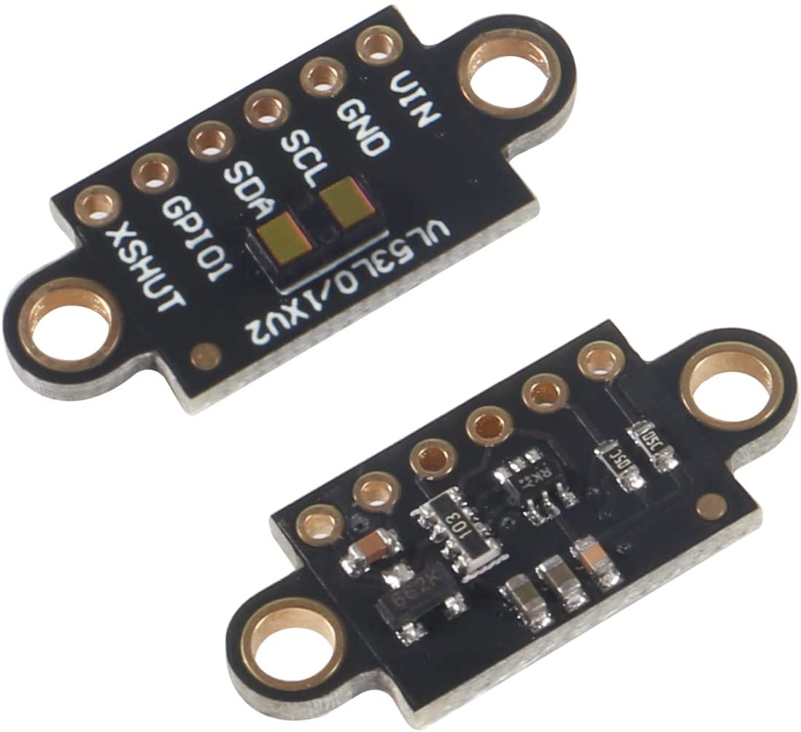

VL53L1X Time Of Flight Distance Sensor
======================================

.. seo::
    :description: Instructions for setting up VL53L1X distance sensors in ESPHome.
    :image: vl53l1x.jpg
    :keywords: VL53L1X

The ``vl53l1x`` sensor platform allows you to use VL53L1X optical time of flight
(`datasheet <https://www.st.com/resource/en/datasheet/vl53l1x.pdf>`__,
`ST <https://www.st.com/en/imaging-and-photonics-solutions/vl53l1x.html>`__) with ESPHome
to measure distances. The sensor works optically by using a 940 nm invisible Class1 laser emitter
and measuring the time it takes the light to be reflected back

The sensor can measure distances up to 4 meters, though that figure depends significantly
on several conditions like surface reflectance, field of view, temperature etc.

The :ref:`I²C Bus <i2c>` is required to be set up in your configuration for this sensor to work.

- ``VCC`` connects to 3V3 (``3V3`` will output 3.3V), or directly connect ``VCC`` to 3.3V
- ``GND`` connects to ground
- ``SCL`` connects I2C SCL (clock)
- ``SDA`` connects I2C SDA (data)
- ``GPIO1`` is not used by ESPHome
- ``XSHUT`` connects to free GPIO pin. Enable/disable device. This is optional if there is only one
  VL53L0X sensor on the I²C bus and the default ``0x29`` address is used. Otherwise this is required.

.. code-block:: yaml

    # Simple configuration entry example
    sensor:
      - platform: vl53l1x
        name: "VL53L1x Distance"

Configuration variables:
------------------------

- **name** (**Required**, string): The name of the sensor.
- **update_interval** (*Optional*, :ref:`config-time`): The interval to check the
  sensor. Defaults to ``60s``.
- **address** (*Optional*, int): Manually specify the i2c address of the sensor. Defaults to ``0x29``.
  If an address other the ``0x29`` is specified, the sensor will be dynamically re-addressed at startup.
  A dynamic re-address of sensor requires the ``enable_pin`` configuration variable to be assigned.
  If more then one VL53L0X sensor is used on the same i2c bus, a unique address must be specified per sensor.
- **enable_pin** (*Optional*, :ref:`Pin Schema <config-pin_schema>`): The pin connected to XSHUT
  on vl53l0x to enable/disable sensor. **Required** if not using address ``0x29`` which is the cause if you
  have multiple VL53L1X on the same i2c bus. In this case you have to assign a different pin to each VL53L1X.
- **long_range** (*Optional*, bool): Set the sensor in long range mode. Defaults to ``true``.
- **timing_budget** (*Optional*, int): Set the timing budget (in ms). Must be one of 15, 20, 33, 50, 100, 200, 500.
  Defaults to ``100``.
- **offset** (*Optional*, int): Set an offset correction (in mm). Defaults to ``0``.
- **io_2v8** (*Optional*, bool): Switch the Sensor to 2V8 mode. By default the sensor uses 1V8 mode for I/O.
  Defaults to ``false``.
- All other options from :ref:`Sensor <config-sensor>`.

.. code-block:: yaml

    # Muliple VL53L1X sensors on same i2c bus
    # Example configuration entry
    sensor:
      - platform: vl53l1x
        name: "distance1"
        id: distance1
        address: 0x41
        enable_pin: GPIO16
        update_interval: 500ms

      - platform: vl53l0x
        name: "distance2"
        id: distance2
        address: 0x42
        enable_pin: GPIO17
        update_interval: 500ms

See Also
--------

- :ref:`sensor-filters`
- :apiref:`vl53l1x/vl53l1x_sensor.h`
- `Adafruit_VL53L1X library <https://github.com/adafruit/Adafruit_VL53L1X>`__ by `Adafruit Industries <http://adafruit.com/>`__
- :ghedit:`Edit`
