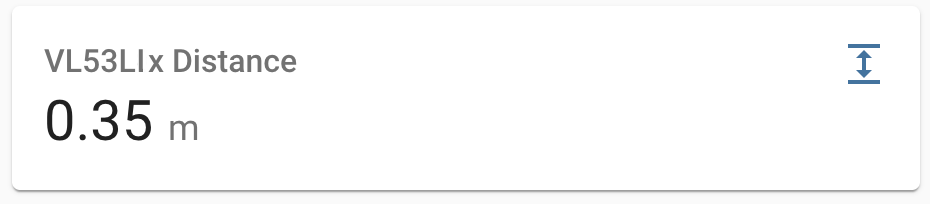

VL53L1X Time Of Flight Distance Sensor
======================================

.. seo::
    :description: Instructions for setting up VL53L1X distance sensors in ESPHome.
    :image: vl53l1x.jpg
    :keywords: VL53L1X

The ``vl53l1x`` sensor platform allows you to use VL53L1X optical time of flight
(`datasheet <https://www.st.com/resource/en/datasheet/vl53l1x.pdf>`__,
`Pololu <https://www.pololu.com/product/3415/resources>`__) with ESPHome
to measure distances. The sensor works optically by emitting short infrared pulses
and measuring the time it takes the light to be reflected back.

The sensor can measure distances up to 4 meters, though that figure depends significantly
on several conditions like surface reflectance, field of view, temperature etc.

The :ref:`I²C Bus <i2c>` is
required to be set up in your configuration for this sensor to work.

.. figure:: images/vl53l1x.jpg
    :align: center
    :width: 30.0%

    VL53L1X Time Of Flight Distance Sensor.

.. code-block:: yaml

    # Example configuration entry
    sensor:
      - platform: vl53l1x
        name: "VL53L1x Distance"
        update_interval: 60s
        distance_mode: LONG
        timing_budget: 50ms

Configuration variables:
------------------------

- **name** (**Required**, string): The name of the sensor.
- **update_interval** (*Optional*, :ref:`config-time`): The interval to check the
  sensor. Defaults to ``60s``.
- All other options from :ref:`Sensor <config-sensor>`.

Advanced options:

- **distance_mode** (*Optional*, string): Sets the distance mode of the sensor
  (``SHORT``, ``MEDIUM``, or ``LONG``). Shorter distance modes are less affected by ambient
  light but have lower maximum ranges. See the datasheet for more information.
  Defaults to ``LONG``.
- **timing_budget** (*Optional*, :ref:`config-time`): Sets the measurement timing budget. This is the
  time allowed for one range measurement; a longer timing budget allows for more accurate measurements.
  The minimum budget is 20ms in short distance mode and 33 ms for medium and long distance
  modes. See the VL53L1X datasheet for more information on range and timing limits. Defaults to ``50ms``.
- **retry_budget** (*Optional*, int): Sets the retry budget. If a measurement fails, e.g. due to
  movement, consecutive measurements will be triggered until the retry budget is exhausted. Defaults to ``5``.
- **address** (*Optional*, int): Manually specify the I^2C address of the sensor. Defaults to ``0x29``.
- **id** (*Optional*, :ref:`config-id`): Manually specify the ID used for code generation.

See Also
--------

- :ref:`sensor-filters`
- :apiref:`vl53l1x/vl53l1x_sensor.h`
- `vl53l1x-arduino library <https://github.com/pololu/vl53l1x-arduino/>`__ by `Pololu <https://github.com/pololu>`__
- :ghedit:`Edit`
