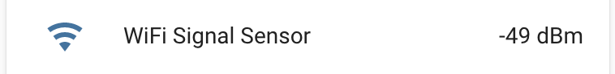

WiFi Signal Sensor
==================

.. seo::
    :description: Instructions for setting up WiFi signal sensors that track the RSSI connection strength value to the network.
    :image: network-wifi.svg

The ``wifi_signal`` sensor platform allows you to read the signal
strength of the currently connected :doc:`WiFi Access Point </components/wifi>`.

The sensor value is the `"Received signal strength indication" <https://en.wikipedia.org/wiki/Received_signal_strength_indication>`__
measured in decibel-milliwatts (dBm). These values are always negative and the closer they are to zero, the better the signal is.

.. code-block:: yaml

    # Example configuration entry
    sensor:
      - platform: wifi_signal
        name: "WiFi Signal Sensor"
        update_interval: 60s

Configuration variables:
------------------------

- **name** (**Required**, string): The name of the WiFi signal sensor.
- **update_interval** (*Optional*, :ref:`config-time`): The interval
  to check the sensor. Defaults to ``60s``.
- **id** (*Optional*, :ref:`config-id`): Manually specify the ID used for code generation.
- All other options from :ref:`Sensor <config-sensor>`.

.. warning::

    Signal strength readings are only available when WiFi is in station mode. Readings are not valid
    if the device is acting as an access point without any station mode connection.

See Also
--------

- :ref:`sensor-filters`
- :doc:`/components/wifi`
- :apiref:`wifi_signal/wifi_signal_sensor.h`
- :ghedit:`Edit`
