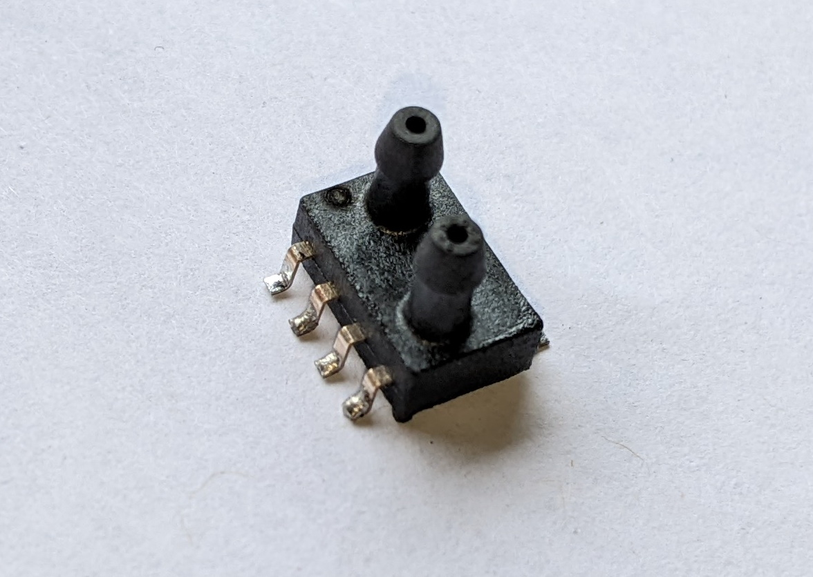

XGZP6897D Digital Air Differential Pressure Sensor
==================================================

.. seo::
    :description: Instructions for setting up XGZP6897D pressure sensors
    :image: xgzp6897d.jpg
    :keywords: XGZP6897D

The ``xgzp6897d`` sensor platform allows you to use your XGZP6897D
(`datasheet <https://www.cfsensor.com/static/upload/file/20220412/XGZP6897D%20Pressure%20Sensor%20Module%20V2.4.pdf>`__)
differential pressure sensors with ESPHome. The :ref:`I²C <i2c>` is
required to be set up in your configuration for this sensor to work.

    XGZP6897D Digital Air Differential Pressure Sensor.

.. _Adafruit: https://www.adafruit.com/product/2652

.. code-block:: yaml

    # Example configuration entry
    sensor:
      - platform: xgzp6897d
        pressure_range: 50
        pressure:
          name: "XGZP6897D Pressure"
        temperature:
          name: "XGZP6897D Internal Temperature"
        oversampling: 32768x
        update_interval: 60s

Configuration variables:
------------------------

- **pressure_range** (**Required**, float): Maximum positive pressure range of the sensor in kPa.

- **temperature** (*Optional*): The information for the internal temperature.
  sensor

  - **name** (**Required**, string): The name for the internal temperature
    sensor.
  - **id** (*Optional*, :ref:`config-id`): Set the ID of this sensor for use in lambdas.
  - All other options from :ref:`Sensor <config-sensor>`.

- **pressure** (*Optional*): The information for the pressure sensor.

  - **name** (**Required**, string): The name for the pressure sensor.
  - **id** (*Optional*, :ref:`config-id`): Set the ID of this sensor for use in lambdas.
  - All other options from :ref:`Sensor <config-sensor>`.

- **oversampling** (**Optional**: The oversampling parameter for the temperature sensor.
    See :ref:`Oversampling Options <xgzp6897d-oversampling>`.
- **continues_mode** (**Optional**, boolean): Set if the XGZP6897D should continuously do measurements.
- **sleep_time** (**Optional**, int): Time between measurements in continues mode. Possible values: 0-15 (0:0ms; 1:62.5ms; 2:125ms ;... 15: ~1s).
  
- **update_interval** (*Optional*, :ref:`config-time`): The interval to check the
  sensor. Defaults to ``60s``.

.. _xgzp6897d-oversampling:

Oversampling Options
--------------------

By default, the XGZP6897D sensor measures each value 1024 times when requesting a new value. You can, however,
configure this amount. Possible oversampling values:

-  ``256x``
-  ``512x``
-  ``1024x`` (default)
-  ``2048x``
-  ``4096x``
-  ``8192x``
-  ``16384x``
-  ``32768x``

See Also
--------

- :ref:`sensor-filters`
- :apiref:`xgzp6897d/xgzp6897d.h`
- :ghedit:`Edit`
