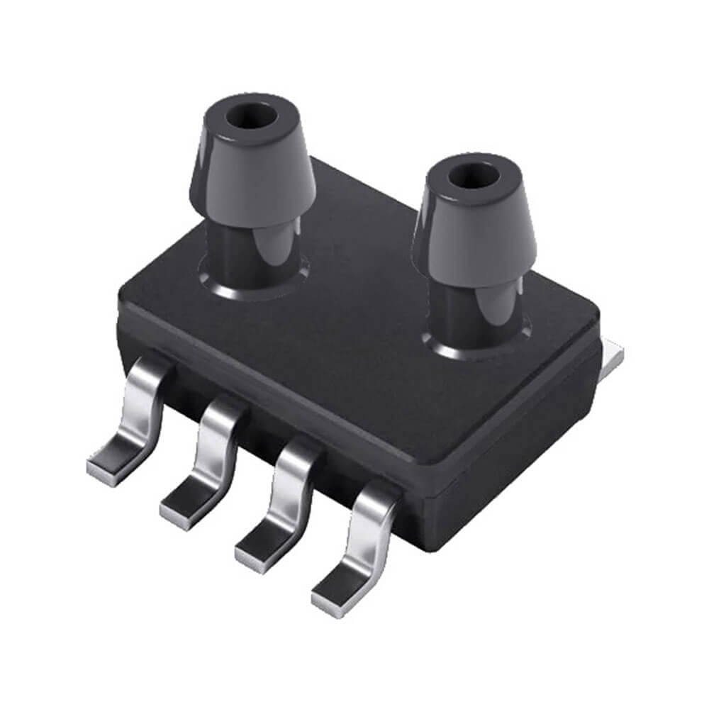

CFSensor XGZP68xx Series Differential Pressure Sensor
=====================================================

.. seo::
    :description: Instructions for setting up the CFSensor XGZP68xx Series Differential Pressure sensor.
    :image: 6897d.jpg
    :keywords: XGZP68xx, XGZP6897, XGZP6899, XGZP6899D, XGZP6897D

The XGZP68xx Differential Pressure sensor allows you to use digital differential pressure sensors such as the 6899D
(`datasheet <https://cfsensor.com/wp-content/uploads/2022/11/XGZP6899D-Pressure-Sensor-V2.8.pdf>`__) or 
6897D Series (`datasheet <https://cfsensor.com/wp-content/uploads/2022/11/XGZP6897D-Pressure-Sensor-V2.7.pdf>`__)
sensors with ESPHome. The sensors pressure ranges are specified in the datasheets.

Calibrating the sensor can be done by checking the value that is returned when
the ports are open to the air. This value should be 0. If it is not, you can use the offset option to correct the
reading. For example, if your sensor is reading -40Pa when the ports are disconnected, you can set the offset to 40.

    XGZP6897D Differential Pressure Sensor.
    (Credit: `CFSensor <https://cfsensor.net/i2c-differential-pressure-sensor-xgzp6897d/>`__, image cropped and compressed)

.. _Sparkfun: https://www.sparkfun.com/products/17874

To use the sensor, set up an :ref:`I²C Bus <i2c>` and connect the sensor to the specified pins.

.. code-block:: yaml

    # Example configuration entry
    # It uses a filter offset to calibrate the sensor
    sensor:
      - platform: xgzp68xx
        temperature:
            name: "Temperature"
        pressure:
            name: "Differential Pressure"
            filters:
                - offset: 40.5

Configuration variables:
------------------------

- **temperature** (*Optional*): All options from :ref:`Sensor <config-sensor>`.
- **pressure** (*Optional*): All options from :ref:`Sensor <config-sensor>`.
- **k_value** (*Optional*, int): The K value comes from the datasheet. It will default to 4096 if not specified, which is appropriate for a sensor with a range of +/- 0.5kPa.
- **update_interval** (*Optional*, :ref:`config-time`): The interval to check the sensor. Defaults to ``60s``.

See Also
--------
- `esphome-pressure device <https://github.com/gcormier/esphome-pressure/>`__
- :ref:`sensor-filters`
- :apiref:`sdp3x/sdp3x.h`
- :ghedit:`Edit`
