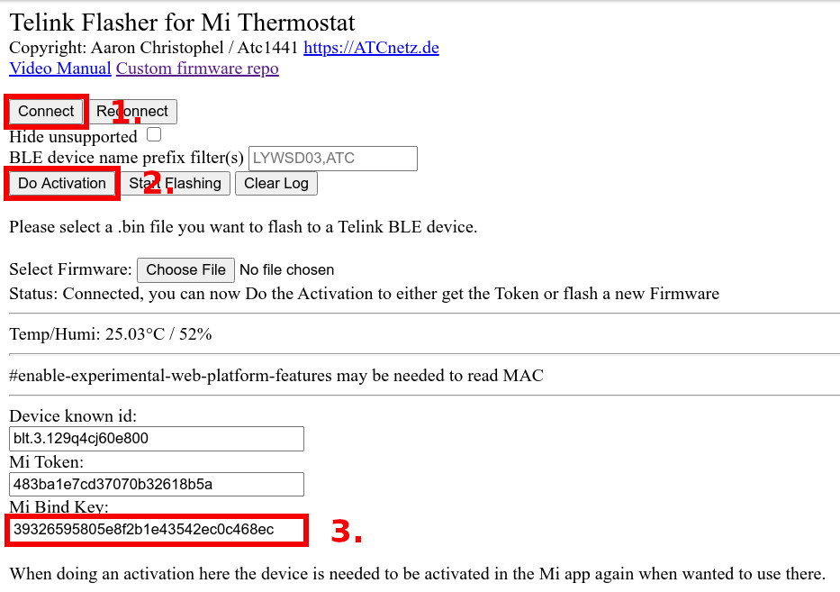

Xiaomi Mijia BLE Sensors
========================

.. seo::
    :description: Instructions for setting up Xiaomi Mi Home (Mijia) bluetooth-based sensors in ESPHome.
    :image: xiaomi_mijia_logo.jpg
    :keywords: Xiaomi, Mi Home, Mijia, BLE, Bluetooth, HHCCJCY01, GCLS002, HHCCPOT002, LYWSDCGQ, LYWSD02, CGG1, LYWSD03MMC, CGD1, JQJCY01YM, MUE4094RT, WX08ZM, MHO, C401, MHOC401

The ``xiaomi_ble`` sensor platform lets you track the output of Xiaomi Bluetooth Low Energy devices using the :doc:`/components/esp32_ble_tracker`. This component will track, for example, the temperature, humidity, moisture, conductivity, illuminance, formaldehyde, mosquito tablet and battery level of the device every time the sensor sends out a BLE broadcast. Contrary to other implementations, ``xiaomi_ble`` listens passively to advertisement packets and does not pair with the device. Hence ESPHome has no impact on battery life. Thus, if you only use such sensors, you can safely set ``scan_parameters.active: false`` in ``esp32_ble_tracker`` configuration, to save from spamming your RF environment with useless scan requests.

.. note::

    You may alternatively use ESPHome's :doc:`/components/bluetooth_proxy` component to forward sensor data to Home Assistant and have Mija devices configured using its own Mija BLE component. This should work for the devices flashed with `PVVX MiThermometer <https://github.com/pvvx/ATC_MiThermometer>`__ custom firmware, as well as the regular, stock firmware.

Supported Devices
-----------------

HHCCJCY01
*********

MiFlora, Huahuacaocao, measures temperature, moisture, ambient light and nutrient levels in the soil.

.. figure:: images/xiaomi_hhccjcy01.jpg
    :align: center
    :width: 60.0%

Configuration example:

.. code-block:: yaml

    sensor:
      - platform: xiaomi_hhccjcy01
        mac_address: '94:2B:FF:5C:91:61'
        temperature:
          name: "Xiaomi HHCCJCY01 Temperature"
        moisture:
          name: "Xiaomi HHCCJCY01 Moisture"
        illuminance:
          name: "Xiaomi HHCCJCY01 Illuminance"
        conductivity:
          name: "Xiaomi HHCCJCY01 Soil Conductivity"
        battery_level:
          name: "Xiaomi HHCCJCY01 Battery Level"

.. note::

    Newer versions of HHCCJCY01 ship with firmware 3.2.1, and they
    `don't send the battery level data anymore <https://github.com/esphome/esphome/pull/1288#issuecomment-695809481>`__.

GCLS002
*******

VegTrug Grow Care Garden, Takasho, suitable for outside, similar to the MiFlora.

.. figure:: images/xiaomi_gcls002.jpg
    :align: center
    :width: 30.0%

Configuration example:

.. code-block:: yaml

    sensor:
      - platform: xiaomi_gcls002
        mac_address: "94:2B:FF:5C:91:61"
        temperature:
          name: "GCLS02 Temperature"
        moisture:
          name: "GCLS02 Moisture"
        conductivity:
          name: "GCLS02 Soil Conductivity"
        illuminance:
          name: "GCLS02 Illuminance"

HHCCPOT002
**********

FlowerPot, Huahuacaocao, RoPot, broadcasts moisture and conductivity

Configuration example:

.. code-block:: yaml

    sensor:
      - platform: xiaomi_hhccpot002
        mac_address: "94:2B:FF:5C:91:61"
        moisture:
          name: "HHCCPOT002 Moisture"
        conductivity:
          name: "HHCCPOT002 Soil Conductivity"

LYWSDCGQ
********

Hygro thermometer, round body, segment LCD, broadcasts temperature, humidity and battery level. This device is also known as MJ_HT_V1. In HA's native Xiaomi BLE integration, the device info page shows it as "MJ_HT_V1 (LYWSDCGQ by Xiaomi)".

Configuration example:

.. code-block:: yaml

    sensor:
      - platform: xiaomi_lywsdcgq
        mac_address: "7A:80:8E:19:36:BA"
        temperature:
          name: "LYWSDCGQ Temperature"
        humidity:
          name: "LYWSDCGQ Humidity"
        battery_level:
          name: "LYWSDCGQ Battery Level"

LYWSD02
*******

Hygro thermometer, rectangular body, e-ink display, broadcasts temperature, humidity and battery level.

.. figure:: images/xiaomi_lywsd02.jpg
    :align: center
    :width: 30.0%

- Battery Level, needs xiaomi firmware 1.1.2_0085

Configuration example:

.. code-block:: yaml

    sensor:
      - platform: xiaomi_lywsd02
        mac_address: "3F:5B:7D:82:58:4E"
        temperature:
          name: "LYWSD02 Temperature"
        humidity:
          name: "LYWSD02 Humidity"
        battery_level:
          name: "LYWSD02 Battery Level"

CGG1
****

Cleargrass (Qingping): hygro thermometer, round body, e-ink display.

New firmware requires a bindkey in order to decrypt the received data (see :ref:`obtaining_the_bindkey`), and stopped broadcasting battery level.

.. figure:: images/xiaomi_cgg1.jpg
    :align: center
    :width: 30.0%

Configuration example:

.. code-block:: yaml

    sensor:
      - platform: xiaomi_cgg1
        mac_address: "7A:80:8E:19:36:BA"
        temperature:
          name: "CGG1 Temperature"
        humidity:
          name: "CGG1 Humidity"
        battery_level:
          name: "CGG1 Battery Level"
      - platform: xiaomi_cgg1
        mac_address: "7A:80:8E:28:39:CD"
        bindkey: "00112233445566778899aabbccddeeff"
        temperature:
          name: "CGG1 (New) Temperature"
        humidity:
          name: "CGG1 (New) Humidity"

LYWSD03MMC
**********

Hygro thermometer, small square body, segment LCD, encrypted, broadcasts temperature, humidity and battery status.

.. figure:: images/xiaomi_lywsd03mmc.jpg
    :align: center
    :width: 30.0%

There are the following possibilities to operate this sensor:

1. Xiaomi stock firmware (requires a bindkey in order to decrypt the received data, see :ref:`obtaining_the_bindkey`)
2. Device flashed with `PVVX MiThermometer <https://github.com/pvvx/ATC_MiThermometer>`__ custom firmware
3. Device flashed with `ATC MiThermometer <https://github.com/atc1441/ATC_MiThermometer>`__ custom firmware

   - "Mi Like" advertisement (dummy bindkey required)
   - "Custom" advertisement (no bindkey required)
   - "pvvx" custom advertisement (no bindkey required, only PVVX firmware)

Configuration example for Xiaomi stock firmware or ATC MiThermometer firmware set to "Mi Like" advertisement:

.. code-block:: yaml

    sensor:
      - platform: xiaomi_lywsd03mmc
        mac_address: "A4:C1:38:B1:CD:7F"
        bindkey: "eef418daf699a0c188f3bfd17e4565d9"
        temperature:
          name: "LYWSD03MMC Temperature"
        humidity:
          name: "LYWSD03MMC Humidity"
        battery_level:
          name: "LYWSD03MMC Battery Level"

Configuration example for PVVX MiThermometer firmware set to "Custom" advertisement:

.. code-block:: yaml

    sensor:
      - platform: pvvx_mithermometer
        mac_address: "A4:C1:38:B1:CD:7F"
        temperature:
          name: "PVVX Temperature"
        humidity:
          name: "PVVX Humidity"
        battery_level:
          name: "PVVX Battery-Level"
        battery_voltage:
          name: "PVVX Battery-Voltage"
        signal_strength:
          name: "PVVX Signal"

Configuration example for ATC MiThermometer firmware set to "Custom" advertisement:

.. code-block:: yaml

    sensor:
      - platform: atc_mithermometer
        mac_address: "A4:C1:38:B1:CD:7F"
        temperature:
          name: "ATC Temperature"
        humidity:
          name: "ATC Humidity"
        battery_level:
          name: "ATC Battery-Level"
        battery_voltage:
          name: "ATC Battery-Voltage"
        signal_strength:
          name: "ATC Signal"

MHO-C303
********

Hygro thermometer clock with alarm, rectangular body, e-ink display, broadcasts temperature, humidity and battery status. Not encrypted.

Similar to the LYWSD02, with additional clock features (alarm, pomodoro timer). Runs on two AAA batteries.

Configuration example:

.. code-block:: yaml

    sensor:
      - platform: xiaomi_mhoc303
        mac_address: "E7:50:59:32:A0:1C"
        temperature:
          name: "MHO-C303 Climate Temperature"
        humidity:
          name: "MHO-C303 Climate Humidity"
        battery_level:
          name: "MHO-C303 Climate Battery Level"

MHO-C401
********

Hygro thermometer, square body, e-ink display, encrypted, broadcasts temperature, humidity and battery status. Requires a bindkey in order to decrypt the received data (see :ref:`obtaining_the_bindkey`).

.. figure:: images/xiaomi_mhoc401.jpg
    :align: center
    :width: 30.0%

( MHO-C201 doesn't have BT )

Similar to the LYWSD03MMC, there is custom firmware available for this device, so there are the following possibilities to operate this sensor:

1. Xiaomi stock firmware (requires a bindkey in order to decrypt the received data, see :ref:`obtaining_the_bindkey`)
2. Device flashed with `PVVX MiThermometer <https://github.com/pvvx/ATC_MiThermometer>`__ custom firmware

   - "Mi Like" advertisement (dummy bindkey required)
   - "pvvx" custom advertisement (no bindkey required, only PVVX firmware)

Configuration example for Xiaomi stock firmware:

.. code-block:: yaml

    sensor:
      - platform: xiaomi_mhoc401
        mac_address: "A4:C1:38:B1:CD:7F"
        bindkey: "eef418daf699a0c188f3bfd17e4565d9"
        temperature:
          name: "MHOC401 Temperature"
        humidity:
          name: "MHOC401 Humidity"
        battery_level:
          name: "MHOC401 Battery Level"

Configuration example for PVVX MiThermometer firmware set to "Custom" advertisement:

.. code-block:: yaml

    sensor:
      - platform: pvvx_mithermometer
        mac_address: "A4:C1:38:B1:CD:7F"
        temperature:
          name: "PVVX Temperature"
        humidity:
          name: "PVVX Humidity"
        battery_level:
          name: "PVVX Battery-Level"
        battery_voltage:
          name: "PVVX Battery-Voltage"

CGD1
****

Cleargrass (Qingping) alarm clock, segment LCD, encrypted, broadcasts temperature, humidity and battery status. Requires a bindkey in order to decrypt the received data (see :ref:`obtaining_the_bindkey`).

.. figure:: images/xiaomi_cgd1.jpg
    :align: center
    :width: 30.0%

Configuration example:

.. code-block:: yaml

    sensor:
      - platform: xiaomi_cgd1
        mac_address: "A4:C1:38:8C:34:B7"
        bindkey: "fe39106baeedb7c801e3d63c4396f97e"
        temperature:
          name: "CGD1 Temperature"
        humidity:
          name: "CGD1 Humidity"
        battery_level:
          name: "CGD1 Battery Level"

CGDK2
*****

Cleargrass (Qingping) Temp & RH Lite, round body, segment LCD, encrypted, broadcasts temperature, humidity and battery status. Requires a bindkey in order to decrypt the received data (see :ref:`obtaining_the_bindkey`).
The measurements are broadcast every 10-15 minutes.

Configuration example:

.. code-block:: yaml

    sensor:
      - platform: xiaomi_cgdk2
        mac_address: "58:2D:34:11:34:B7"
        bindkey: "fe39106baeedb7c801e3d63c4396f97e"
        temperature:
          name: "CGDK2 Temperature"
        humidity:
          name: "CGDK2 Humidity"
        battery_level:
          name: "CGDK2 Battery Level"

JQJCY01YM
*********

Xiaomi (Honeywell) formaldehyde sensor, OLED display, broadcasts temperature, humidity, formaldehyde concentration (mg/m³) and battery status.

.. figure:: images/xiaomi_jqjcy01ym.jpg
    :align: center
    :width: 30.0%

Configuration example:

.. code-block:: yaml

    sensor:
      - platform: xiaomi_jqjcy01ym
        mac_address: "7A:80:8E:19:36:BA"
        temperature:
          name: "JQJCY01YM Temperature"
        humidity:
          name: "JQJCY01YM Humidity"
        formaldehyde:
          name: "JQJCY01YM Formaldehyde"
        battery_level:
          name: "JQJCY01YM Battery Level"

WX08ZM
******

Mosquito Repellent Smart Version, broadcasts the tablet resource level, on/off state and battery level, implemented as a hybrid sensor, needs both ``sensor`` and ``binary_sensor`` in config.

.. figure:: images/xiaomi_wx08zm.jpg
    :align: center
    :width: 30.0%

Configuration example:

.. code-block:: yaml

    sensor:

    binary_sensor:
      - platform: xiaomi_wx08zm
        mac_address: "74:a3:4a:b5:07:34"
        tablet:
          name: "WX08ZM Mosquito Tablet"
        battery_level:
          name: "WX08ZM Battery Level"

MUE4094RT
*********

Xiaomi Philips BLE night light, broadcasts motion detection (detected/clear, on/off), default timeout is 5s, implemented as a hybrid sensor, needs both ``sensor`` and ``binary_sensor`` in config.

Configuration example:

.. code-block:: yaml

    sensor:

    binary_sensor:
      - platform: xiaomi_mue4094rt
        name: "MUE4094RT Night Light"
        mac_address: "7A:80:8E:19:36:BA"
        timeout: "5s"

MJYD02YL-A
**********

Xiaomi Yeelight night light, in-shape replacement of MJYD02YL with BLE, broadcasts light on/off status, motion detection, idle time since last motion event and battery status. Requires a bindkey in order to decrypt the received data (see :ref:`obtaining_the_bindkey`). Implemented as a hybrid sensor, needs both ``sensor`` and ``binary_sensor`` in config.

.. figure:: images/xiaomi_mjyd02yla.jpg
    :align: center
    :width: 30.0%

Configuration example:

.. code-block:: yaml

    sensor:

    binary_sensor:
      - platform: xiaomi_mjyd02yla
        name: "MJYD02YL-A Night Light"
        mac_address: "50:EC:50:CD:32:02"
        bindkey: "48403ebe2d385db8d0c187f81e62cb64"
        idle_time:
          name: "MJYD02YL-A Idle Time"
        light:
          name: "MJYD02YL-A Light Status"
        battery_level:
          name: "MJYD02YL-A Battery Level"
        illuminance:
          name: "MJYD02YL-A Illuminance"

CGPR1
*****

Qingping motion & ambient light sensor. Broadcasts motion detection, idle time since last motion event, lux value and battery status. Requires a bindkey in order to decrypt the received data (see :ref:`obtaining_the_bindkey`).

.. figure:: images/xiaomi_cgpr1.png
    :align: center
    :width: 30.0%

Configuration example:

.. code-block:: yaml

    binary_sensor:
      - platform: xiaomi_cgpr1
        name: "CGPR1 Motion detector"
        mac_address: 58:2D:34:60:32:A2
        bindkey: "ff1ae526b23b4aebeadcaaad86f59055"
        idle_time:
          name: "CGPR1 Idle Time"
        battery_level:
          name: "CGPR1 Battery Level"
        illuminance:
          name: "CGPR1 Illuminance"

RTCGQ02LM - Mi Motion Sensor 2
******************************

Motion & ambient light sensor. Broadcasts motion detection, light/dark and battery status. Also has a button that broadcasts when pressed.
Requires a bindkey in order to decrypt the received data (see :ref:`obtaining_the_bindkey`).

.. figure:: images/xiaomi_rtcgq02lm.jpg
    :align: center
    :width: 30.0%

Configuration example:

.. code-block:: yaml

    xiaomi_rtcgq02lm:
      - id: motion_one
        mac_address: 01:23:45:67:89:AB
        bindkey: fe39106baeedb7c801e3d63c4396f97e

    binary_sensor:
      - platform: xiaomi_rtcgq02lm
        id: motion_one
        motion:
          name: "Mi Motion"
        light:
          name: "Mi Motion Sensor Light"
        button:
          name: "Mi Motion Sensor Button"

    sensor:
      - platform: xiaomi_rtcgq02lm
        id: motion_one
        battery_level:
          name: "Mi Motion Sensor Battery Level"

Setting Up Devices
------------------

Required:

- **mac_address** (MAC Address): The MAC address of the device.
- **bindkey** (string, 32 characters, case insensitive): The key to decrypt the BLE advertisements for encrypted sensor types

Optional with **name**, **id** (:ref:`config-id`) and all other options from :ref:`Sensor <config-sensor>`:

- **temperature**
- **humidity**
- **moisture**
- **illuminance**
- **conductivity**
- **tablet**
- **formaldehyde**
- **battery_level**

.. _obtaining_the_mac_address:

Obtaining the MAC address
-------------------------
To find the MAC Address so that ESPHome can identify the device, you can create a simple configuration without any sensor entries:

.. code-block:: yaml

    esp32_ble_tracker:

    xiaomi_ble:

After uploading, the ESP32 will immediately try to scan for BLE devices. When it detects a new sensor, it will automatically parse the BLE message print a message like this one:

.. code::

    Found device A4:C1:38:4E:16:78 RSSI=-78
      Address Type: PUBLIC
      Name: 'LYWSD03MMC'

It can sometimes take some time for the first BLE broadcast to be received. Once the device has been found, copy the address ``A4:C1:38:4E:16:78`` into a new platform entry like shown in the example configurations.

.. _obtaining_the_bindkey:

Obtaining the Bindkey
---------------------

To set up an encrypted device such as the LYWSD03MMC (with Xiaomi stock firmware) and CGD1, you first need to obtain the bind key. The ``xiaomi_ble`` sensor component is not able to automatically generate a bindkey so other workarounds are necessary.

LYWSD03MMC/MHO-C401
*******************

If the LYWSD03MMC or MHO-C401 sensor is operated with the Xiaomi stock firmware, you can use the `TeLink flasher application <https://atc1441.github.io/TelinkFlasher.html>`__ to easily generate a new bind key and upload the key to the device without the need to flash a new firmware (see figure). For this, you load the flasher `webpage <https://atc1441.github.io/TelinkFlasher.html>`__ with a `supported browser <https://github.com/WebBluetoothCG/web-bluetooth/blob/master/implementation-status.md>`__ and connect the device by pressing "Connect". After the connection is established, you press the "Do Activation" button and the new key will be shown in the "Mi Bind Key" field. The key can be copied directly into the sensor YAML configuration.

    Telink flasher application.

.. warning::

    The new bind key will work with ESPHome, but the Mi Home app will not recognise the sensor anymore once the device has been activated by the TeLink flasher application. To use the sensor again with the Xiaomi Mi Home app, the device needs to be removed and then re-added inside the Mi Home app.

CGDK2
*****

The method to obtain a new bind key for the CGDK2 sensor is similar to the method for the LYWSD03MMC sensor, except a modified version of the flasher application is used.

For this, you load the `application <https://zaluthar.github.io/TelinkFlasher.html>`__ with a `supported browser <https://github.com/WebBluetoothCG/web-bluetooth/blob/master/implementation-status.md>`__ and connect the device by pressing "Connect". After the connection is established, you press the "Do Activation" button and the new key will be shown in the "Mi Bind Key" field. The key can be copied directly into the sensor YAML configuration.

Other encrypted devices
***********************
1.
The easiest method (confirmed to work for LYWSD03MMC) is to use the `Telink flasher method <https://github.com/pvvx/ATC_MiThermometer>`__. The accompanying `video
<https://www.youtube.com/watch?v=NXKzFG61lNs>`_ shows how to wirelessly flash a LYWSD03MMC, or how to obtain the bind key of the stock firmware (watch till around 13:10). The custom firmware allows you to change several settings of the device, including the smiley and the advertising interval. Follow the instructions on the site using Telink Flasher - best results with a Bluetooth-enabled Android phone. Note that with ``pvvx`` default settings advertisment is set to ``Custom`` with no encryption. No need for ``bind_key`` in this case, you can just add the sensors to your ESPHome config as described above.

2.
The other option is to use the original Mi Home app to add the sensor once. While adding the device, a new key is generated and uploaded into the Xiaomi cloud and to the device itself. Currently a chinese server needs to be selected as the rest of the world doesn't support most of these devices yet. Once generated, the key will not change again until the device is removed and re-added in the Xiaomi app.

2a.
The easiest method to retrieve the bindkey from the cloud is to use the `Cloud Tokens Extractor <https://github.com/PiotrMachowski/Xiaomi-cloud-tokens-extractor>`__, written by one of Home Assistant users. If you prefer to not use the executable, read `here <https://www.home-assistant.io/integrations/xiaomi_miio/#xiaomi-cloud-tokens-extractor>`__.

2b.
Another option is to use a SSL packet sniffer. It can be setup on either an Android phone or the iPhone. A good choice for Android is the `Remote PCAP <https://play.google.com/store/apps/details?id=com.egorovandreyrm.pcapremote&hl=en>`__ in combination with `Wireshark <https://www.wireshark.org/>`__. A tutorial on how to setup the Remote PCAP packet sniffer can be found `here <https://egorovandreyrm.com/pcap-remote-tutorial/>`__ and `here <https://github.com/ahpohl/xiaomi_lywsd03mmc>`__. Instructions how to obtain the key using an iPhone are `here <https://github.com/custom-components/sensor.mitemp_bt/blob/master/faq.md#my-sensors-ble-advertisements-are-encrypted-how-can-i-get-the-key>`__. Once the traffic between the Mi Home app and the Xiaomi servers has been recorded, the bind key will show in clear text:

.. code-block:: yaml

    packet: POST /app/device/bltbind

    "data" = "{"did":"blt.3.129q4nasgeg00","token":"20c665a7ff82a5bfb5eefc36","props":[{"type":"prop","key":"bind_key","value":"cfc7cc892f4e32f7a733086cf3443cb0"},   {"type":"prop","key":"smac","value":"A4:C1:38:8C:34:B7"}]}"

The ``bind_key`` is the 32 digits "value" item in the above output which needs to be inserted into the config file.

Improving reception performance
-------------------------------

Use a board with an Ethernet connection to the network, to offload ESP32's radio module from WiFi traffic, this gains performance on Bluetooth side.
To maximize the chances of catching advertisements of the sensors, you can set ``interval`` equal to ``window`` in :doc:`/components/esp32_ble_tracker` scan parameter settings:

.. code-block:: yaml

    esp32_ble_tracker:
      scan_parameters:
        interval: 5s # try with 300ms if you don't have LAN module
        window: 5s # try with 300ms if you don't have LAN module
        active: false

Avoid placing the ESP node in racks, close to routers/switches or other network equipment as EMI interference will degrade Bluetooth signal reception. For best results put as far away as possible, at least 3 meters distance from any other such equipment.

Security considerations
-----------------------

You should at least protect your sensors with a custom pairing PIN code. Choose a method employing bindkey in order to use encrypted communication over the air.

See Also
--------

- :doc:`/components/esp32_ble_tracker`
- :doc:`/components/sensor/index`
- :doc:`/components/display/pvvx_mithermometer`
- :apiref:`xiaomi_lywsd03mmc/xiaomi_ble.h`
- :doc:`/components/ethernet`
- :doc:`/components/bluetooth_proxy`
- Passive BLE monitor integration for Home Assistant (ble_monitor custom component) `<https://github.com/custom-components/ble_monitor>`__
  by `@Magalex2x14 <https://github.com/Magalex2x14>`__ and `@Ernst79 <https://github.com/Ernst79>`__
- Custom firmware (PVVX) for the Xiaomi Thermometer LYWSD03MMC `<https://github.com/pvvx/ATC_MiThermometer>`__
- TeLink flasher application (PVVX) `<https://pvvx.github.io/ATC_MiThermometer/TelinkMiFlasher.html>`__
- Custom firmware (ATC) for the Xiaomi Thermometer LYWSD03MMC `<https://github.com/atc1441/ATC_MiThermometer>`__
- TeLink flasher application (ATC) `<https://atc1441.github.io/TelinkFlasher.html>`__
- TeLink flasher application modified for CGDK2 `<https://zaluthar.github.io/TelinkFlasher.html>`__
- Xiaomi LYWSD03MMC passive sensor readout `<https://github.com/ahpohl/xiaomi_lywsd03mmc>`__ by `@ahpohl <https://github.com/ahpohl>`__
- Cloud Tokens Extractor: `<https://github.com/PiotrMachowski/Xiaomi-cloud-tokens-extractor>`__

- :ghedit:`Edit`
