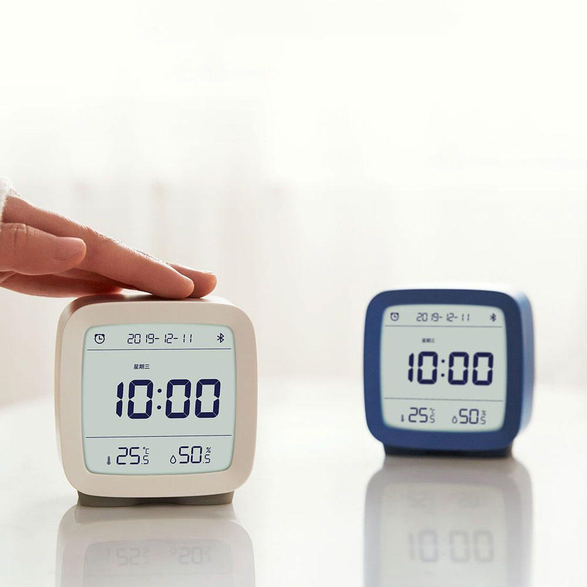

Xiaomi LYWSD03MMC BLE Sensor
============================

.. seo::
    :description: Instructions for setting up Xiaomi Mi Jia CGD1 bluetooth-based temperature and humidity sensors in ESPHome.
    :image: xiaomi_cgd1.jpg
    :keywords: Xiaomi, Mi Jia, BLE, Bluetooth, CGD1, Qingping, ClearGrass, alarm clock

The ``xiaomi_cgd1`` sensor platform lets you track the output of Xiaomi CGD1 ClearGrass Qingping alarm clock using the :doc:`/components/esp32_ble_tracker`. This component will track the temperature, humidity and optionally the battery level of the device every time the sensor sends out a BLE broadcast. The packets are like in the :doc:`/components/sensor/xiaomi_lywsd03mmc` platform encrypted. Hence you need to obtain the bindkey first for each device and give it as an required option in the config file.

    Xiaomi Temperature and Humidity Sensor over BLE.

.. code-block:: yaml

    # Example configuration entry
    esp32_ble_tracker:

    sensor:
      - platform: xiaomi_cgd1
        mac_address: "A4:C1:38:D1:61:7D"
        bindkey: "c99d2313182473b38001086febf781bd"
        temperature:
          name: "CGD1 Temperature"
        humidity:
          name: "CGD1 Humidity"
        battery_level:
          name: "CGD1 Battery Level"

Configuration variables:
------------------------

- **mac_address** (**Required**, MAC Address): The MAC address of the Xiaomi CGD1 device.
- **bindkey** (**Required**, Bind Key): The key to decrypt the BLE advertisements (32 characters = 16 bytes, case insensitive)
- **temperature** (*Optional*): The information for the temperature sensor.

  - **name** (**Required**, string): The name for the temperature sensor.
  - **id** (*Optional*, :ref:`config-id`): Set the ID of this sensor for use in lambdas.
  - All other options from :ref:`Sensor <config-sensor>`.

- **humidity** (*Optional*): The information for the humidity sensor

  - **name** (**Required**, string): The name for the humidity sensor.
  - **id** (*Optional*, :ref:`config-id`): Set the ID of this sensor for use in lambdas.
  - All other options from :ref:`Sensor <config-sensor>`.

- **battery_level** (*Optional*): The information for the battery level sensor

  - **name** (**Required**, string): The name for the battery level sensor.
  - **id** (*Optional*, :ref:`config-id`): Set the ID of this sensor for use in lambdas.
  - All other options from :ref:`Sensor <config-sensor>`.

Setting Up Devices
------------------

The procedure to obtain the bindkey for setting up the CGD1 alarm clock is identical to the LYWSD03MMC devices and is described here :doc:`/components/sensor/xiaomi_lywsd03mmc`. To find the MAC Address so that ESPHome can identify the device, you can create a simple configuration without any ``xiaomi_cgd1`` entries:

.. code-block:: yaml

    esp32_ble_tracker:

After uploading the ESP32 will immediately try to scan for BLE devices. When it detects a CGD1 sensor, it will automatically parse the BLE message and print a message like this one:

.. code::

    Found device A4:C1:38:D1:61:7D RSSI=-92
      Address Type: PUBLIC
      Name: 'CGD1'

It can sometimes take some time for the first BLE broadcast to be received. Once the device has been found, copy the address (``A4:C1:38:D1:61:7D``) into a new ``sensor.xiaomi_cgd1`` platform entry like shown in the configuration example above.

.. note::

    The ESPHome Xiaomi integration listens passively to packets the xiaomi device sends by itself.
    ESPHome therefore has no impact on the battery life of the device.

See Also
--------

- :doc:`/components/esp32_ble_tracker`
- :doc:`/components/sensor/xiaomi_lywsd03mmc`
- :doc:`/components/sensor/index`
- :apiref:`xiaomi_cgd1/xiaomi_cgd1.h`
- Xiaomi Home Assistant mitemp_bt custom component `<https://github.com/custom-components/sensor.mitemp_bt>`__
  by `@Magalex2x14 <https://github.com/Magalex2x14>`__
- Xiaomi LYWSD03MMC passive sensor readout `<https://github.com/ahpohl/xiaomi_lywsd03mmc>`__ by `@ahpohl <https://github.com/ahpohl>`__
- Instructions on how to obtain the bind key `<https://github.com/custom-components/sensor.mitemp_bt/blob/master/faq.md#my-sensors-ble-advertisements-are-encrypted-how-can-i-get-the-key>`__
- :ghedit:`Edit`
