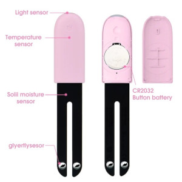

HHCCJCY10 Xiaomi MiFlora (Pink version)
=======================================

.. seo::
    :description: Instructions for setting up a Xiaomi MiFlora HHCCJCY10 (Pink) using ESPHome.
    :image: xiaomi_hhccjcy10.jpg

MiFlora, tuya (pink) version, measures temperature, moisture, ambient light and nutrient levels in the soil.

.. code-block:: yaml

    sensor:
      - platform: xiaomi_hhccjcy10
        mac_address: '94:2B:FF:5C:91:61'
        temperature:
          name: "Xiaomi HHCCJCY10 Temperature"
        moisture:
          name: "Xiaomi HHCCJCY10 Moisture"
        illuminance:
          name: "Xiaomi HHCCJCY10 Illuminance"
        conductivity:
          name: "Xiaomi HHCCJCY10 Soil Conductivity"
        battery_level:
          name: "Xiaomi HHCCJCY10 Battery Level"

Configuration variables:
------------------------

- **mac_address** (**Required**, string): The MAC address of the device.
- **temperature** (*Optional*): The temperature sensor.
  All options from :ref:`Sensor <config-sensor>`.
- **moisture** (*Optional*): The moisture sensor.
  All options from :ref:`Sensor <config-sensor>`.
- **illuminance** (*Optional*): The illuminance sensor.
  All options from :ref:`Sensor <config-sensor>`.
- **conductivity** (*Optional*): The conductivity sensor.
  All options from :ref:`Sensor <config-sensor>`.
- **battery_level** (*Optional*): The battery level sensor.
  All options from :ref:`Sensor <config-sensor>`.

See Also
--------

- :doc:`ble_client`
- :ghedit:`Edit`
