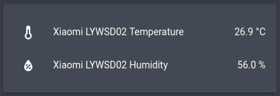

Xiaomi LYWSD02 BLE Sensor
=========================

.. seo::
    :description: Instructions for setting up Xiaomi LYWSD02 bluetooth-based temperature and humidity sensors in ESPHome.
    :image: xiaomi_lywsd02.jpg
    :keywords: Xiaomi, LYWSD02, BLE, Bluetooth

The ``xiaomi_lywsd02`` sensor platform lets you track the output of Xiaomi LYWSD02 Bluetooth Low Energy
devices using the :doc:`/components/esp32_ble_tracker`. This component will track the
temperature, humidity of the LYWSD02 device every time the sensor
sends out a BLE broadcast. Note that contrary to other implementations, ESPHome can track as many
LYWSD02 devices at once as you want.

.. figure:: images/xiaomi_lywsd02-full.jpg
    :align: center
    :width: 60.0%

    Xiaomi LYWSD02 Temperature and Humidity Sensor over BLE.

.. code-block:: yaml

    # Example configuration entry
    esp32_ble_tracker:

    sensor:
      - platform: xiaomi_lywsd02
        mac_address: 3F:5B:7D:82:58:4E
        temperature:
          name: "Xiaomi LYWSD02 Temperature"
        humidity:
          name: "Xiaomi LYWSD02 Humidity"

Configuration variables:
------------------------

- **mac_address** (**Required**, MAC Address): The MAC address of the Xiaomi LYWSD02 device.
- **temperature** (*Optional*): The information for the temperature sensor.

  - **name** (**Required**, string): The name for the temperature sensor.
  - **id** (*Optional*, :ref:`config-id`): Set the ID of this sensor for use in lambdas.
  - All other options from :ref:`Sensor <config-sensor>`.

- **humidity** (*Optional*): The information for the humidity sensor

  - **name** (**Required**, string): The name for the humidity sensor.
  - **id** (*Optional*, :ref:`config-id`): Set the ID of this sensor for use in lambdas.
  - All other options from :ref:`Sensor <config-sensor>`.

Setting Up Devices
------------------

To set up Xiaomi LYWSD02 devices you first need to find their MAC Address so that ESPHome can
identify them. So first, create a simple configuration without any ``xiaomi_lywsd02`` entries like so:

.. code-block:: yaml

    esp32_ble_tracker:

After uploading the ESP32 will immediately try to scan for BLE devices such as the Xiaomi LYWSD02. When
it detects these sensors, it will automatically parse the BLE message print a message like this one:

.. code::

    Got Xiaomi LYWSD02 (3F:5B:7D:82:58:4E): Temperature: 26.9°C

Note that it can sometimes take some time for the first BLE broadcast to be received. You can speed up
the process by pressing the grey bluetooth button on the back of the device.

Then just copy the address (``3F:5B:7D:82:58:4E``) into a new ``sensor.xiaomi_lywsd02`` platform entry like
in the configuration example at the top.

.. note::

    The ESPHome Xiaomi integration listens passively to packets the xiaomi device sends by itself.
    ESPHome therefore has no impact on the battery life of the device.

See Also
--------

- :doc:`/components/esp32_ble_tracker`
- :doc:`/components/sensor/xiaomi_mijia`
- :doc:`/components/sensor/xiaomi_miflora`
- :doc:`/components/sensor/index`
- :apiref:`xiaomi_mijia/xiaomi_mijia.h`
- `Xiaomi Mijia BLE protocol <https://github.com/mspider65/Xiaomi-Mijia-Bluetooth-Temperature-and-Humidity-Sensor>`__
  by `@mspider65 <https://github.com/mspider65>`__
- `OpenMQTTGateway <https://github.com/1technophile/OpenMQTTGateway>`__ by `@1technophile <https://github.com/1technophile>`__
- :ghedit:`Edit`
