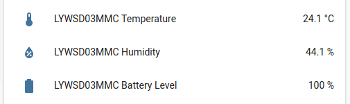

Xiaomi LYWSD03MMC BLE Sensor
============================

.. seo::
    :description: Instructions for setting up Xiaomi Mi Jia LYWSD03MMC bluetooth-based temperature and humidity sensors in ESPHome.
    :image: xiaomi_lywsd03mmc.jpg
    :keywords: Xiaomi, Mi Jia, BLE, Bluetooth, LYWSD03MMC

The ``xiaomi_lywsd03mmc`` sensor platform lets you track the output of Xiaomi LYWSD03MMC Bluetooth Low Energy
devices using the :doc:`/components/esp32_ble_tracker`. This component will track the
temperature, humidity and optionally the battery level of the device every time the sensor
sends out a BLE broadcast. Note that contrary to other implementations, ESPHome can track as many
as eight LYWSD03MMC devices at once. As the payload in the BLE advertisement is encrypted, you need to obtain
the bindkey for each LYWSD03MMC device first and give it as an required option in the config file.  

    Xiaomi Temperature and Humidity Sensor over BLE.

.. code-block:: yaml

    # Example configuration entry
    esp32_ble_tracker:

    sensor:
      - platform: xiaomi_lywsd03mmc
        mac_address: "A4:C1:38:8C:34:B7"
        bindkey: "cfc7cc892f4e32f7a733086cf3443cb0"
        temperature:
          name: "LYWSD03MMC Temperature"
        humidity:
          name: "LYWSD03MMC Humidity"
        battery_level:
          name: "LYWSD03MMC Battery Level"

Configuration variables:
------------------------

- **mac_address** (**Required**, MAC Address): The MAC address of the Xiaomi LYWSD03MMC device.
- **bindkey** (**Required**, Bind Key): The key to decrypt the BLE advertisements (32 characters = 16 bytes, case insensitive)
- **temperature** (*Optional*): The information for the temperature sensor.

  - **name** (**Required**, string): The name for the temperature sensor.
  - **id** (*Optional*, :ref:`config-id`): Set the ID of this sensor for use in lambdas.
  - All other options from :ref:`Sensor <config-sensor>`.

- **humidity** (*Optional*): The information for the humidity sensor

  - **name** (**Required**, string): The name for the humidity sensor.
  - **id** (*Optional*, :ref:`config-id`): Set the ID of this sensor for use in lambdas.
  - All other options from :ref:`Sensor <config-sensor>`.

- **battery_level** (*Optional*): The information for the battery level sensor

  - **name** (**Required**, string): The name for the battery level sensor.
  - **id** (*Optional*, :ref:`config-id`): Set the ID of this sensor for use in lambdas.
  - All other options from :ref:`Sensor <config-sensor>`.

Setting Up Devices
------------------

To set up a Xiaomi LYWSD03MMC device you first need to obain the bind key. This sensor component is
not able to automatically generate a bind key, so you need to use the original Mi Home app to add the sensor once. 
While adding the device, a new key is generated and uploaded into the Xiaomi cloud (currently a chinese server needs to be selected. The rest of
the world doesn't support the LYWSD03MMC type yet.) and to the device itself. Once generated, it will not
change again until the device is removed and re-added in the Xiaomi app (it will be kept even after removal
of the battery).

In order to obtain the bind key, a SSL packet sniffer needs to be setup on either an Android phone or the
iPhone. A good choice for Android is the `Remote PCAP <https://play.google.com/store/apps/details?id=com.egorovandreyrm.pcapremote&hl=en>`__ app
in combination with Wireshark. A tutorial on how to setup the Remote PCAP packet sniffer can be found 
`here <https://egorovandreyrm.com/pcap-remote-tutorial/>`__. More info including some instructions for the iPhone are 
`here <https://github.com/custom-components/sensor.mitemp_bt/blob/master/faq.md#my-sensors-ble-advertisements-are-encrypted-how-can-i-get-the-key>`__. 
Once the traffic between the Mi Home app and the Xiaomi could has been recorded, the bind key will show in clear text

.. code-block:: yaml

    packet: POST /app/device/bltbind

    "data" = "{"did":"blt.3.129q4nasgeg00","token":"20c665a7ff82a5bfb5eefc36","props":[{"type":"prop","key":"bind_key","value":"dc06a798095b178767c0b74185275352"},   {"type":"prop","key":"smac","value":"A4:C1:38:BF:54:5D"}]}"

The ``bind_key`` is the 32 digits "value" item in the above output which needs to be inserted into the config file. Alternatively, there are efforts 
to generate a bind key with a python `script <https://github.com/danielkucera/mi-standardauth>`__  without the need for the Mi Home app.

To find the MAC Address so that ESPHome can identify the device, create a simple configuration without any ``xiaomi_lywsd03mmc`` 
entries:

.. code-block:: yaml

    esp32_ble_tracker:

After uploading the ESP32 will immediately try to scan for BLE devices such as the Xiaomi LYWSD03MMC. When
it detects these sensors, it will automatically parse the BLE message print a message like this one:

.. code::

    Got Xiaomi LYWSD03MMC A4:C1:38:8C:34:B7 Got temperature=23.4°C

Note that it can sometimes take some time for the first BLE broadcast to be received.

Then just copy the address (``A4:C1:38:8C:34:B7``) into a new ``sensor.xiaomi_lywsd03mmc`` platform entry like
in the configuration example at the top.

.. note::

    The ESPHome Xiaomi integration listens passively to packets the xiaomi device sends by itself.
    ESPHome therefore has no impact on the battery life of the device.

See Also
--------

- :doc:`/components/esp32_ble_tracker`
- :doc:`/components/sensor/xiaomi_hhccjcy01`
- :doc:`/components/sensor/index`
- :apiref:`xiaomi_lywsd03mmc/xiaomi_lywsd03mmc.h`
- `Xiaomi Home Assistant mitemp_bt custom component `<https://github.com/custom-components/sensor.mitemp_bt>`__
  by `@Magalex2x14 <https://github.com/Magalex2x14>`__
- Xiaomi LYWSD03MMC passive sensor readout `<https://github.com/ahpohl/xiaomi_lywsd03mmc>`__ by `@ahpohl <https://github.com/ahpohl>`__
- Instructions on how to obtain the bind key `<https://github.com/custom-components/sensor.mitemp_bt/blob/master/faq.md#my-sensors-ble-advertisements-are-encrypted-how-can-i-get-the-key>`__
- :ghedit:`Edit`
