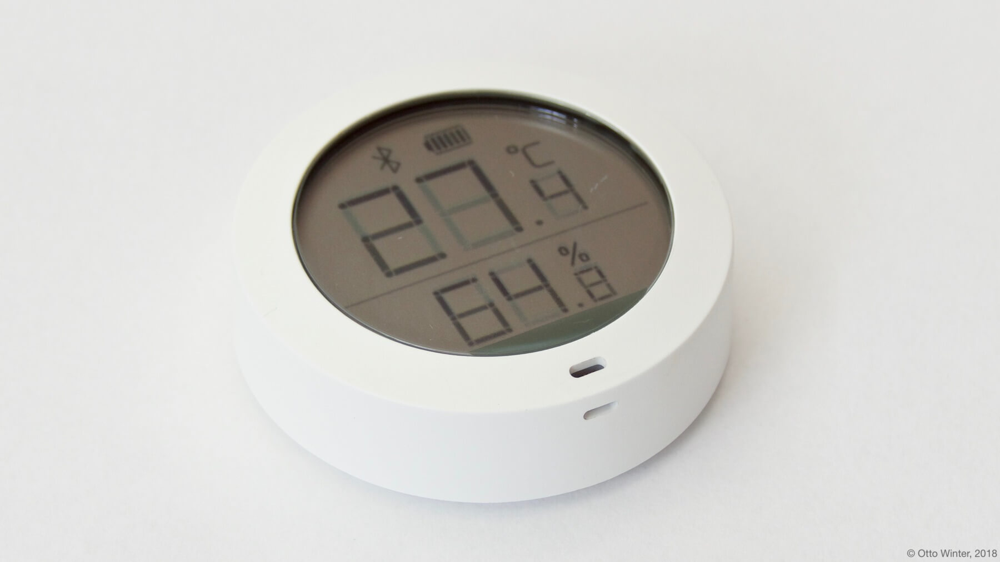
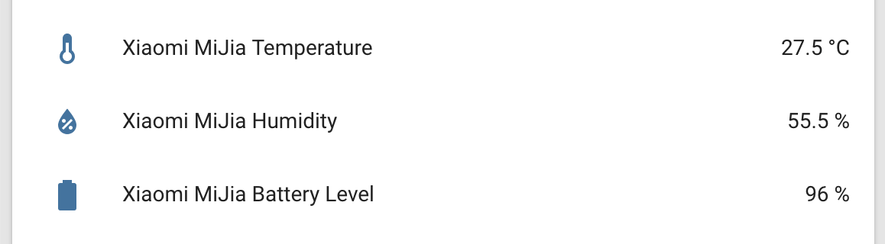

Xiaomi MiJia BLE Sensor
=======================

.. seo::
    :description: Instructions for setting up Xiaomi Mi Jia bluetooth-based temperature and humidity sensors in ESPHome.
    :image: xiaomi_miflora.jpg
    :keywords: Xiaomi, Mi Jia, BLE, Bluetooth

The ``xiaomi_mijia`` sensor platform lets you track the output of Xiaomi MiJia Bluetooth Low Energy
devices using the :doc:`/components/esp32_ble_tracker`. This component will track the
temperature, humidity and optionally the battery level of the MiJia device every time the sensor
sends out a BLE broadcast. Note that contrary to other implementations, ESPHome can track as many
MiJia devices at once as you want.

    Xiaomi MiJia Temperature and Humidity Sensor over BLE.

.. code-block:: yaml

    # Example configuration entry
    esp32_ble_tracker:

    sensor:
      - platform: xiaomi_mijia
        mac_address: 7A:80:8E:19:36:BA
        temperature:
          name: "Xiaomi MiJia Temperature"
        humidity:
          name: "Xiaomi MiJia Humidity"
        battery_level:
          name: "Xiaomi MiJia Battery Level"

Configuration variables:
------------------------

- **mac_address** (**Required**, MAC Address): The MAC address of the Xiaomi MiJia device.
- **temperature** (*Optional*): The information for the temperature sensor.

  - **name** (**Required**, string): The name for the temperature sensor.
  - **id** (*Optional*, :ref:`config-id`): Set the ID of this sensor for use in lambdas.
  - All other options from :ref:`Sensor <config-sensor>`.

- **humidity** (*Optional*): The information for the humidity sensor

  - **name** (**Required**, string): The name for the humidity sensor.
  - **id** (*Optional*, :ref:`config-id`): Set the ID of this sensor for use in lambdas.
  - All other options from :ref:`Sensor <config-sensor>`.

- **battery_level** (*Optional*): The information for the battery level sensor

  - **name** (**Required**, string): The name for the humidity sensor.
  - **id** (*Optional*, :ref:`config-id`): Set the ID of this sensor for use in lambdas.
  - All other options from :ref:`Sensor <config-sensor>`.

Setting Up Devices
------------------

To set up Xiaomi MiJia devices you first need to find their MAC Address so that ESPHome can
identify them. So first, create a simple configuration without any ``xiaomi_mijia`` entries like so:

.. code-block:: yaml

    esp32_ble_tracker:

After uploading the ESP32 will immediately try to scan for BLE devices such as the Xiaomi MiJia. When
it detects these sensors, it will automatically parse the BLE message print a message like this one:

.. code::

    Xiaomi MiJia 7A:80:8E:19:36:BA Got temperature=23.4°C, humidity=65.0%

Note that it can sometimes take some time for the first BLE broadcast to be received. You can speed up
the process by pressing the grey bluetooth button on the back of the device.

Then just copy the address (``7A:80:8E:19:36:BA``) into a new ``sensor.xiaomi_mijia`` platform entry like
in the configuration example at the top.

See Also
--------

- :doc:`/components/esp32_ble_tracker`
- :doc:`/components/sensor/xiaomi_miflora`
- :doc:`/components/sensor/index`
- :apiref:`xiaomi_mijia/xiaomi_mijia.h`
- `Xiaomi Mijia BLE protocol <https://github.com/mspider65/Xiaomi-Mijia-Bluetooth-Temperature-and-Humidity-Sensor>`__
  by `@mspider65 <https://github.com/mspider65>`__
- `OpenMQTTGateway <https://github.com/1technophile/OpenMQTTGateway>`__ by `@1technophile <https://github.com/1technophile>`__
- :ghedit:`Edit`
