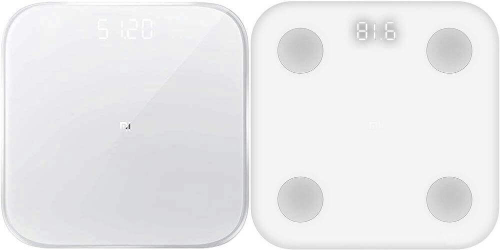

Xiaomi Miscale Sensors
========================

.. seo::
    :description: Instructions for setting up Xiaomi Miscale bluetooth-based sensors in ESPHome.
    :image: xiaomi_miscale.jpg
    :keywords: Xiaomi, Miscale, BLE, Bluetooth, XMTZC01HM, XMTZC04HM, XMTZC02HM, XMTZC05HM

The ``xiaomi_miscale`` sensor platform lets you track the output of Xiaomi Bluetooth Low Energy devices using the :doc:`/components/esp32_ble_tracker`. This component will track, for example, the weight of the device every time the sensor sends out a BLE broadcast. Contrary to other implementations, ``xiaomi_miscale`` listens passively to advertisement packets and does not pair with the device. Hence ESPHome has no impact on battery life.

To get the body scores using your weight, height, age and gender see the custom_components `<https://github.com/dckiller51/bodymiscale>`__

Supported Devices
-----------------

XMTZC01HM, XMTZC04HM, XMTZC02HM, XMTZC05HM
******************************************

Miscale (left) measures weight only. Miscale2 (right) measures weight and impedance.

.. code-block:: yaml

    sensor:
      - platform: xiaomi_miscale
        mac_address: '5C:CA:D3:70:D4:A2'
        weight:
          name: "Xiaomi Mi Scale Weight"
        impedance:
          name: "Xiaomi Mi Scale Impedance"

Configuration variables:
------------------------

- **mac_address** (**Required**, MAC Address): The MAC address of the scale.
- **weight** (*Optional*): The information for the weight sensor.

  - **name** (**Required**, string): The name for the weight sensor.
  - All other options from :ref:`Sensor <config-sensor>`.

- **impedance** (*Optional*): The information for the impedance sensor. **Only available on MiScale2**

  - **name** (**Required**, string): The name for the impedance sensor.
  - All other options from :ref:`Sensor <config-sensor>`.

- **clear_impedance** (*Optional*): Clear the impedance information if a weight reading without impedance is received. Defaults to ``false``. **Only available on MiScale2**

  Useful in the example below if a person steps onto the scale without waiting for the complete measurement. Without setting the flag the impedance reading of the measurement before will be used for the currently measured person.

Configuration example with multiple users:
******************************************

You have to replace the numbers in the lambdas to determine your weight which is between X weight and X weight.

.. code-block:: yaml

    sensor:
      - platform: xiaomi_miscale
        mac_address: '5C:CA:D3:70:D4:A2'
        weight:
          name: "Xiaomi Mi Scale Weight"
          id: weight_miscale
          on_value:
            then:
              - lambda: |-
                  if (id(weight_miscale).state >= 69 && id(weight_miscale).state <= 74.49) {
                    return id(weight_user1).publish_state(x);}
                  else if (id(weight_miscale).state >= 74.50 && id(weight_miscale).state <= 83) {
                    return id(weight_user2).publish_state(x);}

        impedance:
          name: "Xiaomi Mi Scale Impedance"
          id: impedance_miscale
          on_value:
            then:
              - lambda: |-
                  if (id(weight_miscale).state >= 69 && id(weight_miscale).state <= 74.49) {
                    return id(impedance_user1).publish_state(x);}
                  else if (id(weight_miscale).state >= 74.50 && id(weight_miscale).state <= 83) {
                    return id(impedance_user2).publish_state(x);}

      - platform: template
        name: Weight Aurélien
        id: weight_user1
        unit_of_measurement: 'kg'
        icon: mdi:weight-kilogram
        accuracy_decimals: 2
      - platform: template
        name: Impedance Aurélien
        id: impedance_user1
        unit_of_measurement: 'Ω'
        icon: mdi:omega
        accuracy_decimals: 0
      - platform: template
        name: Weight Siham
        id: weight_user2
        unit_of_measurement: 'kg'
        icon: mdi:weight-kilogram
        accuracy_decimals: 2
      - platform: template
        name: Impedance Siham
        id: impedance_user2
        unit_of_measurement: 'Ω'
        icon: mdi:omega
        accuracy_decimals: 0

See Also
--------

- :doc:`/components/esp32_ble_tracker`
- :doc:`/components/sensor/index`
- bodymiscale score integration for Home Assistant (bodymiscale custom component) `<https://github.com/dckiller51/bodymiscale>`__
- bodymiscale Lovelace Card `<https://github.com/dckiller51/lovelace-body-miscale-card>`__

- :ghedit:`Edit`
