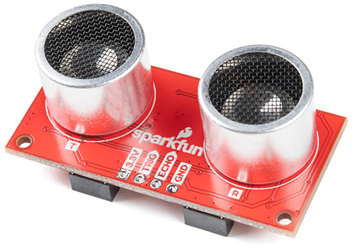

Zio Ultrasonic Distance Sensor
==============================

.. seo::
    :description: Instructions for setting up the Zio Ultrasonic Distance sensor.
    :image: zio_ultrasonic.jpg
    :keywords: ultrasonic, i2c

The Zio Ultrasonic Distance sensor allows you to use your compatible
(`datasheet <https://cdn.sparkfun.com/datasheets/Sensors/Proximity/HCSR04.pdf>`__,
`sparkfun <https://www.sparkfun.com/products/17777>`__)
sensors with ESPHome. 

    Zio Ultrasonic Distance Sensor.
    (Credit: `Sparkfun <https://www.sparkfun.com/products/17777>`__, image cropped and compressed)

.. _Sparkfun: https://www.sparkfun.com/products/17777

The Zio Ultrasonic Distance Sensor is an ultrasonic distance sensor based on the HC-SR04 sensor. Unlike the :doc:`Ultrasonic Distance Sensor component </components/sensor/ultrasonic>`, measurements are read over the I²C bus.

To use the sensor, first set up an :ref:`I²C Bus <i2c>` and connect the sensor to the specified pins.

.. code-block:: yaml

    # Example configuration entry
    sensor:
      - platform: zio_ultrasonic
        name: "Distance"
        update_interval: 60s

Configuration variables:
------------------------

- **address** (*Optional*, int): Manually specifiy the I²C address of the sensor. Defaults to ``0x00``.
- **update_interval** (*Optional*, :ref:`config-time`): The interval to check the sensor. Defaults to ``60s``.
- All other options from :ref:`Sensor <config-sensor>`.

See Also
--------

- :doc:`Ultrasonic Sensor Component </components/sensor/ultrasonic>`
- :ref:`sensor-filters`
- :doc:`template`
- :ghedit:`Edit`
