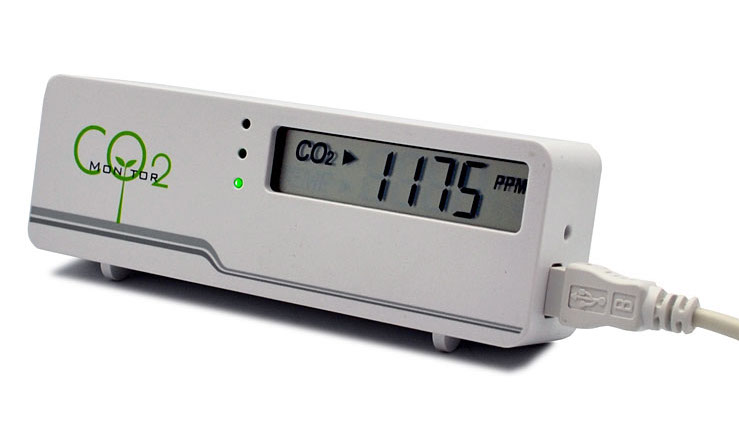
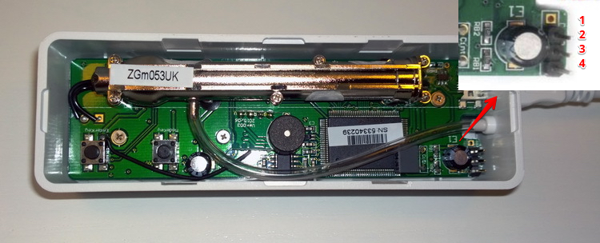

ZyAura CO2 & Temperature & Humidity Sensor
==========================================

.. seo::
    :description: Instructions for setting up ZyAura co2, temperature and humidity monitors.
    :image: zgm053.jpg
    :keywords: CO2, MT8057, MT8057S, MT8060, ZGm05, ZGm053U, ZG1683R, ZG1583RUD

The ZyAura CO2 & Temperature & Humidity sensor allows you to use your
`ZGm05(3)(U) <http://www.zyaura.com/products/ZGm05.asp>`__
(`MT8057 <https://masterkit.ru/shop/1266110>`__, `MT8057S <https://medgadgets.ru/shop/kit-mt8057.html>`__),
`ZG1683R(U) <http://www.zyaura.com/products/ZG1683R.asp>`__ (`MT8060 <https://masterkit.ru/shop/1921398>`__),
`ZG1583RUD <http://www.zyaura.com/products/ZG1583RUD.asp>`__
monitors with ESPHome.

    ZyAura ZGm053U CO2 & Temperature Monitor.

    ZyAura ZGm053U connection diagram (1 - empty, 2 - clock, 3 - data, 4 - GND). In some other models the clock and data pins are swapped.

.. code-block:: yaml

    # Example configuration entry
    sensor:
      - platform: zyaura
        clock_pin: D1
        data_pin: D2
        co2:
          name: "ZyAura CO2"
        temperature:
          name: "ZyAura Temperature"
        humidity:
          name: "ZyAura Humidity"

Configuration variables:
------------------------

- **clock_pin** (**Required**, :ref:`config-pin`): The pin where the clock bus is connected.
- **data_pin** (**Required**, :ref:`config-pin`): The pin where the data bus is connected.
- **co2** (*Optional*): The information for the CO2 sensor.

  - **name** (**Required**, string): The name for the CO2 sensor.
  - **id** (*Optional*, :ref:`config-id`): Set the ID of this sensor for use in lambdas.
  - All other options from :ref:`Sensor <config-sensor>`.

- **temperature** (*Optional*): The information for the temperature sensor.

  - **name** (**Required**, string): The name for the temperature sensor.
  - **id** (*Optional*, :ref:`config-id`): Set the ID of this sensor for use in lambdas.
  - All other options from :ref:`Sensor <config-sensor>`.

- **humidity** (*Optional*): The information for the humidity sensor

  - **name** (**Required**, string): The name for the humidity sensor.
  - **id** (*Optional*, :ref:`config-id`): Set the ID of this sensor for use in lambdas.
  - All other options from :ref:`Sensor <config-sensor>`.

- **update_interval** (*Optional*, :ref:`config-time`): The interval to check the
  sensor. Defaults to ``60s``.

.. note::

    ZGm05 monitor (and maybe others) needs some initial time to get correct data when powered
    on. Only after this timespan will the sensor report correct values. It's not recommended to set
    ``update_interval`` lower than ``20s``.

See Also
--------

- :ref:`sensor-filters`
- :doc:`absolute_humidity`
- :doc:`mhz19`
- `CO2mon-esp firmware <https://github.com/Anonym-tsk/co2mon-esp>`__ by `@anonym-tsk <https://github.com/Anonym-tsk>`__
- `Some information about hacking MT8060 <https://habr.com/ru/company/dadget/blog/394333/>`__
- `CO2MeterHacking project <https://revspace.nl/CO2MeterHacking>`__
- :apiref:`zyaura/zyaura.h`
- :ghedit:`Edit`
