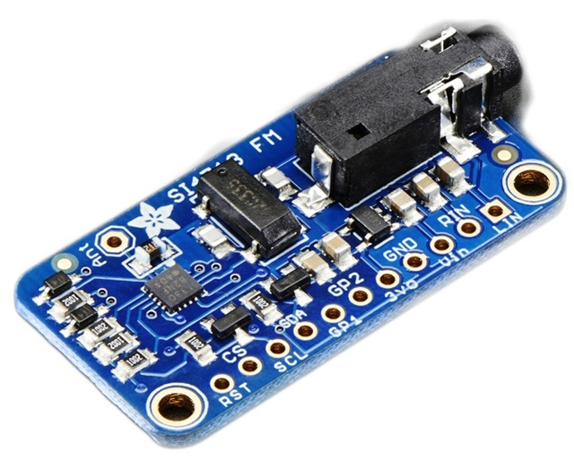
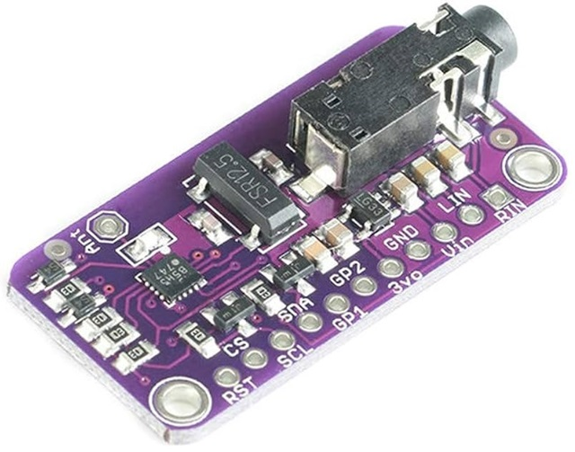

SI4713 FM Transmitter
=====================

.. seo::
    :description: Instructions for setting up Si4713 FM Transmitter
    :image: si4713.jpg
    :keywords: si4710, si4711, si4712, si4713

This component implements the I²C interface for the Si47xx family of FM transmitters. Si4710, Si4711, Si4712, Si4713 are supported. Developement boards from Adafruit Si4713 (blue) and its clones (purple) are available. It comes with no amplifier. Frequency range is 76-108 MHz. RDS isn't supported yet. Every register can be controlled through different components (sensor, switch, select, number, text).

The chip has three GPOI pins. They can be configured as output. 

- GPIO2 would be the interrupt pin, but this component does polling instead.
- GPOI3 is the clock source, it connected to crystal oscillator or the digital clock. On the Adafruit board the crystal is hardwired, there other two I²S pins are not connected, digital input is not possible without hacking and soldering.

Documents
---------

`Si4712/13-B30 Datasheet <https://github.com/gabest11/datasheet/blob/main/Silicon_Labs-SI4712-B30-GMR-datasheet.pdf>`__ 

`Si4712/13-B30 FM Radio Transmitter With Receive Power Scan <https://github.com/gabest11/datasheet/blob/main/Si4712-13-B30.pdf>`__ 

`Si47xx Programming Guide <https://github.com/gabest11/datasheet/blob/main/SiLabs Programming guide AN332.pdf>`__

    Adafruit Si4713

    Adafruit Si4713 clone

Example configuration
---------------------

.. code-block:: yaml

    si4713_i2c:
      id: fm_transmitter
      reset_pin: 10
      op_mode: Analog
      mute: False
      mono: False
      pre_emphasis: '75us'
      tuner:
        enable: True
        frequency: 87.50
        deviation: 68.25
        power: 115
        antcap: 0
      analog:
        level: 636
        attenuation: '60kOhm'
      digital:
        sample_rate: 48000
        sample_bits: '16'
        channels: Stereo
        mode: 'I2S'
        clock_edge: 'Rising'
      pilot:
        enable: True
        frequency: 19.00
        deviation: 6.75
      refclk:
        frequency: 32768
        source: 'RCLK'
        prescaler: 1
      acomp:
        enable: True
        preset: 'Custom'
        threshold: -40
        attack: '0.5ms'
        release: '1000ms'
        gain: 15
      limiter:
        enable: True
        release_time: 5.01
      asq:
        iall: True
        ialh: True
        overmod: True
        level_low: -50
        duration_low: 10000
        level_high: -20
        duration_high: 5000
      rds:
        enable: True
        deviation: 2.0
        station: si4713
        text: sample text
      sensor:
        chip_id:
          name: Chip ID
        frequency:
          name: Frequency
        power:
          name: Power
        antcap:
          name: Antenna Tuning Capacitor
        noise_level:
          name: Received Noise Level
        iall:
          name: Input Audio Level Detection Low
        ialh:
          name: Input Audio Level Detection High 
        overmod:
          name: Overmodulation Detection
        inlevel:
          name: Input Audio Level
  
    number:
      - platform: si4713_i2c
        tuner:
          frequency:
            id: si4713_frequency
            name: Frequency
          deviation:
            name: Audio Deviation
          power:
            name: Tune Power
          antcap:
            name: Antenna Tuning Capacitor
        analog:
          level:
            name: Line Level
        digital:
          sample_rate:
            name: Digital Input Sample Rate
        pilot:
          frequency:
            name: Pilot Frequency
          deviation:
            name: Pilot Deviation
        refclk:
          frequency:
            name: Reference Clock Frequency
          prescaler:
            name: Reference Clock Prescaler
        acomp:
          threshold:
            name: Dynamic Range Control Threshold
          gain:
            name: Dynamic Range Control Gain
        limiter:
          release_time:
            name: Limiter Release Time
        asq:
          level_low:
            name: Input Audio Level Low Threshold
          duration_low:
            name: Input Audio Level Duration Low
          level_high:
            name: Input Audio Level High Threshold
          duration_high:
            name: Input Audio Level Duration High
        rds:
          deviation:
            name: RDS Deviation
  
    switch:
      - platform: si4713_i2c
        mute:
          name: Mute
        mono:
          name: Mono
        tuner:
          enable:
            name: Power Enable
        pilot:
          enable:
            name: Pilot Tone Enable
        acomp:
          enable:
            name: Dynamic Range Control Enable
        limiter:
          enable:
            name: Audio Limiter Enable
        asq:
          iall:
            name: Input Audio Level Detection High Threshold Enable
          ialh:
            name: Input Audio Level Detection Low Threshold Enable
          overmod:
            name: Overmodulation Detection Enable
        rds:
          enable:
            name: RDS Enable
        output:
          gpio1:
            name: GPIO1 Switch
          gpio2:
            name: GPIO2 Switch
          gpio3:
            name: GPIO3 Switch
  
    select:
      - platform: si4713_i2c
        pre_emphasis:
          name: Pre-Emphasis
        analog:
          attenuation:
            name: Line Attenuation
        digital:
          sample_bits:
            name: Digital Audio Sample Precision
          channels:
            name: Digital Audio Channels
          mode:
            name: Digital Mode
          clock_edge:
            name: Digital Clock Edge
        refclk:
          source:
            name: Reference Clock Source
        acomp:
          attack:
            name: Dynamic Range Control Attack Time
          release:
            name: Dynamic Range Control Release Time
          preset:
            name: Dynamic Range Control Preset
  
    text:
      - platform: si4713_i2c
        rds:
          station:
            name: RDS Station
          text:
            name: RDS Text
  
    output:
      - platform: si4713_i2c
        id: "GPIO1"
        pin: 1
      - platform: si4713_i2c
        id: "GPIO2"
        pin: 2

Configuration variables:
------------------------

- **reset_pin** (**Required**, :ref:`config-pin`): The device needs to be reset before use, connect the reset pin to this pin.
- **op_mode** (*Optional*, enum): Audio input mode.
- **mute** (*Optional*, boolean): Mute audio if True.
- **mono** (*Optional*, boolean): Mono audio if True. Disables Left minus Right (Stereo) to be transmitted.
- **pre_emphasis** (*Optional*, enum): Configures pre-emphasis time constant. (50us => Europe, Australia, 75us => USA, Japan)

Tuner (tuner):
--------------

- **enable** (*Optional*, boolean): Enables transmission.
- **frequency** (*Optional*, float): Selects the tune frequency.
- **deviation** (*Optional*, float): Transmit audio frequency deviation.
- **power** (*Optional*, int): Sets the tune power in dBuV. Power may be set as high as 120 dBuV, however, voltage accuracy is not guaranteed.
- **antcap** (*Optional*, float): This selects the value of the antenna tuning capacitor manually, or automatically if set to zero.

Analog (analog):
----------------

- **level** (*Optional*, int): Maximum line amplitude level on the LIN/RIN pins in mVPK.
- **attenuation** (*Optional*, enum): Line attenuation.

Digital (digital):
------------------

- **sample_rate** (*Optional*, int): Digital input sample rate.
- **sample_bits** (*Optional*, enum): Digital audio sample precision.
- **channels** (*Optional*, enum): Mono or Stereo audio mode.
- **mode** (*Optional*, enum): Digital mode.
- **clock_edge** (*Optional*, enum): DCLK rising/falling edge.

Pilot (pilot):
--------------

- **enable** (*Optional*, boolean): Enables the pilot tone to be transmitted.
- **frequency** (*Optional*, float): Stereo Pilot Frequency.
- **deviation** (*Optional*, float): Transmit pilot frequency deviation.

Reference Clock (refclk) configuration variables:
-------------------------------------------------

- **frequency** (*Optional*, int): Frequency of Reference Clock.
- **source** (*Optional*, enum): Selects RCLK/DCLK pin as the clock source.
- **prescaler** (*Optional*, int): Integer number used to divide the RCLK frequency down to REFCLK frequency.

Audio Compressor (acomp):
------------------------------

- **enable** (*Optional*, boolean): Transmit audio dynamic range control enable.
- **preset** (*Optional*, enum): Configures the compressor with predefined values. Minimal: -40dB, 50ms, 100ms, 15dB. Aggressive: -15dB, 0.5ms, 1000ms, 5dB.
- **threshold** (*Optional*, float): Transmit audio dynamic range control threshold.
- **attack** (*Optional*, enum): Transmit audio dynamic range control attack time.
- **release** (*Optional*, enum): Transmit audio dynamic range control release time.
- **gain** (*Optional*, float): Transmit audio dynamic range control gain.

Audio Limiter (limiter):
------------------------

- **enable** (*Optional*, boolean): Audio limiter enable.
- **release_time** (*Optional*, float): Sets the limiter release time.

Audio Signal Quality (asq):
---------------------------

- **iall** (*Optional*, boolean): Input audio level detection low threshold enable.
- **ialh** (*Optional*, boolean): Input audio level detection high threshold enable.
- **overmod** (*Optional*, boolean): Overmodulation detection enable.
- **level_low** (*Optional*, float): Input audio level low threshold.
- **duration_low** (*Optional*, float): Input audio level low duration.
- **level_high** (*Optional*, float): Input audio level high threshold.
- **duration_high** (*Optional*, float): Input audio level low duration.

Enabling iall, ialh, overmod triggers the corresponding binary_sensors, when the level is under/over for the set duration.

RDS (rds):
----------

- **enable** (*Optional*, boolean): RDS Enable.
- **deviation** (*Optional*, float): Transmit RDS frequency deviation.
- **station** (*Optional*, float): Station name. Max 8 characters.
- **text** (*Optional*, float): Additional RDS text. Max 64 characters.

Sensor (sensor):
--------

- **chip_id** (*Optional*, string): Detected chip id. (Si47xx)
- **frequency** (*Optional*, float): Returns frequency being tuned.
- **power** (*Optional*, float): Returns the transmit output voltage setting.
- **antcap** (*Optional*, float): This byte will contain the current antenna tuning capacitor value.
- **noise_level** (*Optional*, float): This byte will contain the receive level as the response to a TX Tune Measure command. The returned value will be the last RNL measurement (or 0 if no measurement has been performed) for the TX Tune Freq and TX Tune Power commands.
- **iall** (*Optional*, boolean): Input audio level low threshold exceeded.
- **ialh** (*Optional*, boolean): = Input audio level high threshold exceeded.
- **overmod** (*Optional*, boolean): Output signal is above requested modulation level.
- **inlevel** (*Optional*, float): The current audio input level measured in dBfs.

======================= ======= ============================================================================================================================================
config variable         default values
======================= ======= ============================================================================================================================================
op_mode                 Analog  Analog, Digital
mute                    False
mono                    False  
pre_emphasis            75us    50us, 75us, Disabled (50ns => Europe, Australia, 75us => USA, Japan)
tuner / enable          True    
tuner / frequency       87.50   76 to 108 (MHz) 0.05 step size
tuner / deviation       68.25   0 to 90 (kHz)
tuner / power           115     88 to 115 (dBuV) [1]_
tuner / antcal          0       0 to 47.75 (pF)
analog / level          636     0 to 1023 mVPK
analog / attenuation    60kOhm  60kOhm, 74kOhm, 100kOhm, 396kOhm
digital / sample_rate   48000   32000 to 48000 (Hz)
digital / sample_bits   16      8, 16, 20, 24 (bits)
digital / channels      Stereo  Mono, Stereo
digital / mode          I2S     Default, I2S, Left Justified, MSB at 1st, MSB at 2nd
digital / clock_edge    Rising  Rising, Falling
pilot / enable          True
pilot / frequency       19.00   0 to 19 (kHz)
pilot / deviation       6.75    0 to 90 (kHz)
refclk / frequency      32768   31130 to 34406 (Hz)
refclk / source         RCLK    RCLK, DCLK
refclk / prescaler      1       1 to 4095
acomp / enable     True
acomp / preset     Custom  Minimal, Aggressive, Custom
acomp / threshold  -40     -40 to 0 (dB)
acomp / attack     0.5ms   0.5ms, 1.0ms, 1.5ms, 2.0ms, 2.5ms, 3.0ms, 3.5ms, 4.0ms, 4.5ms, 5.0ms
acomp / release    1000ms  100ms, 200ms, 350ms, 525ms, 1000ms
acomp / gain       15      0 to 20 (dB)
limiter / enable        True
limiter / release_time  5.01    0.25 to 102.4, 512.0 divided by [5 to 2000] (ms)
asq / iall              True
asq / ialh              True
asq / overmod           True
asq / level_low         -50     -70 to 0 (dB)
asq / duration_low      10000   0 to 65535 (ms)
asq / level_high        -20     -70 to 0 (dB)
asq / duration_high     5000    0 to 65535 (ms)
rds / enable            True
rds / deviation         2.0     0 to 90 (kHz)
rds / station           
rds / text              
======================= ======= ============================================================================================================================================

.. [1] Power may be set as high as 120 dBuV. However, voltage accuracy is not guaranteed.
