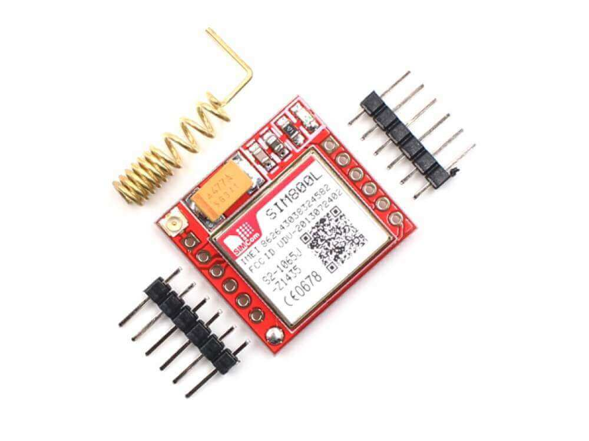

Sim800L Component
=================

.. seo::
    :description: Instructions for setting up the SIM800L GSM module to dial, send and receive SMS in ESPHome.
    :image: sim800l.jpg
    :keywords: SMS SIM800L GSM

Component/Hub
-------------

The ``SIM800L`` Component provides the ability to dial, answer calls, send/receive SMS text messages and
send/receive USSD codes. The device must be connected via a :doc:`UART bus </components/uart>`
supporting both receiving and transmitting line. The UART bus must be configured at the same speed
of the module which is by default 9600bps. The required connection wires are ``+VCC``, ``GND``,
``RX`` and ``TX``.

.. warning::

    If you are using the :doc:`logger` make sure you are not using the same pins for ``TX`` and ``RX`` or
    otherwise disable the UART logging with the ``baud_rate: 0`` option.

.. note::

    This module requires a power supply between 3.8V and 4.2V that can handle current spikes up
    to 2 amps, it will not work by powering from the same 3.3V power source of the ESP. However you can
    connect ``TX`` and ``RX`` lines directly without any level shifter.

.. code-block:: yaml

    # Example configuration entry
    uart:
      baud_rate: 9600
      tx_pin: TX
      rx_pin: RX

    sim800l:
      on_sms_received:
        - logger.log:
            format: "Received '%s' from %s"
            args: [ 'message.c_str()', 'sender.c_str()' ]

    logger:
      baud_rate: 0 # disable uart logger on esp 8266

Configuration variables:

- **uart_id** (*Optional*, :ref:`config-id`): Manually specify the ID of the UART hub.
- **id** (*Optional*, :ref:`config-id`): Manually specify the ID used for code generation.
- **on_sms_received** (*Optional*, :ref:`Automation <automation>`): An action to be
  performed when an SMS is received. See :ref:`sim800l-on_sms_received`.
- **on_incoming_call** (*Optional*, :ref:`Automation <automation>`): An action to be
  performed when a call is received. See :ref:`sim800l-on_incoming_call`.
- **on_call_connected** (*Optional*, :ref:`Automation <automation>`): An action to be
  performed when a call is connected, either because an outgoing call accepted is
  accepted or an incoming call answered.
- **on_call_disconnected** (*Optional*, :ref:`Automation <automation>`): An action to be
  performed when a call is disconnected.

Sensor
------

.. code-block:: yaml

    sensor:
      - platform: sim800l
        rssi:
          name: "Sim800L RSSI"

Configuration variables:

- **rssi** (*Optional*): The informed Received signal strength indication (RSSI) in dBm.

  - **name** (**Required**, string): The name for the rssi sensor.
  - **id** (*Optional*, :ref:`config-id`): Set the ID of this sensor for use in lambdas.
  - All other options from :ref:`Sensor <config-sensor>`.

Binary Sensor
-------------

.. code-block:: yaml

    binary_sensor:
      - platform: sim800l
        registered:
          name: "Sim800L Registered"

Configuration variables:

- **registered** (*Optional*): Indicates if the SIM800L has successfully registered in the cellular network.

  - **name** (**Required**, string): The name for the registered binary sensor.
  - **id** (*Optional*, :ref:`config-id`): Set the ID of this sensor for use in lambdas.
  - All other options from :ref:`Binary Sensor <config-binary_sensor>`.

.. _sim800l-on_sms_received:

``on_sms_received`` Trigger
---------------------------

With this configuration option you can write complex automations whenever an SMS message
is received. To use the message content, use a :ref:`lambda <config-lambda>`
template, the message content and the sender phone number are available inside that lambda
under the variables named ``message`` and ``sender`` respectively.

.. code-block:: yaml

    on_sms_received:
      - lambda: |-
          id(sms_sender).publish_state(sender);
          id(sms_message).publish_state(message);

.. _sim800l-on_incoming_call:

``on_incoming_call`` Trigger
----------------------------

This automation triggers every time the SIM800L sends a RING / Caller ID message, this message
is sent several times per call, presumably every time the phone "RINGs". The automation provides
a ``caller_id`` string parameter which received information. The phone call is neither accepted
or rejected.

.. code-block:: yaml

    on_incoming_call:
      - logger.log:
          format: "Incoming call from '%s'"
          args: ["caller_id.c_str()"]
      - lambda: |-
          id(caller_id_text_sensor).publish_state(caller_id);
      - sim800l.disconnect
      - homeassistant.event:
          event: esphome.incoming_call_event
          data:
            payload: !lambda 'return id(caller_id_text_sensor).state;'

``on_ussd_received`` Trigger
----------------------------

With this configuration option you can write complex automations whenever the ussd code from network
has been received.

.. code-block:: yaml

    on_ussd_received:

.. _sim800l-send_sms_action:

``sim800l.send_sms`` Action
---------------------------

Send a SMS message to a phone recipient using this action in automations.

.. code-block:: yaml

    on_...:
      then:
        - sim800l.send_sms:
            recipient: '+15551234567'
            message: Hello there

        # Templated:
        - sim800l.send_sms:
            recipient: !lambda |-
              if (id(reed_switch).state) return "+15551234567";
              else return "15551234568";
            message: !lambda |-
              return id(reed_switch).state ? "Door is now OPEN" : "Hey door just CLOSED";

Configuration options:

- **recipient** (**Required**, string, :ref:`templatable <config-templatable>`): The message recipient.
  number.
- **message** (**Required**, string, :ref:`templatable <config-templatable>`): The message content.
- **id** (*Optional*, :ref:`config-id`): Manually specify the ID of the SIM800L if you have multiple components.

.. _sim800l-dial_action:

``sim800l.dial`` Action
-----------------------

Dial to a phone recipient using this action in automations.

.. code-block:: yaml

    on_...:
      then:
        - sim800l.dial:
            recipient: '+15551234567'

Configuration options:

- **recipient** (**Required**, string, :ref:`templatable <config-templatable>`): The number to dial.
- **id** (*Optional*, :ref:`config-id`): Manually specify the ID of the SIM800L if you have multiple components.

``sim800l.connect`` Action
--------------------------

Answers an incoming call.

.. code-block:: yaml

    on_...:
      then:
        - sim800l.connect

``sim800l.disconnect`` Action
-----------------------------

Disconnects a call, either dialed in or received.

.. code-block:: yaml

    on_...:
      then:
        - sim800l.disconnect

``sim800l.send_ussd`` Action
----------------------------

Sends a ussd code to the network.

.. code-block:: yaml

    on_...:
      then:
        - sim800l.send_ussd

Getting started with Home Assistant
-----------------------------------

The following code will get you up and running with a configuration updating received messages
on Home Assistant and will also setup a service so you can send messages and dial with your SIM800L.

.. code-block:: yaml

    api:
      services:
        - service: send_sms
          variables:
            recipient: string
            message: string
          then:
            - sim800l.send_sms:
                recipient: !lambda 'return recipient;'
                message: !lambda 'return message;'
        - service: dial
          variables:
            recipient: string
          then:
            - sim800l.dial:
                recipient: !lambda 'return recipient;'
        - service: connect
          then:
            - sim800l.connect
        - service: disconnect
          then:
            - sim800l.disconnect
        - service: send_ussd
          variables:
            ussdCode: string
          then:
            - sim800l.send_ussd:
                ussd: !lambda 'return ussdCode;'

    text_sensor:
      - platform: template
        id: sms_sender
        name: "Sms Sender"
      - platform: template
        id: sms_message
        name: "Sms Message"
      - platform: template
        id: caller_id_text_sensor
        name: "Caller ID"
      - platform: template
        id: ussd_message
        name: "Ussd Code"

    uart:
      baud_rate: 9600
      tx_pin: TX
      rx_pin: RX

    sim800l:
      on_sms_received:
        - lambda: |-
            id(sms_sender).publish_state(sender);
            id(sms_message).publish_state(message);
      on_incoming_call:
        - lambda: |-
            id(caller_id_text_sensor).publish_state(caller_id);
      on_call_connected:
        - logger.log:
            format: Call connected
      on_call_disconnected:
        - logger.log:
            format: Call disconnected
      on_ussd_received:
        - lambda: |-
            id(ussd_message).publish_state(ussd);

Now your latest received SMS and sender number will be displayed by the text sensors.

To trigger the automation from Home Assistant you can invoke the service with this code:

.. code-block:: yaml

    automation:
      # ...
      action:
      - service: esphome.livingroom_send_sms
        data:
          recipient: "+15551234567"
          message: "Hello World!"
      - service: esphome.livingroom_dial
        data:
          recipient: "+15551234567"

Relay management commands received from an authorized sender:

.. code-block:: yaml

    sim800l:
      on_sms_received:
        - lambda: |-
            if ( (id(sms_sender).state == "+79991234567") && ( (id(sms_message).state == "relay_1_on") OR (id(sms_message).state == "Relay_1_on") ) ) {
              id(relay_1).turn_on();
            }
    switch:
      - platform: gpio
        id: relay_1
        pin: GPIOXX

See Also
--------

- :apiref:`sim800l/sim800l.h`
- :doc:`/components/uart`
- :ghedit:`Edit`
