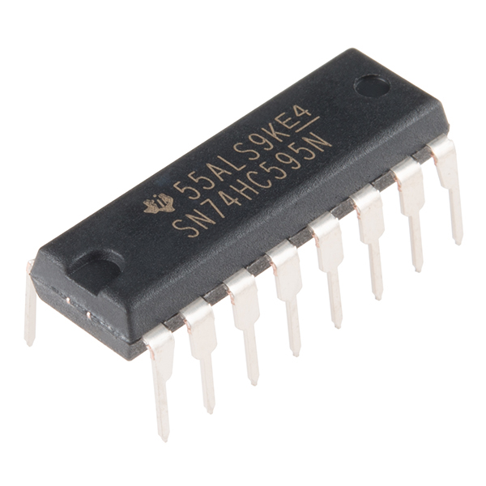

SN74HC595 I/O Expander (shift register)
=======================================

.. seo::
    :description: Instructions for setting up SN74HC595 shift registers as digital port expanders in ESPHome.

The SN74HC595 component allows you to use SN74HC595 shift registers as I/O expanders
(`datasheet <http://www.ti.com/lit/ds/symlink/sn74hc595.pdf>`__,
`SparkFun`_) in ESPHome. It uses 3 wires (optionally 4) for communication. Optionally, it can be added
to a SPI bus to allow sharing pins with other components.

Once configured, you can use any of the 8 pins for your projects. Up to 256 shift registers can be daisy-chained
to provide more pins, without using more GPIO pins on the controller.

Use of the OE pin is optional. If used, the pin should be pulled up externally.

    SN74HC595 I/O Expander (shift register).

.. _SparkFun: https://www.sparkfun.com/products/13699

The component can be configured using :ref:`GPIO pins <config-pin_schema>` or the :ref:`SPI Bus <spi>`.

Over GPIO
---------

.. code-block:: yaml

    # Example configuration entry
    sn74hc595:
      - id: 'sn74hc595_hub'
        data_pin: GPIOXX
        clock_pin: GPIOXX
        latch_pin: GPIOXX
        oe_pin: GPIOXX
        sr_count: 2

    # Individual outputs
    switch:
      - platform: gpio
        name: "SN74HC595 Pin #0"
        pin:
          sn74hc595: sn74hc595_hub
          # Use pin number 0
          number: 0
          inverted: false

Configuration variables:
************************

- **id** (**Required**, :ref:`config-id`): The id to use for this SN74HC595 component.
- **data_pin** (**Required**, :ref:`Pin Schema <config-pin_schema>`): Pin connected to SN74HC595 SER (SD) input.
- **clock_pin** (**Required**, :ref:`Pin Schema <config-pin_schema>`): Pin connected to SN74HC595 SRCLK (SH_CP) pin
- **latch_pin** (**Required**, :ref:`Pin Schema <config-pin_schema>`): Pin connected to SN74HC595 RCLK (ST_CP) pin
- **oe_pin** (*Optional*, :ref:`Pin Schema <config-pin_schema>`): Pin connected to SN74HC595 OE pin
- **sr_count** (*Optional*, int): Number of daisy-chained shift registers, up-to 256. Defaults to ``1``.

Over SPI
--------

.. code-block:: yaml

    # Example configuration entry
    sn74hc595:
      - id: 'sn74hc595_hub'
        type: spi
        latch_pin: GPIOXX
        oe_pin: GPIOXX
        sr_count: 2

Configuration variables:
************************

- **id** (**Required**, :ref:`config-id`): The id to use for this SN74HC595 component.
- **spi_id** (**Required**, :ref:`SPI Bus Schema <spi>`): The SPI bus to use. This will automatically be set to the ID of the SPI bus if there is only one.
- **type** (**Required**, string): Must be ``spi``.
- **latch_pin** (**Required**, :ref:`Pin Schema <config-pin_schema>`): Pin connected to SN74HC595 RCLK (ST_CP) pin
- **oe_pin** (*Optional*, :ref:`Pin Schema <config-pin_schema>`): Pin connected to SN74HC595 OE pin
- **sr_count** (*Optional*, int): Number of daisy-chained shift registers, up to 256. Defaults to ``1``.

Pin configuration
-----------------

.. code-block:: yaml

    # Individual outputs
    switch:
      - platform: gpio
        name: "SN74HC595 Pin #0"
        pin:
          sn74hc595: sn74hc595_hub
          # Use pin number 0
          number: 0
          inverted: false

- **sn74hc595** (**Required**, :ref:`config-id`): The id of the SN74HC595 component of the pin.
- **number** (**Required**, int): The pin number.
- **inverted** (*Optional*, boolean): If all written values should be treated as inverted.
  Defaults to ``false``.

See Also
--------

- :doc:`switch/gpio`
- :doc:`binary_sensor/gpio`
- `Serial to Parallel Shifting-Out with a 74HC595 <https://www.arduino.cc/en/tutorial/ShiftOut>`__
- :apiref:`sn74hc595/sn74hc595.h`
- :ghedit:`Edit`
