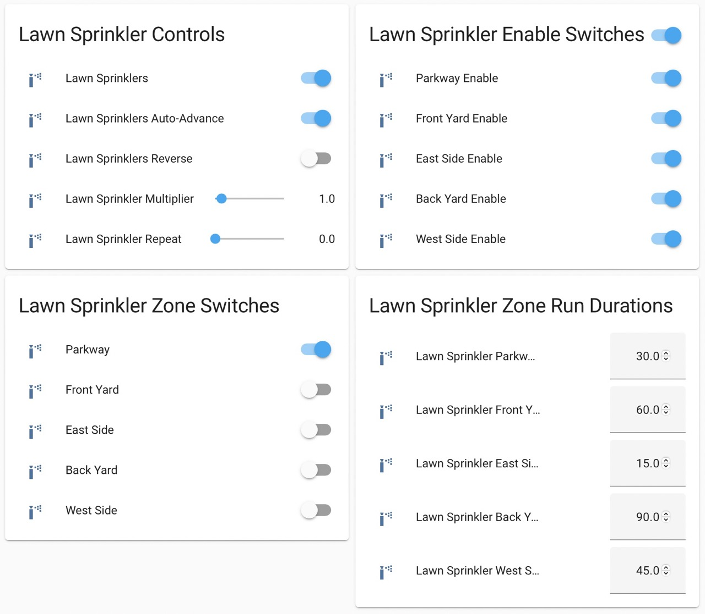

Sprinkler Controller
====================

.. seo::
    :description: Instructions for setting up the sprinkler controller component in ESPHome to control sprinkler valves.
    :image: sprinkler-variant.svg

.. figure:: images/sprinkler.png
    :align: center

The ``sprinkler`` controller component aims to behave like a sprinkler system/valve controller, much
like those made by companies such as Rain Bird or Hunter. It does so by automating control of a
number of :ref:`switch <config-switch>` components, each of which would typically be used to control
an individual electric valve via a relay or other switching device. It provides a number of features
you'd expect of a sprinkler controller, including:

- Virtually any number of zones (sections of the sprinkler system) per controller instance, limited only by
  available memory and/or GPIO (including I/O expanders!) pin availability on the ESP
- The ability to run:

  - One or more full cycles (iterations through all zones) of the system
  - Only a single zone

- Automatic cycle repeating
- Support for pumps/main valves located upstream of distribution valves
- A multiplier value to proportionally increase or decrease the run duration for all zones
- Pausing and resuming a zone/cycle
- Iterating through zones in forward or reverse order
- Support for both latching ("pulsed") and non-latching valves

It reaches even further, however, offering several more advanced features, as well:

- Multiple sprinkler controller instances can operate simultaneously on a single (ESP) device
- Multiple pumps, each of which may be shared across controller instances
- Enable/disable switches for each individual zone, allowing zones to be omitted from full cycles of the system
- A valve/zone queuing mechanism aimed at providing advanced support for automation
- Several valve management strategies to accommodate varying types of hardware/installations:

  - Adjustable "valve open delay" to help ensure valves are fully closed before the next one is opened
  - Adjustable "valve overlap" to help minimize banging of pipes due to water hammer
  - Adjustable delay intervals to coordinate pump starting and stopping relative to distribution valve opening and closing

.. note::

    While the term "pump" is used throughout this document, the device controlled need not be a
    physical pump. Instead, it may simply be another electric valve located upstream of distribution
    valves (often known in the industry as a "main" or "master" valve). The pump or upstream valve
    simply controls the water supply to other downstream valves.

    Example Sprinkler Controller UI -- Note that this example leverages :ref:`number <config-number>` components
    for setting run durations, repeat and multiplier values. More details below.

.. code-block:: yaml

    # Example minimal configuration entry
    # (...but please see more detailed examples below!)
    sprinkler:
      - id: sprinkler_ctrlr
        main_switch: "Sprinklers"
        auto_advance_switch: "Sprinklers Auto Advance"
        valves:
          - valve_switch: "Front Lawn"
            enable_switch: "Enable Front Lawn"
            run_duration: 1800s
            valve_switch_id: lawn_sprinkler_valve_sw0
          - valve_switch: "Back Lawn"
            enable_switch: "Enable Back Lawn"
            run_duration: 900s
            valve_switch_id: lawn_sprinkler_valve_sw1

Please see the :ref:`sprinkler-controller-examples` section below for extensive, detailed configuration
examples that are ready for you to copy and paste!

Configuration variables:
------------------------

- **main_switch** (**Required** with more than one valve, *string*): The name for the sprinkler
  controller's main switch as it will appear in the front end. This switch, when turned on, calls the
  ``sprinkler.resume_or_start_full_cycle`` action; when turned off, it calls the ``sprinkler.shutdown``
  action (see below). It will appear to be "on" when any valve on the controller is active. This switch
  will not appear in the front end if the controller is configured with only one valve.
- **auto_advance_switch** (**Required** with more than one valve, *string*): The name for the
  sprinkler controller's "auto-advance" switch as it will appear in the front end. When this switch is
  turned on while a valve is active, when the valve's ``run_duration`` is reached, the sprinkler
  controller will automatically advance to the next enabled valve as a part of a "full cycle" of the
  system. When turned off, the sprinkler controller will shut down after the active valve's
  ``run_duration`` is reached (unless there are valves in the queue -- see
  :ref:`sprinkler-controller-sprinkler_controller_queue` section below for more detail). This switch will
  not appear in the front end if the controller is configured with only one valve.
- **manual_selection_delay** (*Optional*, :ref:`config-time`): The amount of time the controller should
  wait to activate a valve after the ``next_valve`` and ``previous_valve`` actions are called. Useful
  if the control interface consists of only forward/reverse buttons as the button(s) may be pressed
  multiple times to make the selection.
- **queue_enable_switch** (*Optional*, *string*): The name for the sprinkler controller's queue enable
  switch as it will appear in the front end. When this switch is turned on or not provided, the controller
  will select the next valve/zone to run based on the contents of the queue; the queue takes precedence over
  valves that would otherwise run as a part of a full cycle of the system (when auto-advance is on/enabled).
  See :ref:`sprinkler-controller-sprinkler_controller_queue` section below for more detail.
- **reverse_switch** (*Optional*, *string*): The name for the sprinkler controller's reverse switch
  as it will appear in the front end. When this switch is turned on, the controller will iterate through
  the valves in reverse order (last-to-first as they appear in the controller's configuration). When
  this switch is turned off or not provided, the controller will iterate through the valves first-to-last.
  This switch will not appear in the front end if the controller is configured with only one valve.
- **valve_open_delay** (*Optional*, :ref:`config-time`): The *minimum* delay in seconds that should be
  inserted between (distribution) valve switching -- in other words, the amount of time that must elapse
  between one valve switching off and the next one switching on. Useful for systems with valves which depend
  on sufficient water pressure to close. May not be used with *valve_overlap*.
- **valve_overlap** (*Optional*, :ref:`config-time`): The amount of time in seconds that the current valve
  and the next valve should run simultaneously as the next valve/zone starts up. This may help prevent pipes
  from banging as valves close. May not be used with *valve_open_delay*.
- **pump_switch_off_during_valve_open_delay** (*Optional*, boolean): If set to ``true``, the pump will be
  switched off during the ``valve_open_delay`` interval; otherwise, it remains on. This may only be
  specified when ``valve_open_delay`` is configured (see above). Defaults to ``false``.
- **pump_start_pump_delay** (*Optional*, :ref:`config-time`): The delay in seconds from when a distribution
  valve is opened to when the associated pump is activated. Useful to ensure pressure does not build
  up from running the pump when no distribution valves are open. May not be used with *pump_start_valve_delay*.
- **pump_start_valve_delay** (*Optional*, :ref:`config-time`): The delay in seconds from when a pump
  is started to when the associated distribution valve is opened. Useful for systems where distribution
  valves require sufficient pressure to fully/quickly close. May not be used with *pump_start_pump_delay*.
- **pump_stop_pump_delay** (*Optional*, :ref:`config-time`): The delay in seconds from when a distribution
  valve is closed to when the respective pump is deactivated. Useful for systems where distribution valves
  require sufficient pressure to fully/quickly close. May not be used with *pump_stop_valve_delay*.
- **pump_stop_valve_delay** (*Optional*, :ref:`config-time`): The delay in seconds from when a pump is
  deactivated to when the respective distribution valve is closed. Useful to ensure pressure does not build
  up from running the pump when no distribution valves are open or to allow the main line out to distribution
  valves to drain. May not be used with *pump_stop_pump_delay*.
- **pump_pulse_duration** (*Optional*, :ref:`config-time`): The *minimum* length of the pulse generated to
  operate a pump in milliseconds. *Required* when one or more latching pumps is configured. Note that the *exact*
  length of the pulse is determined by the frequency of the main application loop (as are other ``delay`` timers
  used in ESPHome). Typically this is expected to provide a resolution of approximately 16 milliseconds, however
  this may vary somewhat depending on your exact configuration. Regardless, it should provide
  more-than-sufficient precision to operate any such valve.
- **valve_pulse_duration** (*Optional*, :ref:`config-time`): The *minimum* length of the pulse generated to
  operate a valve in milliseconds. *Required* when one or more latching valves is configured. Note that the *exact*
  length of the pulse is determined by the frequency of the main application loop (as are other ``delay`` timers
  used in ESPHome). Typically this is expected to provide a resolution of approximately 16 milliseconds, however
  this may vary somewhat depending on your exact configuration. Regardless, it should provide more-than-sufficient
  precision to operate any such valve.
- **repeat** (*Optional*, int): The number of times a full cycle should be repeated. Defaults to 0.
- **id** (*Optional*, :ref:`config-id`): Manually specify the ID used for code generation. While optional,
  this is necessary to identify the controller instance (particularly in cases where more than one is
  defined) when calling controller actions (see below) such as ``start_full_cycle`` or ``shutdown``.
- **valves** (**Required**, *list*): A list of valves the controller should use. Each valve consists of:

  - **enable_switch** (*Optional*, *string*): The name for the switch component to be used to enable
    this valve to be run as a part of a full cycle of the system. When this switch is turned off, the valve
    will be excluded from a full cycle of the system. When this switch is turned on or not provided, the
    controller will include the valve in a full cycle of the system.
  - **valve_switch** (**Required**, *string*): The name for the switch component to be used to control
    the valve for this part of the sprinkler system (often referred to as a "zone"). When this switch is
    turned on, the controller's "auto-advance" feature is disabled and it will activate the associated
    valve for its ``run_duration`` multiplied by the controller's multiplier value. When this switch is
    turned off, the ``sprinkler.shutdown`` action is called (see below).
  - **pump_switch_id** (*Optional*, :ref:`Switch <config-switch>`): This is the :ref:`switch <config-switch>`
    component to be used to control the valve's pump or upstream electric valve. Typically this would be a
    :doc:`GPIO switch <switch/gpio>` wired to control a relay or other switching device which in turn would
    activate the respective pump/valve. *It is not recommended to expose this switch to the front end; please
    see* :ref:`sprinkler-controller-an_important_note_about_gpio_switches_and_control` *below for more detail.*
    May not be specified with *pump_off_switch_id* or *pump_on_switch_id*.
  - **pump_off_switch_id** (*Optional*, :ref:`Switch <config-switch>`): This is the :ref:`switch <config-switch>`
    component to be used to *turn off* the valve's pump or upstream electric *latching* valve. Typically this
    would be a :doc:`GPIO switch <switch/gpio>` wired to control a relay or other switching device which in turn
    would *switch off* the respective pump/valve. *It is not recommended to expose this switch to the front end; please
    see* :ref:`sprinkler-controller-an_important_note_about_gpio_switches_and_control` *below for more detail.*
    May not be specified with *pump_switch_id*.
  - **pump_on_switch_id** (*Optional*, :ref:`Switch <config-switch>`): This is the :ref:`switch <config-switch>`
    component to be used to *turn on* the valve's pump or upstream electric *latching* valve. Typically this
    would be a :doc:`GPIO switch <switch/gpio>` wired to control a relay or other switching device which in turn
    would *switch on* the respective pump/valve. *It is not recommended to expose this switch to the front end; please
    see* :ref:`sprinkler-controller-an_important_note_about_gpio_switches_and_control` *below for more detail.*
    May not be specified with *pump_switch_id*.
  - **run_duration** (**Required**, :ref:`config-time`): The duration in seconds this valve should
    remain on/open after it is activated. When a given valve is activated, the controller's multiplier value
    is multiplied by this value to determine the actual run duration for the valve, thus allowing the run
    duration for all valves/zones to be proportionally increased or decreased as desired.
  - **valve_switch_id** (**Required**, :ref:`Switch <config-switch>`): This is the :ref:`switch <config-switch>`
    component to be used to control the valve that operates the given section or zone of the sprinkler
    system. Typically this would be a :doc:`GPIO switch <switch/gpio>` wired to control a relay
    or other switching device which in turn would activate the respective valve. *It is not recommended
    to expose this switch to the front end; please see* :ref:`sprinkler-controller-an_important_note_about_gpio_switches_and_control`
    *below for more detail.* May not be specified with *valve_off_switch_id* or *valve_on_switch_id*.
  - **valve_off_switch_id** (**Required**, :ref:`Switch <config-switch>`): This is the :ref:`switch <config-switch>`
    component to be used to *turn off* the *latching* valve that operates the given section or zone of the
    sprinkler system. Typically this would be a :doc:`GPIO switch <switch/gpio>` wired to control a relay
    or other switching device which in turn would *switch off* the respective valve. *It is not recommended
    to expose this switch to the front end; please see* :ref:`sprinkler-controller-an_important_note_about_gpio_switches_and_control`
    *below for more detail.* May not be specified with *valve_switch_id*.
  - **valve_on_switch_id** (**Required**, :ref:`Switch <config-switch>`): This is the :ref:`switch <config-switch>`
    component to be used to *turn on* the *latching* valve that operates the given section or zone of the
    sprinkler system. Typically this would be a :doc:`GPIO switch <switch/gpio>` wired to control a relay
    or other switching device which in turn would *switch on* the respective valve. *It is not recommended
    to expose this switch to the front end; please see* :ref:`sprinkler-controller-an_important_note_about_gpio_switches_and_control`
    *below for more detail.* May not be specified with *valve_switch_id*.

.. _sprinkler-controller-an_important_note_about_gpio_switches_and_control:

An Important Note about GPIO Switches and Control
-------------------------------------------------

The savvy and/or seasoned ESPHome user will quickly realize that ``pump_switch_id``, ``pump_off_switch_id``,
``pump_on_switch_id``, ``valve_switch_id``, ``valve_off_switch_id`` and ``valve_on_switch_id`` (as described above)
are really just pointers to other (GPIO) switches elsewhere in the ESPHome yaml configuration.

It might seem reasonable to assume that these :doc:`GPIO switches <switch/gpio>` may be used to switch the various
sprinkler zones on and off, however, this is **not** the case. It's important to note that the sprinkler controller
provides a switch for each configured zone -- ultimately, this switch is to be used to switch any given zone on or
off, **not** the :doc:`GPIO switch <switch/gpio>` the zone is configured with.

Keep in mind that a :doc:`GPIO switch <switch/gpio>` directly controls the state of the GPIO pin it is associated
with. While it's technically feasible to "override" this behavior, it might not always be desirable. For example,
if you *wanted* to control the state of the switch/pin manually during testing of your system/configuration, this
would make that impossible (or at least more difficult than necessary), presenting other complications. Ultimately,
flexibility is key, as we've learned from any number of conversations on the ESPHome Discord server.

As mentioned in the introduction, the sprinkler controller automates control of the :doc:`GPIO switches <switch/gpio>`
you provide it with -- it does not "override" control of these switches or alter how they behave beyond simply
switching them on or off as required based on the configured scheduling.

So why not just use the :doc:`GPIO switch <switch/gpio>` to control the various sprinkler zones directly? As it relates
to the sprinkler controller itself, the primary reason relates to *state* -- that is, we need to be able to ensure
that the :doc:`GPIO switch <switch/gpio>` state(s) are kept consistent with the configuration of the sprinkler
controller. While it's less important for systems that simply consist of one valve per zone, it becomes very important
for systems with some additional complexity. Consider the example of a system with a pump and multiple distribution
valves attached to said pump; the controller in this case is configured to switch the pump off three seconds *before*
switching off any given distribution valve. If you suddenly manually switch off a :doc:`GPIO switch <switch/gpio>`
connected to one of these distribution valves, what happens to the pump? What should the sprinkler controller do? Should
it switch the distribution valve back on?...or maybe just switch the pump off, too? In either case, based on its
configuration, the pump was supposed be shut down before the valve, but you just went and turned off the valve. The pump
could be damaged. There are many other similar situations such as this that may occur, the simplest of which is little
more than ensuring that any given valve is switched off after some duration and does not remain on/open perpetually.

With all of this in mind, to ensure that your sprinkler system consistently operates as expected:

- Only use the switches provided by the sprinkler controller component to switch any given sprinkler zone on or off.
- Do not use the :doc:`GPIO switches <switch/gpio>` you have in your configuration to control sprinkler zones/valves
  outside of initial testing of your device configuration.
- To help prevent accidents, it's probably best if the :doc:`GPIO switches <switch/gpio>` for each sprinkler zone are
  **not** exposed to the front end. This can be accomplished in two ways:

  - Do not provide a ``name:`` parameter to your :doc:`GPIO switches <switch/gpio>`, or
  - Add ``internal: true`` to each of your :doc:`GPIO switch <switch/gpio>` configurations

These simple configuration tweaks will help prevent any number of errors (human, automation, or otherwise) and may help
to avert disaster!

.. _sprinkler-controller-actions:

Controller Actions
------------------

.. _sprinkler-controller-action_start_full_cycle:

``sprinkler.start_full_cycle`` action
*************************************

Starts a full cycle of the system. This enables the controller's "auto-advance" feature and disables
the queue. The controller will iterate through all enabled valves/zones. They will each run for their
configured ``run_duration`` multiplied by the controller's multiplier value. *Note that if NO valves
are enabled when this action is called, the controller will automatically enable all valves.*

.. code-block:: yaml

    on_...:
      then:
        - sprinkler.start_full_cycle: sprinkler_ctrlr

.. _sprinkler-controller-action_start_from_queue:

``sprinkler.start_from_queue`` action
*************************************

Starts the controller running valves from its queue. If no valves are in the queue, this action does
nothing; otherwise, this disables the controller's "auto-advance" feature so that only queued
valves/zones will run. Queued valves will remain on for either the amount of time specified in the
queue request or for their configured ``run_duration`` multiplied by the controller's multiplier value
(if the queue request run duration is not specified or is zero). *Note that queued valves ignore whether
the valve is enabled; that is, queued valves will always run once the controller is started, unless, of
course, the queue is (manually) cleared prior to the queue reaching them. Also note that, at present,
the queue has a hard-coded limit of 100 entries to limit memory use.*
See :ref:`sprinkler-controller-sprinkler_controller_queue` section below for more detail.

.. code-block:: yaml

    on_...:
      then:
        - sprinkler.start_from_queue:
            id: sprinkler_ctrlr

.. _sprinkler-controller-action_start_single_valve:

``sprinkler.start_single_valve`` action
***************************************

Starts a single valve. This disables the controller's "auto-advance" and queue features so that
only this valve/zone will run. The valve will remain on for its configured ``run_duration``
multiplied by the controller's multiplier value. *Note that this action ignores whether the valve
is enabled; that is, when called, the specified valve will always run.* Valves are numbered in the
order they appear in the sprinkler controller's configuration starting at zero (0).

.. code-block:: yaml

    on_...:
      then:
        - sprinkler.start_single_valve:
            id: sprinkler_ctrlr
            valve_number: 0

.. _sprinkler-controller-action_shutdown:

``sprinkler.shutdown`` action
*****************************

Immediately (begins to) turns off all valves, effectively shutting down the system, respecting any
configured pump or valve stop delays.

.. code-block:: yaml

    on_...:
      then:
        - sprinkler.shutdown: sprinkler_ctrlr

.. _sprinkler-controller-action_next_valve:

``sprinkler.next_valve`` action
*******************************

Advances to the next valve (numerically). If ``manual_selection_delay`` is configured, the controller
will wait before activating the selected valve. If no valve is active, the first valve (as they appear
in the controller's configuration) will be started.

.. code-block:: yaml

    on_...:
      then:
        - sprinkler.next_valve: sprinkler_ctrlr

.. _sprinkler-controller-action_previous_valve:

``sprinkler.previous_valve`` action
***********************************

Advances to the previous valve (numerically). If ``manual_selection_delay`` is configured, the controller
will wait before activating the selected valve. If no valve is active, the last valve (as they appear in
the controller's configuration) will be started.

.. code-block:: yaml

    on_...:
      then:
        - sprinkler.previous_valve: sprinkler_ctrlr

.. _sprinkler-controller-action_pause:

``sprinkler.pause`` action
**************************

Immediately turns off all valves, saving the active valve and the amount of time remaining so that
the cycle may be resumed later on.

.. code-block:: yaml

    on_...:
      then:
        - sprinkler.pause: sprinkler_ctrlr

.. _sprinkler-controller-action_resume:

``sprinkler.resume`` action
***************************

Resumes a cycle placed on hold with ``sprinkler.pause``. If there is no paused cycle, this action
will do nothing.

.. code-block:: yaml

    on_...:
      then:
        - sprinkler.resume: sprinkler_ctrlr

.. _sprinkler-controller-action_resume_or_start_full_cycle:

``sprinkler.resume_or_start_full_cycle`` action
***********************************************

Resumes a cycle placed on hold with ``sprinkler.pause``, but if no cycle was paused, starts a full
cycle (equivalent to ``sprinkler.start_full_cycle``).

.. code-block:: yaml

    on_...:
      then:
        - sprinkler.resume_or_start_full_cycle: sprinkler_ctrlr

.. _sprinkler-controller-action_queue_valve:

``sprinkler.queue_valve`` action
********************************

Adds the specified valve into the controller's queue. When the queue is enabled, valves in the queue
take precedence over valves scheduled as a part of a full cycle of the system (when auto-advance is
enabled). If ``run_duration`` is not specified or is zero, the sprinkler controller will use the
valve's configured run duration. Valves are numbered in the order they appear in the sprinkler
controller's configuration starting at zero (0). *Note that, at present, the queue has a hard-coded
limit of 100 entries to limit memory use.* Please see :ref:`sprinkler-controller-sprinkler_controller_queue`
section below for more detail and examples.

.. code-block:: yaml

    on_...:
      then:
        - sprinkler.queue_valve:
            id: sprinkler_ctrlr
            valve_number: 2
            run_duration: 900s

.. _sprinkler-controller-action_clear_queued_valves:

``sprinkler.clear_queued_valves`` action
****************************************

Removes all queued valves from the controller's queue. Please see :ref:`sprinkler-controller-sprinkler_controller_queue`
section below for more detail and examples.

.. code-block:: yaml

    on_...:
      then:
        - sprinkler.clear_queued_valves:
            id: sprinkler_ctrlr

.. _sprinkler-controller-action_set_multiplier:

``sprinkler.set_multiplier`` action
***********************************

Sets the multiplier value used to proportionally increase or decrease the run duration for all valves/zones.
When a given valve is activated, this value is multiplied by the valve's run duration (see below) to
determine the valve's actual run duration.

.. code-block:: yaml

    on_...:
      then:
        - sprinkler.set_multiplier:
            id: sprinkler_ctrlr
            multiplier: 1.5

.. _sprinkler-controller-action_set_repeat:

``sprinkler.set_repeat`` action
*******************************

Specifies the number of times full cycles should be repeated. **Note that the total number of cycles
the controller will run is equal to the repeat value plus one.** For example, with a ``repeat`` value
of 1, the initial cycle will run, then the repeat cycle will run, resulting in a total of two cycles.

.. code-block:: yaml

    on_...:
      then:
        - sprinkler.set_repeat:
            id: sprinkler_ctrlr
            repeat: 2  # would run three cycles

.. _sprinkler-controller-action_set_valve_run_duration:

``sprinkler.set_valve_run_duration`` action
*******************************************

Sets the run duration for the specified valve. When the valve is activated, this value is multiplied
by the multiplier value (see above) to determine the valve's actual run duration.

.. code-block:: yaml

    on_...:
      then:
        - sprinkler.set_valve_run_duration:
            id: sprinkler_ctrlr
            valve_number: 0
            run_duration: 600s

.. note::

    - The ``next_valve``, ``previous_valve`` and ``start_single_valve`` actions ignore whether a valve
      is enabled via its enable switch.
    - The ``next_valve`` and ``previous_valve`` actions may not appear to respond immediately if either
      ``manual_selection_delay`` or any of the various delay mechanisms described in the
      :ref:`sprinkler-controller-pump_and_distribution_valve_coordination` section below are configured.
      If you are using any of these configuration options, be sure to allow the delay intervals to elapse
      before assuming something isn't working!
    - If a valve is active when its ``run_duration`` or the multiplier value is changed, the active
      valve's run duration will remain unaffected until the next time it is started.

.. _sprinkler-controller-pump_and_distribution_valve_coordination:

Pump and Distribution Valve Coordination
----------------------------------------

The sprinkler controller allows extensive flexibility relating to the switching of pumps and valves.
Let's take a closer look at how to use these features to tune your system.

Delayed Starting and/or Stopping of Pumps or Valves
***************************************************

For systems with pumps, it's generally a bad idea to run the pump with no distribution valves open.
This causes pressure to build up and can even destroy the pump after some time. For systems with (a)
pump(s), you'll likely want to add two configuration options:

.. code-block:: yaml

    sprinkler:
      - id: lawn_sprinkler_ctrlr
        pump_start_pump_delay: 3s
        pump_stop_valve_delay: 3s
        ...

This will cause any given pump to start (in this example) three seconds *after* any associated distribution
valve is opened. In addition, it will wait three seconds to close the *last* distribution valve *after*
the pump is stopped. This would allow the pump to spin down, pressure to drop and lines to drain prior
to switching off the (last) associated distribution valve. (In these configurations, it might also be
desirable to enable ``valve_overlap``, as well -- more on this below.)

Some types of electric valves require sufficient water pressure to (fully/quickly) close. These types of
valves, when coupled with electric valves upstream of distribution valves (often known in the industry as
"main" or "master" valves), may require that the upstream valve is switched on *before* any given distribution
valve(s), allowing the water pressure to stabilize and force all distribution valves closed *before* any single
distribution valve is opened. In these situations, the reverse of the above configuration may be desirable:

.. code-block:: yaml

    sprinkler:
      - id: lawn_sprinkler_ctrlr
        pump_start_valve_delay: 3s
        pump_stop_pump_delay: 3s
        ...

In this example, the upstream valve would open three seconds prior to any given associated distribution
valve, allowing the water pressure to force any attached distribution valves closed. After the delay, the
required distribution valve is opened and the cycle starts. When the cycle is complete, the (last) distribution
valve would be switched off three seconds prior to the upstream valve. (In these configurations, it might also
be desirable to enable ``valve_open_delay``, as well.)

.. note::

    Using ``pump_stop_valve_delay`` or ``pump_stop_pump_delay`` with ``valve_open_delay`` and
    ``pump_switch_off_during_valve_open_delay`` may increase the off-time inserted between the operation
    of each zone, as the controller must wait for a given zone (pump *and* valve) to fully shut down before
    it can be started again.

Banging Pipes or Valves That Don't Consistently Close
*****************************************************

A common complaint people have with sprinkler systems is that of banging pipes. In other, less common situations,
some systems suffer from valves that do not (fully/quickly) close. There are three controller options available to
address either of these complaints/concerns:

- ``valve_overlap``
- ``valve_open_delay``
- ``pump_switch_off_during_valve_open_delay``

The first option, ``valve_overlap``, causes the current valve and the next valve (as the controller is iterating
through valves) to run simultaneously for the duration specified. The idea here is that this causes a reduction
in water pressure as the next zone starts up, therefore minimizing banging pipes (aka the "water hammer" effect)
when the valve that is finishing up finally closes.

The second and third options may be used to ensure sufficient water pressure is available to force valves closed.
This may be useful for pressure-sensitive valves that don't quickly and/or fully close when water pressure is low.

For systems with pumps, it may be desirable to switch off the pump before switching to the next distribution
valve/zone. In these situations, ``pump_switch_off_during_valve_open_delay`` may prove useful in conjunction
with ``valve_open_delay``.

In any case, the examples in the next section illustrate how/where to add these options into your configuration.

.. _sprinkler-controller-examples:

Controller Examples
-------------------

Single Controller, Single Valve, No Pump
****************************************

This first example illustrates a complete, single-valve system with no pump/upstream valve(s). It
could be useful for controlling a single valve independent of any other sprinkler controllers. A pump
could easily be added by adding the ``pump_switch_id`` parameter and a :ref:`switch <config-switch>`.

.. code-block:: yaml

    esphome:
        name: esp-sprinkler-controller
        platform: ESP32
        board: featheresp32

    wifi:
        ssid: "wifi_ssid"
        password: "wifi_password"

    logger:

    sprinkler:
      - id: garden_sprinkler_ctrlr
        valves:
          - valve_switch: "Flower Garden"
            run_duration: 300s
            valve_switch_id: garden_sprinkler_valve

    switch:
      - platform: gpio
        id: garden_sprinkler_valve
        pin: 5

Single Controller, Three Valves, No Pump
****************************************

This example illustrates a complete, simple three-valve system with no pump/upstream valve(s):

.. code-block:: yaml

    esphome:
        name: esp-sprinkler-controller
        platform: ESP32
        board: featheresp32

    wifi:
        ssid: "wifi_ssid"
        password: "wifi_password"

    logger:

    sprinkler:
      - id: lawn_sprinkler_ctrlr
        main_switch: "Lawn Sprinklers"
        auto_advance_switch: "Lawn Sprinklers Auto Advance"
        reverse_switch: "Lawn Sprinklers Reverse"
        valve_overlap: 5s
        valves:
          - valve_switch: "Front Lawn"
            enable_switch: "Enable Front Lawn"
            run_duration: 900s
            valve_switch_id: lawn_sprinkler_valve_sw0
          - valve_switch: "Side Lawn"
            enable_switch: "Enable Side Lawn"
            run_duration: 900s
            valve_switch_id: lawn_sprinkler_valve_sw1
          - valve_switch: "Back Lawn"
            enable_switch: "Enable Back Lawn"
            run_duration: 900s
            valve_switch_id: lawn_sprinkler_valve_sw2

    switch:
      - platform: gpio
        id: lawn_sprinkler_valve_sw0
        pin: 0
      - platform: gpio
        id: lawn_sprinkler_valve_sw1
        pin: 2
      - platform: gpio
        id: lawn_sprinkler_valve_sw2
        pin: 4

Single Controller, Three Valves, Single Pump
********************************************

This example illustrates a complete three-valve system with a single pump/upstream valve:

.. code-block:: yaml

    esphome:
        name: esp-sprinkler-controller
        platform: ESP32
        board: featheresp32

    wifi:
        ssid: "wifi_ssid"
        password: "wifi_password"

    logger:

    sprinkler:
      - id: lawn_sprinkler_ctrlr
        main_switch: "Lawn Sprinklers"
        auto_advance_switch: "Lawn Sprinklers Auto Advance"
        reverse_switch: "Lawn Sprinklers Reverse"
        valve_open_delay: 5s
        valves:
          - valve_switch: "Front Lawn"
            enable_switch: "Enable Front Lawn"
            pump_switch_id: sprinkler_pump_sw
            run_duration: 900s
            valve_switch_id: lawn_sprinkler_valve_sw0
          - valve_switch: "Side Lawn"
            enable_switch: "Enable Side Lawn"
            pump_switch_id: sprinkler_pump_sw
            run_duration: 900s
            valve_switch_id: lawn_sprinkler_valve_sw1
          - valve_switch: "Back Lawn"
            enable_switch: "Enable Back Lawn"
            pump_switch_id: sprinkler_pump_sw
            run_duration: 900s
            valve_switch_id: lawn_sprinkler_valve_sw2

    switch:
      - platform: gpio
        id: sprinkler_pump_sw
        pin: 12
      - platform: gpio
        id: lawn_sprinkler_valve_sw0
        pin: 0
      - platform: gpio
        id: lawn_sprinkler_valve_sw1
        pin: 2
      - platform: gpio
        id: lawn_sprinkler_valve_sw2
        pin: 4

Single Controller, Three Latching Valves, Single Latching Pump
**************************************************************

This example is similar to the previous example, however it illustrates how a "latching" or "pulsed"
valve can be configured. This type of valve requires two :doc:`GPIO switches <switch/gpio>` to
operate -- one to switch the valve on and one to switch the valve off. To switch on the valve, the
"on" :doc:`GPIO switch <switch/gpio>` is switched on for the configured duration and then switched
off. To switch the valve off, the "off" :doc:`GPIO switch <switch/gpio>` is switched on for the
configured duration and then switched off.

Note that, while this example illustrates a configuration that uses exclusively latching valves,
latching and non-latching valves may be mixed and matched in any configuration, even if attached to
a common pump/upstream valve.

.. code-block:: yaml

    esphome:
      name: esp-sprinkler-controller
      platform: ESP32
      board: featheresp32

    wifi:
      ssid: "wifi_ssid"
      password: "wifi_password"

    logger:

    sprinkler:
      - id: lawn_sprinkler_ctrlr
        main_switch: "Lawn Sprinklers"
        auto_advance_switch: "Lawn Sprinklers Auto Advance"
        queue_enable_switch: "Lawn Sprinklers Queue Enable"
        reverse_switch: "Lawn Sprinklers Reverse"
        pump_pulse_duration: 250ms
        valve_pulse_duration: 250ms
        valve_open_delay: 5s
        valves:
          - valve_switch: "Front Lawn"
            enable_switch: "Enable Front Lawn"
            pump_off_switch_id: sprinkler_pump_sw_off
            pump_on_switch_id: sprinkler_pump_sw_on
            run_duration: 900s
            valve_off_switch_id: lawn_sprinkler_valve_sw0_off
            valve_on_switch_id: lawn_sprinkler_valve_sw0_on
          - valve_switch: "Side Lawn"
            enable_switch: "Enable Side Lawn"
            pump_off_switch_id: sprinkler_pump_sw_off
            pump_on_switch_id: sprinkler_pump_sw_on
            run_duration: 900s
            valve_off_switch_id: lawn_sprinkler_valve_sw1_off
            valve_on_switch_id: lawn_sprinkler_valve_sw1_on
          - valve_switch: "Back Lawn"
            enable_switch: "Enable Back Lawn"
            pump_off_switch_id: sprinkler_pump_sw_off
            pump_on_switch_id: sprinkler_pump_sw_on
            run_duration: 900s
            valve_off_switch_id: lawn_sprinkler_valve_sw2_off
            valve_on_switch_id: lawn_sprinkler_valve_sw2_on

    switch:
      - platform: gpio
        id: sprinkler_pump_sw_off
        pin: 14
      - platform: gpio
        id: sprinkler_pump_sw_on
        pin: 15
      - platform: gpio
        id: lawn_sprinkler_valve_sw0_off
        pin: 0
      - platform: gpio
        id: lawn_sprinkler_valve_sw0_on
        pin: 2
      - platform: gpio
        id: lawn_sprinkler_valve_sw1_off
        pin: 4
      - platform: gpio
        id: lawn_sprinkler_valve_sw1_on
        pin: 5
      - platform: gpio
        id: lawn_sprinkler_valve_sw2_off
        pin: 12
      - platform: gpio
        id: lawn_sprinkler_valve_sw2_on
        pin: 13

Dual Controller, Five Valves, Two Pumps
***************************************

This example illustrates a complete and more complex dual-controller system with a total of five
valves (three on the first controller and two on the second controller) and two pumps/upstream
valves, each of which are shared between the two controllers:

.. code-block:: yaml

    esphome:
        name: esp-sprinkler-controller
        platform: ESP32
        board: featheresp32

    wifi:
        ssid: "wifi_ssid"
        password: "wifi_password"

    logger:

    sprinkler:
      - id: lawn_sprinkler_ctrlr
        main_switch: "Lawn Sprinklers"
        auto_advance_switch: "Lawn Sprinklers Auto Advance"
        reverse_switch: "Lawn Sprinklers Reverse"
        valve_overlap: 5s
        valves:
          - valve_switch: "Front Lawn"
            enable_switch: "Enable Front Lawn"
            pump_switch_id: sprinkler_pump_sw0
            run_duration: 900s
            valve_switch_id: lawn_sprinkler_valve_sw0
          - valve_switch: "Side Lawn"
            enable_switch: "Enable Side Lawn"
            pump_switch_id: sprinkler_pump_sw0
            run_duration: 900s
            valve_switch_id: lawn_sprinkler_valve_sw1
          - valve_switch: "Back Lawn"
            enable_switch: "Enable Back Lawn"
            pump_switch_id: sprinkler_pump_sw1
            run_duration: 900s
            valve_switch_id: lawn_sprinkler_valve_sw2
      - id: garden_sprinkler_ctrlr
        main_switch: "Garden Sprinklers"
        auto_advance_switch: "Garden Sprinklers Auto Advance"
        reverse_switch: "Garden Sprinklers Reverse"
        valve_open_delay: 5s
        valves:
          - valve_switch: "Front Garden"
            enable_switch: "Enable Front Garden"
            pump_switch_id: sprinkler_pump_sw0
            run_duration: 900s
            valve_switch_id: garden_sprinkler_valve_sw0
          - valve_switch: "Back Garden"
            enable_switch: "Enable Back Garden"
            pump_switch_id: sprinkler_pump_sw1
            run_duration: 900s
            valve_switch_id: garden_sprinkler_valve_sw1

    switch:
      - platform: gpio
        id: sprinkler_pump_sw0
        pin: 12
      - platform: gpio
        id: sprinkler_pump_sw1
        pin: 13
      - platform: gpio
        id: lawn_sprinkler_valve_sw0
        pin: 0
      - platform: gpio
        id: lawn_sprinkler_valve_sw1
        pin: 2
      - platform: gpio
        id: lawn_sprinkler_valve_sw2
        pin: 4
      - platform: gpio
        id: garden_sprinkler_valve_sw0
        pin: 14
      - platform: gpio
        id: garden_sprinkler_valve_sw1
        pin: 15

.. note::

    In this final complete configuration example, pump control is split among the two sprinkler
    controller instances. This will behave as expected; multiple instances of the controller will
    communicate to ensure any given pump is activated and deactivated only as necessary, even when
    the controllers are operating simultaneously.

Extending the Sprinkler Controller's Switches
*********************************************

It is worth noting that each of the various switches in the sprinkler controller's configuration are standard
ESPHome :ref:`switch <config-switch>` components. Their configuration may be extended in a manner similar to
the following example:

.. code-block:: yaml

    # Extended switch configuration for 'main_switch'
    sprinkler:
      - id: sprinkler_ctrlr
        main_switch:
          name: "Lawn Sprinklers"
          id: sprinkler_ctrlr_main_switch_id
          on_turn_on:
            light.turn_on: my_light
        ...

This arrangement is possible for any other switch within the sprinkler controller's configuration block, with
the exception of ``pump_off_switch_id``, ``pump_on_switch_id``, ``pump_switch_id``, ``valve_off_switch_id``,
``valve_on_switch_id`` and ``valve_switch_id`` (because these are the IDs of other switch components already
defined elsewhere in your configuration). In addition, specifying each switch ID enables the ability to refer
to any of the sprinkler controller's switches from elsewhere in your configuration. Here's another brief example:

.. code-block:: yaml

    # Template switch as a secondary main switch
    switch:
      - platform: template
        id: my_switch
        name: "My Special Sprinkler Switch"
        on_turn_off:
          - switch.turn_off: sprinkler_ctrlr_main_switch_id
          - light.turn_off: sprinkler_indicator_light
        on_turn_on:
          - switch.turn_on: sprinkler_ctrlr_main_switch_id
          - light.turn_on: sprinkler_indicator_light
        ...

While the above example illustrates creating a secondary "main" switch, this method could be extended to take
advantage of other devices such as a moisture :ref:`sensor <config-sensor>` -- when the moisture level is too
low (look for ``on_value`` or ``on_value_range``), the sprinkler controller (or a specific valve) could be
activated by calling one of the controller's start-up actions, such as ``sprinkler.start_full_cycle``,
``sprinkler.start_from_queue``, ``sprinkler.start_single_valve``, or ``sprinkler.resume_or_start_full_cycle``.

.. _sprinkler-controller-sprinkler_controller_queue:

The Sprinkler Controller Queue
******************************

The queuing mechanism is an unusual feature for a sprinkler controller; it becomes useful as a result of the
extreme flexibility of both ESPHome and Home Assistant. Given the extensive ecosystem of devices available today,
the sprinkler controller's queuing mechanism provides an advanced feature aimed at allowing even more advanced automation.

In general, it comes down to flexibility: the more traditional "run full cycle" and "run single valve" functionality
is intended for use by humans (via the front end or physical control interface) while the queuing mechanism is aimed
at supporting automation.

Here's a practical example:

Consider a home with a yard divided into a number of sprinkler zones -- perhaps it even includes a garden or two
(flowers and vegetables, of course!). An array of soil moisture sensors could be deployed throughout the various
zones and gardens and when a given sensor falls below some defined threshold, that sensor's zone is entered into
the sprinkler controller's queue.

Then, each morning at some specific hour, Home Assistant (or even the ESP device itself!) calls the sprinkler
controller's ``sprinkler.start_from_queue`` action, causing the controller to iterate only through queued zones.
Because the run duration may be specified as a part of the queue request, this could be extended to compute a
specific run duration for each zone depending on the specific moisture level of the soil on any given day. The
possibilities are endless and are only limited by your creativity!

It is important to note that, if *both* the auto-advance and queue switches are turned on/enabled, **queued valves
take precedence over valves that would run as a part of a full cycle of the system.** In other words, if the queue
is enabled and a valve is entered into the queue while a full cycle is active, at the next valve transition, the
queue entry will be picked up *before* the next valve that would run as a part of the full cycle. At present, this
behavior cannot be changed. It should also be noted that the queue has a hard-coded limit of 100 entries to limit
memory use.

Additional Tricks
*****************

Beyond what is shown in the configuration examples above, other ESPHome elements may be called into
play to help build out an extensive interface for the controller in the front end (Home Assistant).
For example, the :ref:`number <config-number>` component may be used to set valve run durations or
the controller's multiplier value:

.. code-block:: yaml

    # Example configuration to set multiplier via number
    number:
      - platform: template
        id: sprinkler_ctrlr_multiplier
        name: "Sprinkler Controller Multiplier"
        optimistic: true
        min_value: 0.1
        max_value: 10.0
        step: 0.1
        initial_value: 1.0
        set_action:
          - sprinkler.set_multiplier:
              id: lawn_sprinkler_ctrlr
              multiplier: !lambda 'return x;'

Expose Sprinkler Controller Actions via user-API
************************************************

This configuration snippet illustrates how user-defined ESPHome API services may be used to expose
various sprinkler controller actions to the front end. This could be useful to change settings
and/or trigger sprinkler controller actions using automations.

.. code-block:: yaml

    api:
      services:
        - service: set_multiplier
          variables:
            multiplier: float
          then:
            - sprinkler.set_multiplier:
                id: lawn_sprinkler_ctrlr
                multiplier: !lambda 'return multiplier;'
        - service: start_full_cycle
          then:
            - sprinkler.start_full_cycle: lawn_sprinkler_ctrlr
        - service: start_single_valve
          variables:
            valve: int
          then:
            - sprinkler.start_single_valve:
                id: lawn_sprinkler_ctrlr
                valve_number: !lambda 'return valve;'
        - service: next_valve
          then:
            - sprinkler.next_valve: lawn_sprinkler_ctrlr
        - service: previous_valve
          then:
            - sprinkler.previous_valve: lawn_sprinkler_ctrlr
        - service: shutdown
          then:
            - sprinkler.shutdown: lawn_sprinkler_ctrlr

See Also
--------

- :apiref:`sprinkler/sprinkler.h`
- :apiref:`switch/switch.h`
- :ghedit:`Edit`
