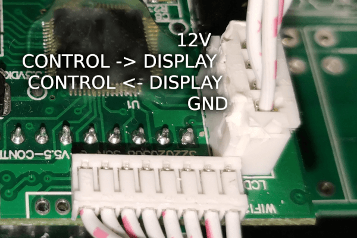
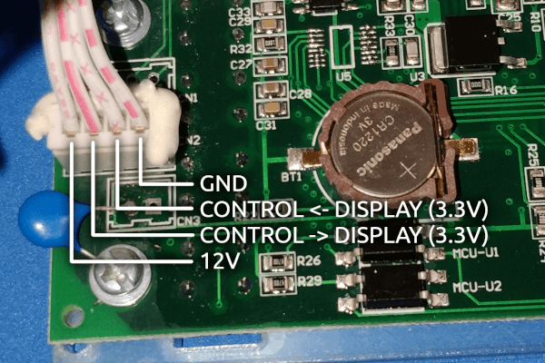
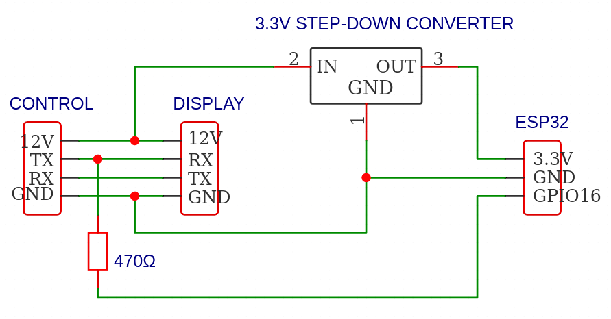

SUN_GTIL2 Grid Tie Inverter
===========================

.. seo::
    :description: Instructions for reading data from a SUN-1000G2 grid tie inverter using ESPHome
    :keywords: sun-1000g2, sun-2000g2, sun1000, sun2000, sun-1000gtil2, sun-2000gtil2

The ``sun_gtil2`` component allows you to get voltage, power and temperature readings from your ``SUN-1000G2``
or ``SUN-2000G2`` grid tie inverter. This is done by reading the UART data transmitted from the inverter's
controller board to the display board.

.. note::

    You need to open your inverter to apply this modification. Use at your own risk! If you want to connect your
    inverter via the (more limited) external RS232 interface you should use the
    :doc:`Modbus </components/modbus_controller>` component instead.

    Pinout of the inverter's controller board

    Pinout of the inverter's display board

    Simplified connection diagram

As the data is read from the inverter using UART, you need to have an :ref:`UART bus <uart>` in your
configuration with the ``rx_pin`` connected to the TX pin of the inverter's controller board. Additionally, you
need to set the ``baud_rate`` to 9600.

The inverter will report new measurements approximately every 1.3 seconds.

Component/Hub
-------------

.. code-block:: yaml

    # Example configuration entry
    sun_gtil2:
      uart_id: control_to_display

Configuration variables:
~~~~~~~~~~~~~~~~~~~~~~~~

- **id** (**Required**, :ref:`config-id`): The id to use for this component.
- **uart_id** (*Optional*): The UART Bus ID for receiving messages sent from the inverter's controller to the display.

Sensor
------

.. code-block:: yaml

    # Example configuration entry
    sensor:
      - platform: sun_gtil2
        temperature:
          id: gtil_temperature
          name: "Heatsink Temperature"
          filters:
            - throttle_average: 30s
        dc_voltage:
          id: gtil_dc_voltage
          name: "DC Voltage"
          filters:
            - throttle_average: 30s
        ac_voltage:
          id: gtil_ac_voltage
          name: "AC Voltage"
          filters:
            - throttle_average: 30s
        ac_power:
          id: gtil_ac_power
          name: "AC Power"
        dc_power:
          id: gtil_dc_power
          name: "DC Power"
        limiter_power:
          id: gtil_limiter_power
          internal: True

Configuration variables:
~~~~~~~~~~~~~~~~~~~~~~~~

- **sun_gtil2_id** (*Optional*): Manually specify the ID of the sun_gtil2 instance if there are multiple.

- **temperature** (*Optional*): The temperature of your inverter's heatsink.
  All options from :ref:`Sensor <config-sensor>`.

- **dc_voltage** (*Optional*): The voltage of your DC source. (battery or solar panels)
  All options from :ref:`Sensor <config-sensor>`.

- **ac_voltage** (*Optional*): The grid voltage measured by the inverter.
  All options from :ref:`Sensor <config-sensor>`.

- **dc_power** (*Optional*): The inverter's input power.
  All options from :ref:`Sensor <config-sensor>`.

- **ac_power** (*Optional*): The inverter's output power.
  All options from :ref:`Sensor <config-sensor>`.

- **limiter_power** (*Optional*): The power measured by the inverter's "Internal" limiter.
  All options from :ref:`Sensor <config-sensor>`.

Text Sensor
-----------

.. code-block:: yaml

    # Example configuration entry
    text_sensor:
      - platform: sun_gtil2
        state:
          id: gtil_state
          name: "State"
        serial_number:
          id: gtil_serial_number
          internal: True

Configuration variables:
~~~~~~~~~~~~~~~~~~~~~~~~

- **sun_gtil2_id** (*Optional*): Manually specify the ID of the sun_gtil2 instance if there are multiple.

- **state** (*Optional*): The inverter's state.
  All options from :ref:`Text Sensor <config-text_sensor>`.

- **serial_number** (*Optional*): The inverter's serial number.
  All options from :ref:`Text Sensor <config-text_sensor>`.

See Also
--------

- :ref:`sensor-filters`
- :ghedit:`Edit`
