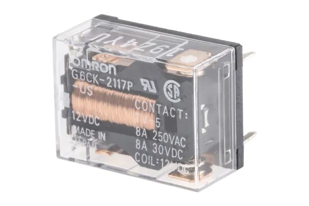

H-bridge Switch
===============

.. seo::
    :description: Instructions for setting up H-Bridge controlled switches (or relays).
    :image: hbridge-relay.jpg

The ``hbridge`` switch platform allows you to drive an *h-bridge* controlled latching relay.

    Omron G6CK-2117P relay module.

.. code-block:: yaml

    # Example configuration entry
    switch:
      - platform: hbridge
        id: my_relay
        name: "Relay"
        on_pin: GPIOXX
        off_pin: GPIOXX
        pulse_length: 50ms
        wait_time: 50ms

Configuration variables:
------------------------

- **on_pin** (**Required**, :ref:`config-pin_schema`): The GPIO pin to pulse to turn on the switch.
- **off_pin** (**Required**, :ref:`config-pin_schema`): The GPIO pin to pulse to turn off the switch.
- **pulse_length** (*Optional*, :ref:`config-time`): The length in milliseconds of the pulse sent on ``on_pin`` and ``off_pin`` to change switch state. Defaults to ``100 ms``.
- **wait_time** (*Optional*, :ref:`config-time`): The time in milliseconds to delay between pulses on ``off_pin`` and ``on_pin``. Defaults to no delay.
- **optimistic** (*optional*, boolean): Whether to operate in optimistic mode - when in this mode,
  any command sent to the switch will immediately update the reported state. Defaults to ``false``, and the reported state updates only at the end of the pulse.

- All other options from :ref:`Switch Component <config-switch>`.

See Also
--------

- :doc:`/components/output/index`
- :doc:`/components/switch/index`
- :apiref:`hbridge/switch/hbridge_switch.h`
- :ghedit:`Edit`
