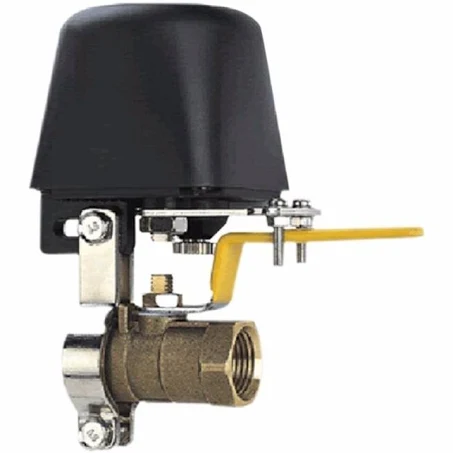
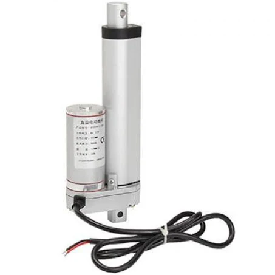

H-bridge Switch
===============

.. seo::
    :description: Instructions for setting up h-bridge controlled switches or motors.
    :image: pin.svg

The ``hbridge`` switch platform allows you to use a `h-bridge` circuit or IC (L298N, DRV8871, MX1508, BTS7960, L9110S, DRV8833, TB6612, etc.) to control a bi-directional motor as a switch.

The basic principal is that you are switching something based on switching an applied voltage.

.. figure:: images/output-ui.png
    :align: center
    :width: 80.0%

This component can be used for (but not limited to):

    Valve-actuator / Valve manipulator motor assembly
    

    Linear-actuator motor assembly

Configuration
-------------

.. code-block:: yaml

    # Output config list
    # Note: For PWM output use "esp8266_pwm" for ESP8266 or "ledc" for ESP32 as platform
    output:
      - platform: ... # PWM Capable output platform
          id: output_switch_a
          pin: ... # Output pin assignment
          frequency: 50 Hz
      - platform: ... # PWM Capable output platform
          id: output_switch_b
          pin: ... # Output pin assignment
          frequency: 50 Hz
      - platform: ... # PWM Capable output platform
          id: output_switch_enable
          pin: ... # Output pin assignment
          frequency: 50 Hz

    # Switch test config    
    switch:
    - platform: hbridge
        id: hbridge_switch
        name: "H-Bridge switch"
        pin_a: output_switch_a
        pin_b: output_switch_b
        enable_pin: output_switch_enable
        decay_mode: SLOW
        duration: 10000ms
    
Output assignment
*****************

- **pin_a** (**Required**, :ref:`config-id`): The id of the :ref:`float output <output>` 
  connected to Pin A (alternatively IN1, etc.) of the h-bridge.
- **pin_b** (**Required**, :ref:`config-id`): The id of the :ref:`float output <output>` 
  connected to Pin B (alternatively IN2, etc.) of the h-bridge.
- **enable_pin** (*Optional*, :ref:`config-id`): The id of the :ref:`float output <output>` 
  connected to the Enable pin of the h-bridge (if h-bridge uses enable). Default is ``null`` (not used)
- **decay_mode** (*Optional*, string): The current decay mode you want to use with
  the h-bridge. Either ``SLOW`` (braking) or ``FAST`` (coasting). Defaults to ``SLOW``.
  For more information on current decay see `this link <https://learn.adafruit.com/improve-brushed-dc-motor-performance/current-decay-mode>`__

- **duration** (*Optional*, float): Switching duration. Duration to apply switching current when changing state. 
  Set this timeout to prevent burning your motor/electronics when the assembly gets stuck.
  Defaults to ``0`` (No limit, signal always applied)

switch configuration
********************

- **name** (**Required**, string): The name for this switch.
- **id** (*Optional*, :ref:`config-id`): Manually specify the ID used for code generation.
- All other options from :ref:`switch Component <config-switch>`.

Current limiting / Transitions
------------------------------

The component is based on the same H-Bridge software driver as the :doc:`/components/fan/hbridge` component.
Therefore it can also apply the "transitions" parameters. In practice they can be put to (limited) use.

See Also
--------
- :doc:`/components/switch/index`
- :doc:`/components/output/ledc`
- :doc:`/components/output/esp8266_pwm`
- :apiref:`switch/switch_state.h`
- `Adafruit's basic H-bridge tutorial <https://learn.adafruit.com/adafruit-arduino-lesson-15-dc-motor-reversing/overview>`__
- `Adafruit's advanced H-bridge tutorial <https://learn.adafruit.com/improve-brushed-dc-motor-performance>`__
- :ghedit:`Edit`
