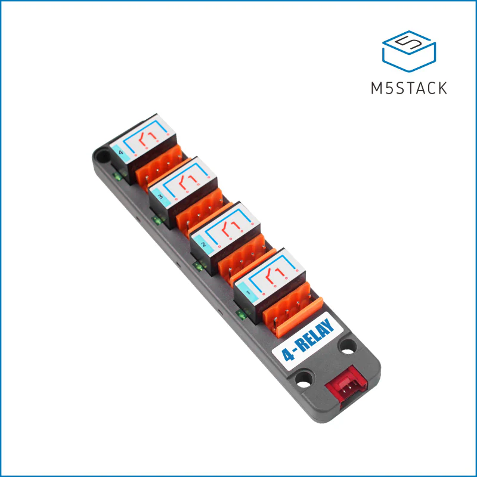

.. _m5stack4relay_switch:

M5Stack 4 Relay Switch Component
================================

.. seo::
    :description: Instructions for setting up m5stack4relay Switch.
    :image: m5stack4relay.jpg

The ``m5stack4relay`` switch platform supports the 4 channels of the relay unit. 
The relays can be used to switch up to AC-230V or DC-28V. For more information: https://docs.m5stack.com/en/unit/4relay

.. code-block:: yaml

    # Example configuration entry
    m5stack4relay:
        id: M5stackrelay_ID1
        # ...

    switch:
      - platform: m5stack4relay
        id: relay_1
        name: relay1
        channel: relay_1
        m5stack4relay_id: M5stackrelay_ID1

Configuration variables:
------------------------
The control has all other options from the I2C devices

Switch:
- **channel** (*Required*, string): The name of channel to switch, options are relay_1, relay_2, relay_3 or relay_4.
- **m5stack4relay_id** (*Optional*, :ref:`config-id`): The ID of the M5Stack 4 relay.
- **interlock** (*Optional*, list): A list of other switches in an interlock group. See
  :ref:`switch-gpio-interlocking`.
- **interlock_wait_time** (*Optional*, :ref:`config-time`): For interlocking mode, set how long
  to wait after other items in an interlock group have been disabled before re-activating.
  Useful for motors where immediately turning on in the other direction could cause problems.

- All other options from :ref:`Switch <config-switch>`.

This switch supports the same interlocking as the GPIO switch.

See Also
--------

- :doc:`index`
- :apiref:`m5stack4relay/switch/m5stack4relay_switch.h`
- :apiref:`gpio/switch/gpio_switch.h`
- :ghedit:`Edit`
