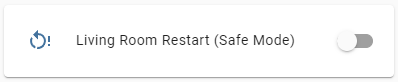

Safe Mode Switch
================

.. seo::
    :description: Instructions for setting up switches that can remotely reboot the ESP in ESPHome into safe mode.
    :image: restart.svg

The ``safe_mode`` switch allows you to remotely reboot your node into :ref:`Safe Mode <config-ota>`. This is useful in certain situations where a misbehaving component, or low memory state is preventing Over-The-Air updates from completing successfully. 

This component requires :ref:`OTA <config-ota>` to be configured.

.. code-block:: yaml

    # Example configuration entry
    switch:
      - platform: safe_mode
        name: "Living Room Restart (Safe Mode)"

Configuration variables:
------------------------

- **name** (**Required**, string): The name for the switch.
- **id** (*Optional*, :ref:`config-id`): Manually specify the ID used for code generation.
- All other options from :ref:`Switch <config-switch>`.

See Also
--------

- :doc:`shutdown`
- :doc:`restart`
- :doc:`factory_reset`
- :doc:`/components/button/safe_mode`
- :doc:`template`
- :apiref:`safe_mode/safe_mode_switch.h`
- :ghedit:`Edit`
