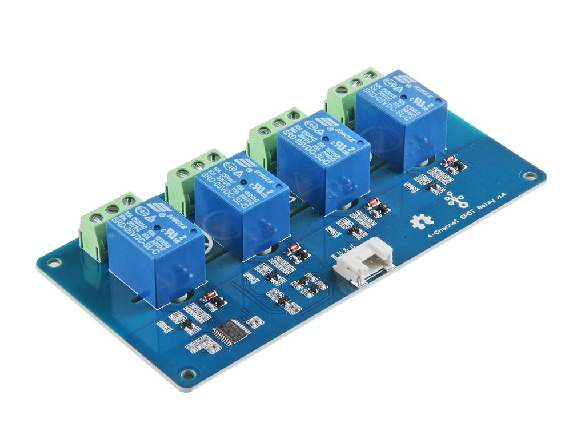
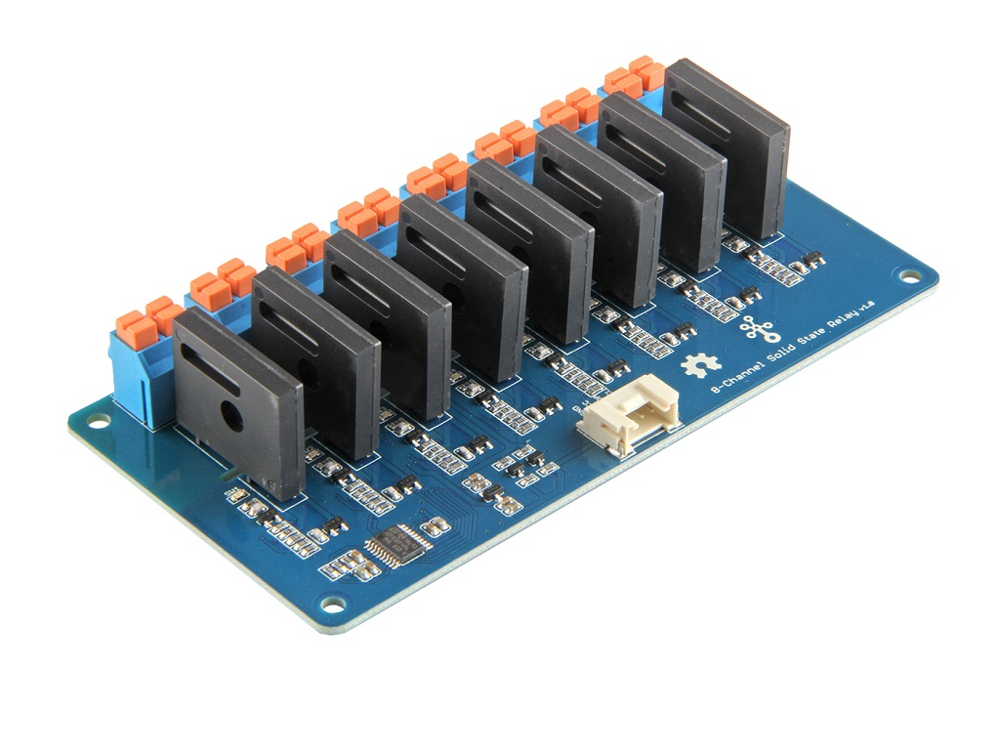

.. _seeedmultichannelrelay_switch:

Seeed Multi Channel Relay Switch Component
==========================================

.. seo::
    :description: Instructions for setting up seeedmultichannelrelay Switch.
    :image: seeedmultichannelrelay.png

The ``seeedmultichannelrelay`` switch platform supports the 8 channels of the relay unit. There are multi relays which are supported.
The relays can be used to switch up to AC-230VDC-28V. For more information: 

Below are several links to supported relays
https://wiki.seeedstudio.com/Grove-4-Channel_SPDT_Relay/
https://wiki.seeedstudio.com/Grove-8-Channel_Solid_State_Relay/

.. code-block:: yaml

    # Example configuration entry
    seeedmultichannelrelay:
        id: SeeedMultiChannelRelay_ID
        # ...

    switch:
      - platform: seeedmultichannelrelay
        id: relay_1
        name: relay1
        channel: relay_1
        seeedmultichannelrelay_id: SeeedMultiChannelRelay_ID

Configuration variables:
------------------------

- **channel** (*Required*, string): The name of channel to switch, options are relay_1, relay_2, relay_3 or relay_4.
- **seeedmultichannelrelay_id** (*Optional*, :ref:`config-id`): The ID of the Seed relay.
- **interlock** (*Optional*, list): A list of other switches in an interlock group. See
  :ref:`switch-gpio-interlocking`.
- **interlock_wait_time** (*Optional*, :ref:`config-time`): For interlocking mode, set how long
  to wait after other items in an interlock group have been disabled before re-activating.
  Useful for motors where immediately turning on in the other direction could cause problems.

- All other options from :ref:`Switch <config-switch>`.

This switch supports the same interlocking as the GPIO switch.

See Also
--------

- :doc:`index`
- :apiref:`seeedmultichannelrelay/switch/seeedmultichannelrelay_switch.h`
- :apiref:`gpio/switch/gpio_switch.h`
- :ghedit:`Edit`
