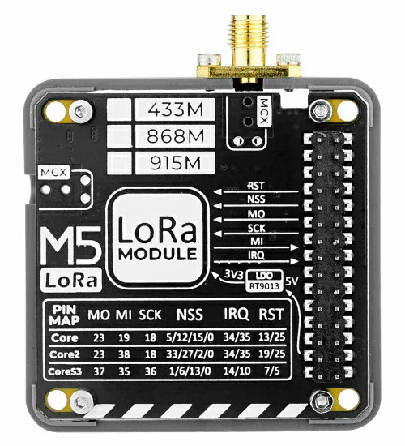

SX127X Component
================================================================

.. seo::
    :description: Instructions for setting up SX1276/SX1277/SX1278/SX1279 transceivers.
    :image: sx127x.jpg

The SX127X component allows you to configure the SX1276, SX1277, SX1278 and SX1279 transceivers
(`datasheet <https://www.semtech.com/products/wireless-rf/lora-connect/sx1278#documentation>`__) in ESPHome. Transceivers are connected via the :ref:`SPI Bus <spi>`. Supported frequencies range from 137 MHz to 1020 MHz. Supported modulations include OOK, FSK, GFSK, MSK and GMSK. The LoRa modem is not supported by this component, only the FSK/OOK modem.

.. code-block:: yaml

    # Example configuration entry
    spi:
      clk_pin: GPIO5
      mosi_pin: GPIO27
      miso_pin: GPIO19

    sx127x:
      nss_pin: GPIO18
      rst_pin: GPIO23
      frequency: 433920000
      modulation: OOK
      rx_start: true
      rx_bandwidth: 50_0kHz
      rx_floor: -90
      pa_pin: BOOST
      pa_power: 17
      shaping: NONE
      fsk_fdev: 5000
      fsk_ramp: 40us

Configuration variables:
------------------------

- **rst_pin** (**Required**, :ref:`Pin Schema <config-pin_schema>`): SX reset pin.
- **nss_pin** (**Required**, :ref:`Pin Schema <config-pin_schema>`): SPI select pin.
- **dio0_pin** (**Optional**, :ref:`Pin Schema <config-pin_schema>`): Digital IO pin 0.
- **dio2_pin** (**Optional**, :ref:`Pin Schema <config-pin_schema>`): Digital IO pin 2.
- **frequency** (**Required**, int): Frequency in Hz of the transceiver.
- **modulation** (**Required**, enum): Modulation can be ``OOK`` or ``FSK``.
- **payload_length** (**Optional**, int): If set to a length greater than zero packet mode is enabled, otherwise continuous mode is used. In packet mode, packets are received with the on_packet trigger and sent via the send_packet automation. In continuous mode raw data appears on dio2 and is handled by remote receiver / transmitter.
- **bitrate** (**Optional**, int): Bitrate of the signal. Required by packet mode and recommended in continuous mode, example 4800.
- **sync_value** (**Optional**, list): Synchronization bytes found after the preamble and before the payload. Required by packet mode.
- **preamble_size** (**Optional**, int): Length of the preamble in bytes. Preamble detector is disabled if the size is 0.
- **preamble_polarity** (**Optional**, int): Polarity of the preamble, either 0xAA or 0x55.
- **preamble_errors** (**Optional**, int): Number of chip errors tolerated over the preamble, 4 chips per bit.
- **rx_start** (**Optional**, bool): Start the receiver on boot or after transmit.
- **rx_bandwidth** (**Optional**, enum): Receive bandwidth can be ``2_6kHz``, ``3_1kHz``, ``3_9kHz``, ``5_2kHz``, ``6_3kHz``, ``7_8kHz``, ``10_4kHz``, ``12_5kHz``, ``15_6kHz``, ``20_8kHz``, ``25_0kHz``, ``31_3kHz``, ``41_7kHz``, ``50_0kHz``, ``62_5kHz``, ``83_3kHz``, ``100_0kHz``, ``125_0kHz``, ``166_7kHz``, ``200_0kHz`` or ``250_0kHz``.
- **rx_floor** (**Optional**, float): When receiving OOK data rx_floor should be set appropriately for your environment / device / antenna. If the floor is set too high (ie closer to 0) the radio will ignore everything. If the floor is set too low (ie closer to -128) noise will overwhelm remote receiver. A good starting point is -90 dBm.
- **rx_duration** (**Optional**, int or :ref:`config-time`): TODO
- **pa_pin** (**Optional**, enum): Transmitter output, can be ``BOOST`` or ``RFO``.
- **pa_power** (**Optional**, int): Transmitter power, range is 0 to 17 dBm.
- **shaping** (**Optional**, enum): Transmitter data shaping, valid values for OOK are ``CUTOFF_BR_X_2``, ``CUTOFF_BR_X_1`` or ``NONE``, valid values for FSK are ``GAUSSIAN_BT_0_3``, ``GAUSSIAN_BT_0_5``, ``GAUSSIAN_BT_1_0`` or ``NONE``. Note only recommended in packet mode as the data has to be syncronized with the data clock.
- **fsk_fdev** (**Optional**, int): Transmitter frequency deviation, valid values range from 0 to 100,000 Hz.
- **fsk_ramp** (**Optional**, enum): Transmitter PA ramp, valid values are ``10us``, ``12us``, ``15us``, ``20us``, ``25us``, ``31us``, ``40us``, ``50us``, ``62us``, ``100us``, ``125us``, ``250us``, ``500us``, ``1000us``, ``2000us`` or ``3400us``.

.. note::

    The config can be changed at runtime using lambdas. Settings, except for mode changes, will only be applied after calling configure. See :apiref:`sx127x/sx127x.h`.

Automations:
------------

- **on_packet** (*Optional*, :ref:`Automation <automation>`): An automation to perform in packet mode when a packet has been decoded. A variable x of type std::vector<uint8_t> is passed to the automation for use in lambdas.

.. code-block:: yaml

    sx127x:
      ...
      on_packet:
        then:
          - lambda: |-
              ESP_LOGD("lambda", "packet %s", format_hex(x).c_str());

Actions:
--------

``sx127x.set_mode_tx`` **Action**

This :ref:`action <config-action>` sets the SX127X mode to tx, SX127X needs to be in continuous mode.

.. code-block:: yaml

    on_...:
      - sx127x.set_mode_tx

``sx127x.set_mode_rx`` **Action**

This :ref:`action <config-action>` sets the SX127X mode to rx.

.. code-block:: yaml

    on_...:
      - sx127x.set_mode_rx

``sx127x.set_mode_standby`` **Action**

This :ref:`action <config-action>` sets the SX127X mode to standby.

.. code-block:: yaml

    on_...:
      - sx127x.set_mode_standby

``sx127x.send_packet`` **Action**

This :ref:`action <config-action>` sends a packet, SX127X needs to be in packet mode.

.. code-block:: yaml

    on_...:
      - sx127x.send_packet:
          data: [0x1F, 0x3E, 0x06, 0x5F, 0x4F, 0x5F, 0xAC, 0xB1]

Configuration variables:

- **data** (**Required**, list): The packet to send, length should match the configured payload_length.

Continuous Mode:
----------------

**As a Receiver:**

The radio will output demodulated data onto a GPIO, typically :doc:`remote_receiver </components/remote_receiver>` is used to handle this. Remote Receiver can either decode the signal itself or pass the raw data to another component (or lambda).

.. code-block:: yaml

    # Example configuration entry
    sx127x:
      nss_pin: GPIO18
      rst_pin: GPIO23
      frequency: 433920000
      modulation: OOK
      rx_start: true
      rx_bandwidth: 50_0kHz
      rx_floor: -90

    remote_receiver:
      pin: GPIO32
      dump: raw

.. note::

    The GPIO used by remote receiver must be DIO2 not DIO0.

**As a Transmitter:**

The radio expects raw data to be sent on a GPIO, typically :doc:`remote_transmitter </components/remote_transmitter>` is used to handle this. The radio transmitter must be enabled before transmit and disabled after. Ideally this is done using the remote transmitter triggers on_transmit and on_complete.

.. code-block:: yaml

    # Example configuration entry
    sx127x:
      id: sx127x_id
      nss_pin: GPIO18
      rst_pin: GPIO23
      frequency: 433920000
      modulation: OOK
      rx_start: false
      pa_pin: BOOST
      pa_power: 17

    remote_transmitter:
      pin: GPIO32
      carrier_duty_percent: 100%
      on_transmit:
        then:
          - sx127x.set_mode_tx
      on_complete:
        then:
          - sx127x.set_mode_standby

    interval:
      - interval: 30sec
        then:
          - remote_transmitter.transmit_raw:
              code: [614, -614, 600, -614, 614, -614, 601, -614]

.. note::

    The GPIO used by remote transmitter must be DIO2 not DIO0.

**As a Transmitter & Receiver:**

The radio can be used as both a transmitter and receiver. The same GPIO is used for both rx and tx. In order to make things work the gpio mode and radio mode must be set appropriately. Ideally this is done using the remote transmitter triggers on_transmit and on_complete.

.. code-block:: yaml

    # Example configuration entry
    sx127x:
      id: sx127x_id
      nss_pin: GPIO18
      rst_pin: GPIO23
      dio2:
        number: GPIO32
        allow_other_uses: true
      frequency: 433920000
      modulation: OOK
      rx_start: true
      rx_bandwidth: 50_0kHz
      rx_floor: -90
      pa_pin: BOOST
      pa_power: 17

    remote_receiver:
      id: rx_id
      pin:
        number: GPIO32
        allow_other_uses: true
      dump: raw

    remote_transmitter:
      id: tx_id
      pin:
        number: GPIO32
        allow_other_uses: true
      carrier_duty_percent: 100%
      on_transmit:
        then:
          - sx127x.set_mode_tx
          - lambda: id(tx_id)->setup(); // workaround
      on_complete:
        then:
          - sx127x.set_mode_rx

    interval:
      - interval: 30sec
        then:
          - remote_transmitter.transmit_raw:
              code: [614, -614, 600, -614, 614, -614, 601, -614]

.. note::

    A workaround is currently needed in remote transmitter. Setup must be called again before transmitting after a gpio mode change.

Packet Mode:
------------

In packet mode the radio can be used as both a transmitter and receiver. Mode changes are handled transparently. 

.. code-block:: yaml

    # Example configuration entry
    sx127x:
      dio0_pin: GPIO26
      nss_pin: GPIO18
      rst_pin: GPIO23
      pa_pin: BOOST
      pa_power: 17
      bitrate: 4800
      frequency: 433920000
      modulation: FSK
      rx_start: true
      payload_length: 8
      sync_value: [0x33, 0x33]
      preamble_size: 2
      preamble_errors: 8
      preamble_polarity: 0x55
      on_packet:
        then:
          - lambda: |-
              ESP_LOGD("lambda", "packet %s", format_hex(x).c_str());

      interval:
       - interval: 60sec
         then:
           - sx127x.send_packet: 
               data: [0xC5, 0x51, 0x78, 0x82, 0xB7, 0xF9, 0x9C, 0x5C]

See Also
--------

- :doc:`index`
- :doc:`/components/remote_transmitter`
- :doc:`/components/remote_receiver`
- :apiref:`sx127x/sx127x.h`
- :ghedit:`Edit`
