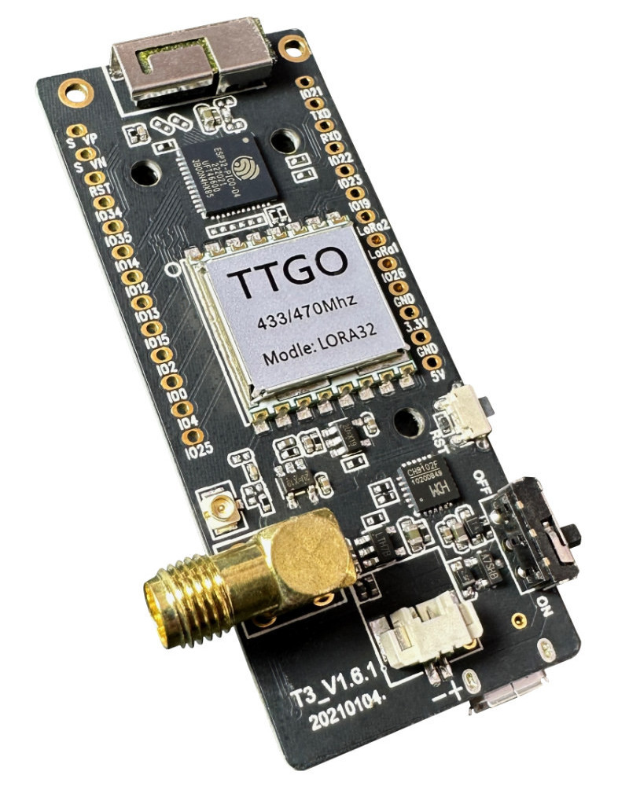

SX127X Component
================================================================

.. seo::
    :description: Instructions for setting up SX1276/SX1277/SX1278/SX1279 transceivers.
    :image: sx127x.jpg

The SX127X component allows you to configure the SX1276, SX1277, SX1278 and SX1279 transceivers
(`datasheet <https://www.semtech.com/products/wireless-rf/lora-connect/sx1278#documentation>`__) in ESPHome. Transceivers are connected via the :ref:`SPI Bus <spi>`. Supported frequencies range from 137 MHz to 1020 MHz. Supported modulations include OOK, FSK, GFSK, MSK and GMSK.

.. code-block:: yaml

    # Example configuration entry
    spi:
      clk_pin: GPIO5
      mosi_pin: GPIO27
      miso_pin: GPIO19

    sx127x:
      nss_pin: GPIO18
      rst_pin: GPIO23
      pa_pin: BOOST
      pa_power: 17
      frequency: 433920000
      modulation: OOK
      rx_start: true
      rx_bandwidth: 50_0kHz
      rx_floor: -90
      fsk_fdev: 5000
      fsk_shaping: NONE
      fsk_ramp: 40us

    remote_transmitter:
      id: tx_id
      pin: GPIO32
      carrier_duty_percent: 100%

Configuration variables:
------------------------

- **rst_pin** (**Required**, :ref:`Pin Schema <config-pin_schema>`): Reset pin.
- **nss_pin** (**Required**, :ref:`Pin Schema <config-pin_schema>`): SPI chip select pin.
- **pa_pin** (**Optional**, enum): Transmitter output, can be ``BOOST`` or ``RFO``.
- **pa_power** (**Optional**, int): Transmitter power, range is 0 to 17 dBm.
- **frequency** (**Required**, int): Frequency in Hz of the transceiver.
- **modulation** (**Required**, enum): Modulation can be ``OOK`` or ``FSK``.
- **rx_start** (**Optional**, bool): Start the receiver on boot or after transmit. 
- **rx_bandwidth** (**Optional**, enum): Receive bandwidth can be ``2_6kHz``, ``3_1kHz``, ``3_9kHz``, ``5_2kHz``, ``6_3kHz``, ``7_8kHz``, ``10_4kHz``, ``12_5kHz``, ``15_6kHz``, ``20_8kHz``, ``25_0kHz``, ``31_3kHz``, ``41_7kHz``, ``50_0kHz``, ``62_5kHz``, ``83_3kHz``, ``100_0kHz``, ``125_0kHz``, ``166_7kHz``, ``200_0kHz`` or ``250_0kHz``.
- **rx_floor** (**Optional**, float): When receiving OOK data rx_floor should be set appropriately for your environment / device / antenna. If the floor is set too high (ie closer to 0) the radio will ignore everything. If the floor is set too low (ie closer to -128) noise will overwhelm remote receiver. A good starting point is -90 dBm. 
- **fsk_fdev** (**Optional**, int): Transmitter frequency deviation, valid values range from 0 to 100,000 Hz.
- **fsk_shaping** (**Optional**, enum): Transmitter data shaping, valid values are ``BT_0_3``, ``BT_0_5``, ``BT_1_0`` or ``NONE``.
- **fsk_ramp** (**Optional**, enum): Transmitter PA ramp, valid values are ``10us``, ``12us``, ``15us``, ``20us``, ``25us``, ``31us``, ``40us``, ``50us``, ``62us``, ``100us``, ``125us``, ``250us``, ``500us``, ``1000us``, ``2000us`` or ``3400us``. 

See Also
--------

- :doc:`index`
- :doc:`/components/remote_transmitter`
- :doc:`/components/remote_receiver`
- :apiref:`sx127x/sx127x.h`
- :ghedit:`Edit`
