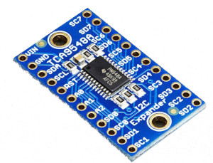

TCA9548A I²C Multiplexer
========================

.. seo::
    :description: Instructions for setting up TCA9548A I²C multiplexer in ESPHome.
    :image: tca9548a.jpg

The TCA9548A component allows you to use TCA9548A as a I²C multiplexer
(`datasheet <https://www.ti.com/lit/ds/symlink/tca9548a.pdf>`__,
`AdaFruit`_) in ESPHome. It uses :ref:`I²C Bus <i2c>` for communication.

Once configured, you can use any of the 8 channels (TCA9548A) as separated channels for your projects.
Every Channel acts for all connected components as a virtual I²C Bus.

    tca9548a I2C Multiplexer.

.. _AdaFruit: https://learn.adafruit.com/adafruit-tca9548a-1-to-8-i2c-multiplexer-breakout

.. code-block:: yaml

    # Example configuration entry
    tca9548a:
      - address: 0x70
        id: multiplex0
        i2c_id: i2c0
        channels: 
          - bus_id: multiplex0channel0
            channel: 0
          - bus_id: multiplex0channel1
            channel: 1

    # Individual I2C Devices
    sensor:
      - platform: bmp280
        i2c_id: multiplex0channel1

Configuration variables:
~~~~~~~~~~~~~~~~~~~~~~~~

- **id** (**Required**, :ref:`config-id`): The id to use for this TCA9548A component.
- **address** (*Optional*, int): The I²C address of the Multiplexer.
  Defaults to ``0x70``.
- **i2c_id** (*Optional*): The I²C Bus ID
  Defaults to ``false`` 
- **channels** (*Optional*): The I²C Bus Channels

  - **bus_id** (**Required**, :ref:`config-id`): The id to use for this virtual I2C Bus.
  - **channel** (**Required**): The channel (0-7) to use for this virtual I2C Bus.

See Also
--------

- :ref:`i2c`
- :ghedit:`Edit`
