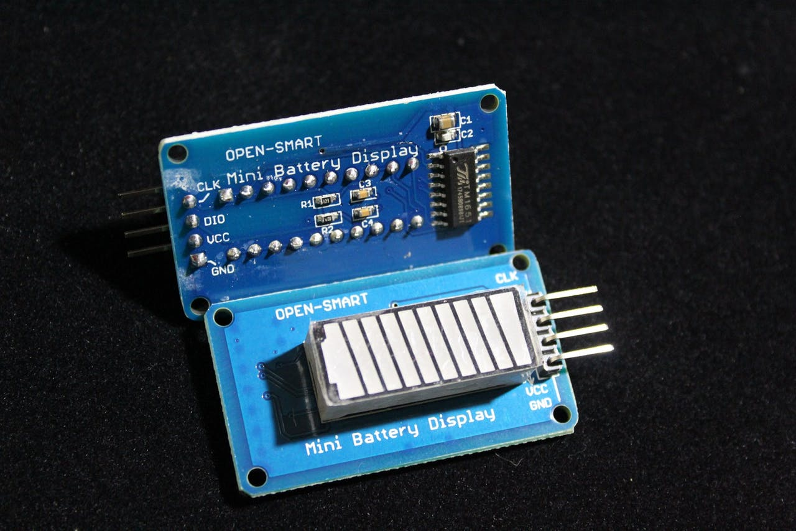

TM1651 Battery Display
======================

.. seo::
    :description: Instructions for setting up TM1651 Battery Display.
    :image: tm1651_battery_display.jpg

.. _tm1651:

Battery Display
---------------

The ``tm1651`` display platform allows you to use battery display units based on the TM1651 chip such as
`this one <https://aliexpress.com/item/32811491559.html>`__ with ESPHome. This component supports the level
and brightness settings. All updates can be made via lambda expressions.

.. code-block:: yaml

    tm1651:
        id: tm1651_battery
        clk_pin: GPIOXX
        dio_pin: GPIOXX

Configuration variables:
************************

- **clk_pin** (**Required**, :ref:`Pin Schema <config-pin_schema>`): CLK pin
- **dio_pin** (**Required**, :ref:`Pin Schema <config-pin_schema>`): DIO pin
- **id** (*Optional*, :ref:`config-id`): Manually specify the ID used for code generation.

.. _tm1651-set_level_percent_action:

``tm1651.set_level_percent`` Action
-----------------------------------

This :ref:`Action <config-action>` changes the level of the battery display at runtime.
Automatically calculates input level in percentages to actual level for the display.

.. code-block:: yaml

    on_...:
      - tm1651.set_level_percent:
          id: tm1651_battery
          level_percent: 50

Configuration variables:

- **id** (**Required**, :ref:`config-id`): The ID of the TM1651.
- **level_percent** (**Required**, :ref:`templatable <config-templatable>`, int): Level from 0 to 100

.. _tm1651-set_level_action:

``tm1651.set_level`` Action
---------------------------

This :ref:`Action <config-action>` changes the level of the battery display at runtime.

.. code-block:: yaml

    on_...:
      - tm1651.set_level:
          id: tm1651_battery
          level: 5

Configuration variables:

- **id** (**Required**, :ref:`config-id`): The ID of the TM1651.
- **level** (**Required**, :ref:`templatable <config-templatable>`, int): Level from 0 to 7

.. _tm1651-set_brightness_action:

``tm1651.set_brightness`` Action
--------------------------------

This :ref:`Action <config-action>` allows you to manually change the brightness of the battery display at runtime.

.. code-block:: yaml

    on_...:
      - tm1651.set_brightness:
          id: tm1651_battery
          brightness: 1

Configuration variables:

- **id** (**Required**, :ref:`config-id`): The ID of the TM1651.
- **brightness** (**Required**, :ref:`templatable <config-templatable>`, int): There is three levels of brightness
  (``1``, ``2`` or ``3``) from lowest to highest brightness.

.. _tm1651-turn_off:

``tm1651.turn_off`` Action
--------------------------

This :ref:`Action <config-action>` turns off all the LEDs.

.. code-block:: yaml

    on_...:
      - tm1651.turn_off:
          id: tm1651_battery

Configuration variables:

- **id** (**Required**, :ref:`config-id`): The ID of the TM1651.

.. _tm1651-turn_on:

``tm1651.turn_on`` Action
-------------------------

This :ref:`Action <config-action>` turns on the LEDs.

.. code-block:: yaml

    on_...:
      - tm1651.turn_on:
          id: tm1651_battery

Configuration variables:

- **id** (**Required**, :ref:`config-id`): The ID of the TM1651.

Advanced Configuration
----------------------

You also can control this component with lambda expressions

.. code-block:: yaml

    api:
      services:
        - service: battery_level
          variables:
            level: int
          then:
            - lambda: |-
                id(tm1651_battery).set_level(level);
        - service: battery_brightness
          variables:
            brightness: int
          then:
            - lambda: |-
                id(tm1651_battery).set_brightness(brightness);

See Also
--------

- :doc:`index`
- :ghedit:`Edit`
